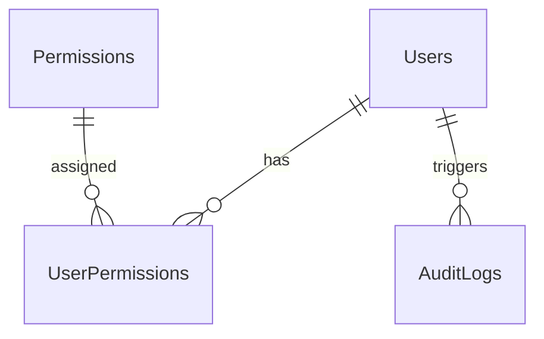

# SPEC — System Administration & RBAC
> **Feature ID:** `feat-admin`
> **UC Coverage:** UC-15 (System Administration)
> **Version:** 1.0 | **Status:** Active
> **Author:** Team | **Last Updated:** 2026-06-27

---

## 1. CONTEXT & GOAL (BỐI CẢNH & MỤC TIÊU)

### 1.1 Bối cảnh
Quản trị viên hệ thống (Admin) cần công cụ quản lý tập trung để điều phối hoạt động kinh doanh toàn sàn, cấu hình các tham số hệ thống nhạy cảm (biểu phí, hạn mức rút tiền), phân quyền hạn hoạt động cho nhân viên vận hành (Staff), và giám sát thông qua nhật ký hoạt động (Audit logs).

### 1.2 Mục tiêu
- Cung cấp báo cáo thống kê doanh thu toàn sàn theo ngày, theo danh mục sản phẩm.
- Hỗ trợ cơ chế phân quyền dựa trên quyền hạn (RBAC) cho tài khoản Staff.
- Cung cấp cổng quản lý người dùng (khóa/mở khóa tài khoản vi phạm, thay đổi role).
- Ghi vết lịch sử mọi hoạt động nhạy cảm trong hệ thống.

### 1.3 Tại sao cần?
Đảm bảo tính tuân thủ, giám sát hoạt động của nhân viên để ngăn chặn lạm quyền và cấu hình kịp thời các tham số tài chính của sàn.

---

## 2. ACTOR (TÁC NHÂN)
| Actor | Role | Điều kiện tiền quyết |
|---|---|---|
| **Admin** | Quản trị viên tối cao | Tài khoản có vai trò `Admin` |

---

## 3. FUNCTIONAL REQUIREMENTS (Cú pháp EARS)

### 3.1 Thống kê & Doanh thu
| ID | EARS Requirement |
|:---|:---|
| FR-ADMIN-01 | WHEN an Admin requests revenue statistics, THE SYSTEM SHALL compute and return daily, category-wise, and overall system revenue from completed orders. |

### 3.2 Quản trị người dùng & RBAC
| ID | EARS Requirement |
|:---|:---|
| FR-ADMIN-02 | WHEN an Admin assigns a permission to a Staff, THE SYSTEM SHALL link the user and permission in the database. |
| FR-ADMIN-03 | WHEN an Admin revokes a permission from a Staff, THE SYSTEM SHALL remove the link from the database. |
| FR-ADMIN-04 | WHEN an Admin toggles account lock status for a user, THE SYSTEM SHALL set `isLocked = 1` or `0` and terminate active sessions if locked. |

### 3.3 Cấu hình hệ thống & Audit
| ID | EARS Requirement |
|:---|:---|
| FR-ADMIN-05 | WHEN an Admin modifies system settings, THE SYSTEM SHALL update the configuration value and write an audit log. |
| FR-ADMIN-06 | THE SYSTEM SHALL write a record to `AuditLogs` for every administrative action, including IP address, target object, and action type. |

---

## 4. NON-FUNCTIONAL REQUIREMENTS
| ID | Category | Requirement |
|:---|:---|:---|
| NFR-ADMIN-01 | Security | Tất cả các endpoint `/api/admin/**` bắt buộc có phân quyền `ROLE_ADMIN`. |
| NFR-ADMIN-02 | Audit | Nhật ký hoạt động `AuditLogs` là bất biến (chỉ cho phép INSERT, không cho phép UPDATE/DELETE). |
| NFR-ADMIN-03 | Performance | API truy vấn báo cáo doanh thu phải phản hồi < 500ms đối với dữ liệu dưới 1 năm. |

---

## 5. DATA MODEL (Mô hình dữ liệu)

```sql
CREATE TABLE Permissions (
    id BIGINT IDENTITY(1,1) PRIMARY KEY,
    name VARCHAR(100) NOT NULL UNIQUE,
    description NVARCHAR(255) NULL
);

CREATE TABLE UserPermissions (
    user_id BIGINT NOT NULL,
    permission_id BIGINT NOT NULL,
    PRIMARY KEY (user_id, permission_id),
    CONSTRAINT FK_UP_User FOREIGN KEY (user_id) REFERENCES Users(id),
    CONSTRAINT FK_UP_Perm FOREIGN KEY (permission_id) REFERENCES Permissions(id)
);

CREATE TABLE AuditLogs (
    id BIGINT IDENTITY(1,1) PRIMARY KEY,
    action VARCHAR(255) NOT NULL,
    user_id BIGINT NULL,
    target_type VARCHAR(100) NULL,
    target_id BIGINT NULL,
    details NVARCHAR(MAX) NULL,
    created_at DATETIME DEFAULT GETDATE(),
    CONSTRAINT FK_Audit_User FOREIGN KEY (user_id) REFERENCES Users(id)
);

CREATE TABLE SystemConfigurations (
    id BIGINT IDENTITY(1,1) PRIMARY KEY,
    config_key VARCHAR(100) NOT NULL UNIQUE,
    config_value VARCHAR(255) NOT NULL,
    description NVARCHAR(255) NULL
);
```

### Quan hệ thực thể


---

## 6. API SPEC (Đặc tả API)

### `GET /api/admin/revenue/summary`
*   **Description**: Lấy thống kê tổng quan doanh thu toàn sàn.
*   **Headers:** `Authorization: Bearer <Admin_JWT_Token>`
*   **Response (200 OK):**
    ```json
    {
      "totalRevenueVnd": 150000000,
      "commissionVnd": 15000000,
      "successfulOrdersCount": 1200
    }
    ```

### `POST /api/admin/staff-permissions/assign`
*   **Request Body (JSON):**
    ```json
    {
      "staffId": 3,
      "permissionId": 2
    }
    ```
*   **Response (200 OK):**
    ```json
    {
      "success": true,
      "message": "Gán quyền thành công cho nhân viên."
    }
    ```

### `PUT /api/admin/system-config`
*   **Request Body (JSON):**
    ```json
    {
      "configKey": "transaction_fee_percentage",
      "configValue": "10"
    }
    ```
*   **Response (200 OK):**
    ```json
    {
      "success": true,
      "message": "Cấu hình hệ thống được cập nhật thành công."
    }
    ```

---

## 7. ERROR HANDLING (Xử lý lỗi)
| HTTP Code | Error Code | Message | Lý do kích hoạt |
|---|---|---|---|
| 403 | FORBIDDEN | "Access Denied" | Người dùng không phải là Admin truy cập |
| 400 | BAD_REQUEST | "Cấu hình giá trị không hợp lệ" | Nhập phí phần trăm âm hoặc > 100 |

---

## 8. ACCEPTANCE CRITERIA (Tiêu chí nghiệm thu)
| ID | Scenario | Given (Bối cảnh) | When (Hành động) | Then (Kết quả) |
|---|---|---|---|---|
| AC-ADMIN-01 | Khóa tài khoản thành công | Admin ở trang quản lý người dùng | Chọn user A và bấm "Khóa tài khoản" | Hệ thống set isLocked = 1, ghi audit log và chặn đăng nhập của user A |
| AC-ADMIN-02 | Phân quyền Staff thành công | Admin ở trang phân quyền Staff | Gán quyền "APPROVE_WITHDRAW" cho Staff B | Quyền được ghi nhận vào UserPermissions, Staff B thực hiện được lệnh duyệt |