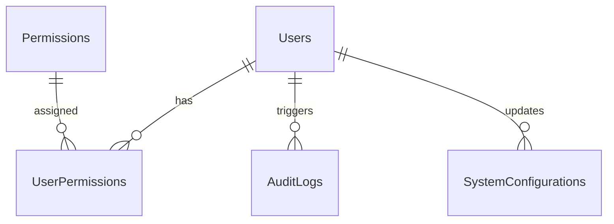

# SPEC — System Administration & RBAC
> **Feature ID:** `feat-admin`
> **UC Coverage:** UC-15 (System Administration)
> **Version:** 2.0 | **Status:** Active
> **Author:** Team | **Last Updated:** 2026-07-16

---

## 1. CONTEXT & GOAL (BỐI CẢNH & MỤC TIÊU)

### 1.1 Bối cảnh
Quản trị viên hệ thống (Admin) cần công cụ quản lý tập trung để điều phối hoạt động kinh doanh toàn sàn, cấu hình các tham số hệ thống nhạy cảm (biểu phí, hạn mức rút tiền, hạn mức nạp tiền), phân quyền hạn hoạt động cho nhân viên vận hành (Staff), quản lý thông báo/announcements chung toàn sàn, điều chỉnh chế độ bảo trì hệ thống và giám sát thông qua nhật ký hoạt động (Audit logs).

### 1.2 Mục tiêu
- Cung cấp báo cáo thống kê doanh thu ròng từ phí hoa hồng, phí mở Shop, phí rút tiền.
- Hỗ trợ cơ chế phân quyền chi tiết cho tài khoản Staff (RBAC) thông qua vai trò và nhóm quyền.
- Cung cấp cổng quản lý người dùng (khóa/mở khóa tài khoản vi phạm, quản lý tài khoản Staff).
- Quản lý thông báo chung của hệ thống (tạo/xóa thông báo broadcast, kích hoạt/vô hiệu hóa chế độ bảo trì hệ thống).
- Ghi vết lịch sử mọi hoạt động nhạy cảm trong hệ thống qua Audit Logs.

### 1.3 Tại sao cần?
Đảm bảo tính tuân thủ, giám sát hoạt động của nhân viên để ngăn chặn lạm quyền và cấu hình kịp thời các tham số tài chính của sàn.

---

## 2. ACTOR (TÁC NHÂN)
| Actor | Role | Điều kiện tiền quyết |
|---|---|---|
| **Admin** | Quản trị viên tối cao | Tài khoản có vai trò `Admin` |

---

## 3. FUNCTIONAL REQUIREMENTS (Cú pháp EARS)

### 3.1 Thống kê & Doanh thu
| ID | EARS Requirement |
|:---|:---|
| FR-ADMIN-01 | WHEN an Admin requests revenue statistics, THE SYSTEM SHALL compute and return commissions, shop opening fees, withdrawal fees, and net total revenue. |

### 3.2 Quản trị người dùng & RBAC
| ID | EARS Requirement |
|:---|:---|
| FR-ADMIN-02 | WHEN an Admin assigns permissions to staffs, THE SYSTEM SHALL link the user IDs and permission names in the database. |
| FR-ADMIN-03 | WHEN an Admin revokes permissions from a staff, THE SYSTEM SHALL remove the links from the database. |
| FR-ADMIN-04 | WHEN an Admin toggles account lock status for a user, THE SYSTEM SHALL set `isLocked = 1` or `0`, blocking access dynamically in security filters. |

### 3.3 Quản trị Thông báo hệ thống & Bảo trì
| ID | EARS Requirement |
|:---|:---|
| FR-ADMIN-05 | WHEN an Admin creates a notification, THE SYSTEM SHALL save the announcement and broadcast it to all active users. |
| FR-ADMIN-06 | WHEN an Admin toggles maintenance mode, THE SYSTEM SHALL update the system configuration key `MAINTENANCE_MODE` to `TRUE` or `FALSE` and log the audit event. |
| FR-ADMIN-07 | WHEN an Admin deletes a notification, THE SYSTEM SHALL perform a soft delete (`isDelete = 1`) on the notification in the database. |

### 3.4 Cấu hình hệ thống & Audit
| ID | EARS Requirement |
|:---|:---|
| FR-ADMIN-08 | WHEN an Admin modifies system settings, THE SYSTEM SHALL update the configuration value in SystemConfigurations, record the editor and timestamp, and write an audit log. |
| FR-ADMIN-09 | THE SYSTEM SHALL write a record to `AuditLogs` for every administrative action, recording the user ID, action type, IP address, description, and json difference payload. |

---

## 4. NON-FUNCTIONAL REQUIREMENTS
| ID | Category | Requirement |
|:---|:---|:---|
| NFR-ADMIN-01 | Security | Tất cả các endpoint `/api/admin/**` bắt buộc có phân quyền `ROLE_ADMIN` hoặc `ROLE_STAFF` (tùy thuộc vào quyền hạn chi tiết). |
| NFR-ADMIN-02 | Audit | Nhật ký hoạt động `AuditLogs` là bất biến (chỉ cho phép INSERT, không cho phép UPDATE/DELETE). |
| NFR-ADMIN-03 | Performance | API truy vấn báo cáo doanh thu phải phản hồi < 500ms đối với dữ liệu dưới 1 năm. |

---

## 5. DATA MODEL (Mô hình dữ liệu)

```sql
CREATE TABLE Permissions (
    id INT IDENTITY(1,1) PRIMARY KEY,
    name VARCHAR(100) NOT NULL UNIQUE,
    group_name VARCHAR(100) NOT NULL, -- Nhóm chức năng (KYC, COMPLAINT, WITHDRAW, v.v.)
    description NVARCHAR(500) NULL,
    created_at DATETIME DEFAULT GETDATE()
);

CREATE TABLE UserPermissions (
    user_id BIGINT NOT NULL,
    permission_id INT NOT NULL,
    PRIMARY KEY (user_id, permission_id),
    CONSTRAINT FK_UP_User FOREIGN KEY (user_id) REFERENCES Users(id),
    CONSTRAINT FK_UP_Perm FOREIGN KEY (permission_id) REFERENCES Permissions(id)
);

CREATE TABLE AuditLogs (
    id BIGINT IDENTITY(1,1) PRIMARY KEY,
    user_id BIGINT NOT NULL, -- ID Admin/Staff thực hiện hành động
    action VARCHAR(255) NOT NULL, -- Tên hành động
    details NVARCHAR(MAX) NULL, -- Mô tả chi tiết hành động hoặc JSON diff
    target_user_id BIGINT NULL, -- Đối tượng người dùng bị tác động (nếu có)
    target_id BIGINT NULL, -- ID đối tượng bị tác động (nếu có)
    target_type VARCHAR(100) NULL, -- Loại đối tượng bị tác động (nếu có)
    created_at DATETIME DEFAULT GETDATE(),
    CONSTRAINT FK_Audit_Users FOREIGN KEY (user_id) REFERENCES Users(id)
);

CREATE TABLE SystemConfigurations (
    id INT IDENTITY(1,1) PRIMARY KEY,
    config_key VARCHAR(100) NOT NULL UNIQUE,
    config_value NVARCHAR(MAX) NOT NULL, -- Lưu cấu hình hệ thống
    description NVARCHAR(500) NULL,
    updated_by BIGINT NULL, -- Người cập nhật cuối cùng
    updated_at DATETIME DEFAULT GETDATE(),
    CONSTRAINT FK_Config_Admin FOREIGN KEY (updated_by) REFERENCES Users(id)
);
```

### Quan hệ thực thể


---

## 6. API SPEC (Đặc tả API)

### 6.1 Báo cáo doanh thu & Dòng tiền
#### `GET /api/admin/revenue/summary`
*   **Description**: Lấy thống kê tổng quan doanh thu toàn sàn từ hoa hồng, phí mở Shop, và phí rút tiền.
*   **Response (200 OK):**
    ```json
    {
      "commissions": 15000000,
      "shopOpeningFees": 5000000,
      "withdrawalFees": 2000000,
      "netTotal": 22000000
    }
    ```

#### `GET /api/admin/revenue/transactions`
*   **Description**: Lấy danh sách giao dịch dòng tiền (Cashflow).
*   **Query Params**: `keyword`, `type`, `startDate`, `endDate`, `page`, `size`
*   **Response (200 OK)**

#### `GET /api/admin/revenue/export`
*   **Description**: Xuất danh sách giao dịch dòng tiền dưới dạng tệp tin CSV.
*   **Response (200 OK, text/csv)**

### 6.2 Phân quyền RBAC
#### `POST /api/admin/staff-permissions/assign`
*   **Request Body (JSON):**
    ```json
    {
      "userIds": [3, 4],
      "permissionNames": ["APPROVE_WITHDRAW", "RESOLVE_COMPLAINT"]
    }
    ```
*   **Response (200 OK):**
    ```json
    {
      "success": true,
      "message": "Gán quyền thành công."
    }
    ```

#### `POST /api/admin/staff-permissions/revoke`
*   **Request Body (JSON):**
    ```json
    {
      "userId": 3,
      "permissionNames": ["APPROVE_WITHDRAW"]
    }
    ```
*   **Response (200 OK):**
    ```json
    {
      "success": true,
      "message": "Thu hồi quyền thành công."
    }
    ```

### 6.3 Quản lý Thông báo hệ thống & Bảo trì (Admin/Staff Workbench)
#### `POST /api/admin/notifications`
*   **Description**: Admin/Staff tạo và phát hành thông báo mới toàn sàn (announcements, bảo trì).
*   **Request Body (JSON):**
    ```json
    {
      "title": "Bảo trì hệ thống định kỳ",
      "content": "MMO Market tiến hành nâng cấp từ 2h đến 4h sáng ngày mai.",
      "type": "maintenance",
      "activateMaintenance": true
    }
    ```
*   **Response (200 OK):**
    ```json
    {
      "success": true,
      "message": "Phát thông báo thành công."
    }
    ```

#### `POST /api/admin/notifications/toggle-maintenance`
*   **Description**: Bật/Tắt thủ công chế độ bảo trì hệ thống.
*   **Request Body (JSON):** `{ "active": true }`
*   **Response (200 OK):**
    ```json
    {
      "success": true,
      "message": "Đã kích hoạt chế độ bảo trì hệ thống."
    }
    ```

#### `DELETE /api/admin/notifications/{id}`
*   **Description**: Xóa mềm thông báo hệ thống đã phát hành.
*   **Response (200 OK):**
    ```json
    {
      "success": true,
      "message": "Xóa thông báo thành công."
    }
    ```

#### `GET /api/admin/notifications/maintenance-status`
*   **Description**: Lấy trạng thái và nội dung thông báo bảo trì hiện tại.
*   **Response (200 OK)**

### 6.4 Cấu hình hệ thống
#### `PUT /api/admin/system-config/general`
*   **Request Body (JSON):**
    ```json
    {
      "sessionTimeout": 15,
      "otpTimeout": 5,
      "maxLoginRetries": 5,
      "lockDurationMins": 15,
      "escrowHoldHours": 72,
      "allowGoogleLogin": true,
      "allowRegister": true,
      "requireWithdraw2FA": true
    }
    ```
*   **Response (200 OK)**

#### `PUT /api/admin/system-config/commissions`
*   **Request Body (JSON):**
    ```json
    {
      "basePercent": 5.0,
      "withdrawalPercent": 1.5,
      "shopOpeningFee": 50000,
      "minWithdrawLimit": 50000,
      "maxWithdrawLimit": 50000000,
      "minDepositLimit": 10000,
      "maxDepositLimit": 50000000
    }
    ```
*   **Response (200 OK)**

### 6.5 Quản trị người dùng
#### `POST /api/admin/user-management/users/{userId}/toggle-lock`
*   **Response (200 OK)**

---

## 7. ERROR HANDLING (Xử lý lỗi)
| HTTP Code | Error Code | Message | Lý do kích hoạt |
|---|---|---|---|
| 403 | FORBIDDEN | "Access Denied" | Người dùng không phải là Admin truy cập |
| 400 | BAD_REQUEST | "Hoa hồng C2C phải nằm trong khoảng từ 0% đến 100%." | Nhập phí phần trăm ngoài tầm 0-100 |

---

## 8. ACCEPTANCE CRITERIA (Tiêu chí nghiệm thu)
| ID | Scenario | Given (Bối cảnh) | When (Hành động) | Then (Kết quả) |
|---|---|---|---|---|
| AC-ADMIN-01 | Khóa tài khoản thành công | Admin ở trang quản lý người dùng | Chọn user A và bấm "Khóa tài khoản" | Hệ thống set isLocked = 1, ghi audit log, JWT Filter chặn mọi truy cập của user A ngay lập tức |
| AC-ADMIN-02 | Phát thông báo và kích hoạt bảo trì | Admin ở trang quản trị thông báo | Nhập tiêu đề "Bảo trì nâng cấp", chọn type "maintenance" và kích hoạt bảo trì | Thông báo được lưu vào DB, cấu hình MAINTENANCE_MODE đổi thành TRUE, và ghi nhận audit log |