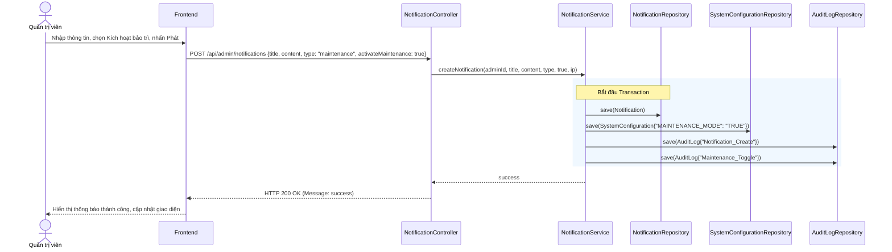

# UC-15 — Quản Trị Hệ Thống (System Administration)

> **Feature:** `feat-admin` | **Phiên bản:** 2.0 | **Trạng thái:** Published
> **Tham chiếu FR:** FR-ADMIN-01 đến FR-ADMIN-09
> **Cập nhật:** 2026-07-16

---

## 1. Tổng Quan

| Thuộc tính | Nội dung |
|:---|:---|
| **Mã Use Case** | UC-15 |
| **Tên** | Quản Trị Hệ Thống (System Administration) |
| **Tác nhân chính** | Quản trị viên (Admin) |
| **Mô tả ngắn** | Admin thực hiện cấu hình các tham số hệ thống như tỷ lệ hoa hồng đơn hàng, phí mở Shop, hạn mức nạp/rút tiền, các cấu hình bảo mật hệ thống chung, quản lý phát hành thông báo hệ thống / bảo trì và kiểm tra vết lịch sử kiểm toán (Audit Logs) để đảm bảo tính minh bạch. |
| **Độ ưu tiên** | Trung bình (P2) — hỗ trợ kiểm soát vận hành vĩ mô và phân tích an ninh |

---

## 2. Tác Nhân & Điều Kiện

### 2.1 Tác Nhân

| Tác nhân | Vai trò |
|:---|:---|
| **Quản trị viên (Admin)** | Đọc/Ghi cấu hình hệ thống, truy xuất dữ liệu nhật ký kiểm toán, quản lý thông báo/bảo trì hệ thống |
| **SystemConfigurationService** | Xử lý logic nghiệp vụ cấu hình hệ thống và chế độ bảo trì |
| **NotificationService** | Lưu trữ và xử lý logic gửi/xóa thông báo chung |
| **AuditLogRepository** | Tự động ghi lại nhật ký cho mọi hành động nhạy cảm của Admin/Staff |

### 2.2 Điều Kiện Tiền Quyết (Preconditions)

- Người dùng đã đăng nhập hệ thống với quyền hạn tài khoản vai trò `Admin`.

### 2.3 Hậu Điều Kiện (Postconditions)

- **Cấu hình thay đổi:** Giá trị cấu hình mới được áp dụng ngay lập tức vào cơ sở dữ liệu `SystemConfigurations`.
- **Thông báo được gửi:** Thông báo broadcast được lưu vào DB và hiển thị trên chuông của người dùng.
- **Ghi nhật ký:** Hành động thay đổi của Admin được ghi nhận vào `AuditLogs` kèm sự khác biệt chi tiết (diff).

---

## 3. Luồng Xử Lý

### 3.1 Luồng Chính — Thay Đổi Cấu Hình Phí & Hoa Hồng (Happy Path)

```
Bước 1  [Admin]:      Truy cập Admin Dashboard, chọn "Cấu hình tham số phí & hoa hồng"
Bước 2  [Frontend]:   GET /api/admin/system-config
Bước 3  [Backend]:    Truy vấn bảng SystemConfigurations lấy các cấu hình hiện tại
                       Trả về thông tin chi tiết (Default commission percent, Withdrawal fee percent, Shop opening fee, Min/Max limits)
Bước 4  [Admin]:      Thay đổi giá trị phí rút tiền (WITHDRAWAL_FEE_PERCENT) thành 2% và bấm "Lưu"
Bước 5  [Frontend]:   PUT /api/admin/system-config/commissions { "withdrawalPercent": 2.0, "basePercent": 5.0, "shopOpeningFee": 50000, ... }
Bước 6  [Backend]:    Validate: Các tham số trong khoảng cho phép (ví dụ: phí phần trăm từ 0% đến 100%)
                       @Transactional:
                         - Cập nhật giá trị mới của key "WITHDRAWAL_FEE_PERCENT" và các key khác vào bảng SystemConfigurations
                         - Gọi ghi nhận hành động Audit Log với action "Config_Update" và payload JSON diff
                       Trả về: status = 200, message = "Đã cập nhật cấu hình phí & hoa hồng thành công."
Bước 7  [Frontend]:   Hiển thị thông báo cập nhật cấu hình thành công
```

### 3.2 Luồng Phát Hành Thông Báo Hệ Thống & Kích Hoạt Bảo Trì (Broadcast Notification)

```
Bước 1  [Admin]:      Truy cập Admin Dashboard, chọn phần "Quản lý Thông báo"
Bước 2  [Admin]:      Nhập tiêu đề "Bảo trì nâng cấp", nội dung chi tiết, chọn loại "maintenance" và tick vào "Kích hoạt chế độ bảo trì"
Bước 3  [Frontend]:   POST /api/admin/notifications
                       Request Payload: { "title": "Bảo trì nâng cấp", "content": "Bảo trì hệ thống...", "type": "maintenance", "activateMaintenance": true }
Bước 4  [Backend]:    Validate thông tin không rỗng
                       @Transactional:
                         - Lưu bản ghi vào bảng Notifications
                         - Cập nhật MAINTENANCE_MODE = "TRUE" trong SystemConfigurations
                         - Lưu 2 bản ghi Audit Log: "Notification_Create" và "Maintenance_Toggle"
                       Trả về: status = 200, message = "Phát thông báo thành công."
Bước 5  [Frontend]:   Hiển thị thông báo phát hành thành công và hiển thị trạng thái bảo trì đang bật.
```

### 3.3 Luồng Xem Nhật Ký Kiểm Toán (Audit Logs)

```
Bước 1  [Admin]:      Chọn mục "Nhật ký kiểm toán (Audit Logs)"
Bước 2  [Frontend]:   GET /api/admin/audit-logs?search=&action=&page=0&size=20
Bước 3  [Backend]:    Truy vấn phân trang bảng AuditLogs theo các từ khóa tìm kiếm (search, action)
                       Trả về danh sách lịch sử hành động hệ thống dạng Page DTO
Bước 4  [Admin]:      Xem thông tin chi tiết log hoặc lọc theo hành động nhạy cảm để giám sát
```

---

## 4. Quy Tắc Nghiệp Vụ

| Mã | Quy tắc | Chi tiết |
|:---|:---|:---|
| BR-15-01 | Kiểm toán bắt buộc | Mọi hành động ghi cấu hình của Admin bắt buộc phải được ghi lại nhật ký kiểm toán trong DB dưới dạng JSON mô tả sự thay đổi (diff) |
| BR-15-02 | Phân quyền Admin | Chỉ những tài khoản có vai trò `Admin` mới được phép gọi các API cấu hình hệ thống và xem Audit Logs. Đối với việc quản lý thông báo, tài khoản có vai trò `Staff` cũng có thể được phân quyền thực hiện |

---

## 5. Quy Tắc Kiểm Tra Đầu Vào

### PUT /api/admin/system-config/commissions

| Trường | Kiểm tra | Lỗi khi vi phạm |
|:---|:---|:---|
| `basePercent` | Bắt buộc, số thực, nằm trong tầm [0.0 - 100.0] | "Hoa hồng C2C phải nằm trong khoảng từ 0% đến 100%." |
| `withdrawalPercent` | Bắt buộc, số thực, nằm trong tầm [0.0 - 100.0] | "Phí rút tiền phải nằm trong khoảng từ 0% đến 100%." |
| `shopOpeningFee` | Bắt buộc, số nguyên lớn >= 0 | "Phí mở shop không được nhỏ hơn 0 VNĐ." |

### POST /api/admin/notifications

| Trường | Kiểm tra | Lỗi khi vi phạm |
|:---|:---|:---|
| `title` | Bắt buộc, không trống, không khoảng trắng | "Tiêu đề không được để trống." |
| `content` | Bắt buộc, không trống, không khoảng trắng | "Nội dung không được để trống." |

---

## 6. Sơ Đồ Tuần Tự (Sequence Diagram)

### Luồng Phát Hành Thông Báo và Kích Hoạt Bảo Trì



---

## 7. Tham Chiếu API

| Phương thức | Endpoint | Mô tả |
|:---|:---|:---|
| `GET` | `/api/admin/system-config` | Xem danh sách các cấu hình hệ thống & biểu phí |
| `PUT` | `/api/admin/system-config/general` | Cập nhật cấu hình hệ thống chung |
| `PUT` | `/api/admin/system-config/commissions` | Cập nhật cấu hình phí & hoa hồng, hạn mức giao dịch |
| `GET` | `/api/admin/audit-logs` | Xem danh sách nhật ký kiểm toán hệ thống |
| `GET` | `/api/admin/audit-logs/export` | Xuất file CSV nhật ký kiểm toán |
| `POST` | `/api/admin/notifications` | Phát hành thông báo hệ thống / bảo trì |
| `POST` | `/api/admin/notifications/toggle-maintenance` | Bật/Tắt thủ công trạng thái bảo trì |
| `DELETE` | `/api/admin/notifications/{id}` | Xóa mềm thông báo hệ thống đã phát |

---

## 8. Tiêu Chí Chấp Nhận (Acceptance Criteria)

### AC-15-01 — Cập nhật cấu hình thành công và ghi nhật ký kiểm toán
- **Cho trước:** Phí rút tiền hiện tại đang cấu hình là 1.5%
- **Khi:** Admin thực hiện cập nhật phí rút tiền lên thành 2.0%
- **Thì:**
  - Bảng `SystemConfigurations` lưu phí rút tiền mới là 2.0
  - Hệ thống tự động chèn 1 bản ghi vào bảng `AuditLogs` ghi nhận hành động `Config_Update` kèm thông tin chi tiết Admin thực hiện và IP.

### AC-15-02 — Phát thông báo bảo trì thành công
- **Cho trước:** Admin ở giao diện quản lý thông báo.
- **Khi:** Admin gửi thông báo bảo trì và chọn "Kích hoạt chế độ bảo trì".
- **Thì:**
  - Một bản ghi `Notification` loại `maintenance` được tạo.
  - Chế độ bảo trì `MAINTENANCE_MODE` được đặt thành `TRUE`.
  - Hai bản ghi nhật ký kiểm toán được tạo.
