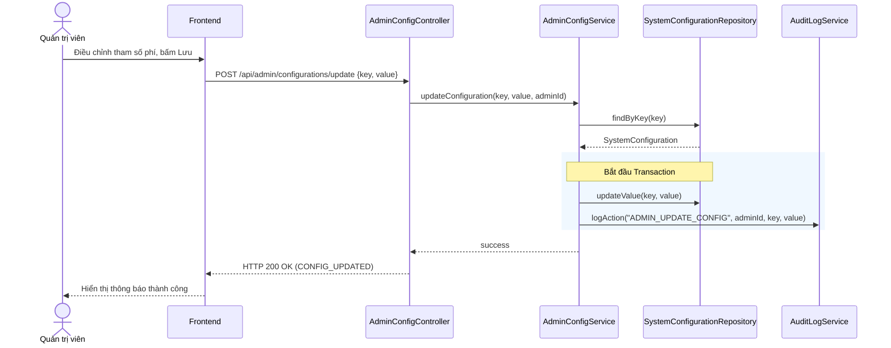

# UC-15 — Quản Trị Hệ Thống (System Administration)

> **Feature:** `feat-admin` | **Phiên bản:** 1.0 | **Trạng thái:** Published
> **Tham chiếu FR:** FR-ADM-01 đến FR-ADM-15
> **Cập nhật:** 2026-06-30

---

## 1. Tổng Quan

| Thuộc tính | Nội dung |
|:---|:---|
| **Mã Use Case** | UC-15 |
| **Tên** | Quản Trị Hệ Thống (System Administration) |
| **Tác nhân chính** | Quản trị viên (Admin) |
| **Mô tả ngắn** | Admin thực hiện cấu hình các tham số hệ thống như tỷ lệ hoa hồng đơn hàng, kích hoạt/vô hiệu hóa 2FA khi rút tiền, kiểm tra vết lịch sử kiểm toán của hệ thống (Audit Logs) để tăng tính minh bạch bảo mật. |
| **Độ ưu tiên** | Trung bình (P2) — hỗ trợ kiểm soát vận hành vĩ mô và phân tích an ninh |

---

## 2. Tác Nhân & Điều Kiện

### 2.1 Tác Nhân

| Tác nhân | Vai trò |
|:---|:---|
| **Quản trị viên (Admin)** | Đọc/Ghi cấu hình hệ thống, truy xuất dữ liệu nhật ký kiểm toán |
| **AuditLogService** | Tự động ghi lại nhật ký cho mọi hành động nhạy cảm trong hệ thống |

### 2.2 Điều Kiện Tiền Quyết (Preconditions)

- Người dùng đã đăng nhập hệ thống với quyền hạn tài khoản vai trò `ADMIN`.

### 2.3 Hậu Điều Kiện (Postconditions)

- **Cấu hình thay đổi:** Giá trị cấu hình mới được áp dụng ngay lập tức vào cơ sở dữ liệu `SystemConfigurations`.
- **Ghi nhật ký:** Hành động thay đổi của Admin được ghi nhận vào `AuditLogs`.

---

## 3. Luồng Xử Lý

### 3.1 Luồng Chính — Thay Đổi Cấu Hình Hệ Thống (Happy Path)

```
Bước 1  [Admin]:      Truy cập Admin Dashboard, chọn "Cấu hình tham số"
Bước 2  [Frontend]:   GET /api/admin/configurations
Bước 3  [Backend]:    Truy vấn bảng SystemConfigurations lấy các cấu hình hiện tại
                       Trả về danh sách tham số cấu hình hệ thống
Bước 4  [Admin]:      Thay đổi giá trị phí hoa hồng rút tiền (WITHDRAWAL_FEE_PERCENT) thành 2% và bấm "Lưu"
Bước 5  [Frontend]:   POST /api/admin/configurations/update { "key": "WITHDRAWAL_FEE_PERCENT", "value": "2" }
Bước 6  [Backend]:    Validate: key tồn tại trong hệ thống, value hợp lệ (0 <= value <= 100)
                       @Transactional:
                         - Cập nhật giá trị mới vào bảng SystemConfigurations
                         - Gọi AuditLogService ghi nhận hành động: ADMIN_UPDATE_CONFIG
                       Trả về: status = 200, message = "CONFIG_UPDATED"
Bước 7  [Frontend]:   Hiển thị thông báo cập nhật cấu hình thành công
```

### 3.2 Luồng Xem Nhật Ký Kiểm Toán (Audit Logs)

```
Bước 1  [Admin]:      Chọn mục "Nhật ký kiểm toán (Audit Logs)"
Bước 2  [Frontend]:   GET /api/admin/audit-logs?page=0&size=20
Bước 3  [Backend]:    Truy vấn phân trang bảng AuditLogs
                       Trả về danh sách lịch sử hành động hệ thống
Bước 4  [Admin]:      Lọc theo từ khóa hành động "EXAM_SUBMITTED" hoặc "WITHDRAW_APPROVED" để giám sát
```

---

## 4. Quy Tắc Nghiệp Vụ

| Mã | Quy tắc | Chi tiết |
|:---|:---|:---|
| BR-15-01 | Kiểm toán bắt buộc | Mọi hành động ghi cấu hình của Admin bắt buộc phải được ghi lại nhật ký kiểm toán trong DB |
| BR-15-02 | Phân quyền Admin | Chỉ những tài khoản có vai trò `ADMIN` mới được phép gọi các API cấu hình hệ thống và xem Audit Logs |

---

## 5. Quy Tắc Kiểm Tra Đầu Vào

### POST /api/admin/configurations/update

| Trường | Kiểm tra | Lỗi khi vi phạm |
|:---|:---|:---|
| `key` | Bắt buộc, phải tồn tại trong DB | "Cấu hình không tồn tại" |
| `value` | Bắt buộc, định dạng hợp lệ tùy theo key | "Giá trị cấu hình không hợp lệ" |

---

## 6. Sơ Đồ Tuần Tự (Sequence Diagram)

### Luồng Cập Nhật Cấu Hình Hệ Thống



---

## 7. Tham Chiếu API

| Phương thức | Endpoint | Mô tả |
|:---|:---|:---|
| `GET` | `/api/admin/configurations` | Xem danh sách các cấu hình |
| `POST` | `/api/admin/configurations/update` | Cập nhật giá trị cấu hình |
| `GET` | `/api/admin/audit-logs` | Xem danh sách nhật ký kiểm toán |

---

## 8. Tiêu Chí Chấp Nhận (Acceptance Criteria)

### AC-15-01 — Cập nhật cấu hình thành công và ghi nhật ký kiểm toán

- **Cho trước:** Phí rút tiền hiện tại đang cấu hình là 1%
- **Khi:** Admin thực hiện cập nhật phí rút tiền lên thành 2%
- **Thì:**
  - Bảng `SystemConfigurations` lưu phí rút tiền mới là 2%
  - Hệ thống tự động chèn 1 bản ghi vào bảng `AuditLogs` ghi nhận hành động cập nhật kèm thông tin Admin.

---

## 9. Ngoài Phạm Vi (Out of Scope)

- ❌ Tự động sao lưu (Backup) cơ sở dữ liệu lên dịch vụ đám mây AWS S3 hàng ngày.
- ❌ Hỗ trợ phục hồi (Restore) cơ sở dữ liệu trực tiếp từ giao diện Admin.
