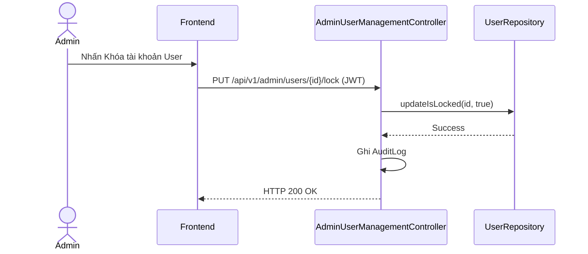

# UC-28 — Quản Lý Người Dùng & Khóa Tài Khoản (Manage Users & Lock Account)

> **Feature:** `feat-admin` | **Phiên bản:** 2.0 | **Trạng thái:** Published
> **Tham chiếu FR:** FR-ADMIN-01 đến FR-ADMIN-12
> **Cập nhật:** 2026-07-24

---

## 1. Tổng Quan

| Thuộc tính | Nội dung |
|:---|:---|
| **Mã Use Case** | UC-28 |
| **Tên** | Quản Lý Người Dùng & Khóa Tài Khoản (Manage Users & Lock Account) |
| **Tác nhân chính** | Quản trị viên (Admin) |
| **Mô tả ngắn** | Admin quản lý danh sách tài khoản người dùng, thực hiện khóa hoặc mở khóa tài khoản vi phạm. |
| **Độ ưu tiên** | Cao (P0) |

---

## 2. Tác Nhân & Điều Kiện

### 2.1 Tác Nhân
| Tác nhân | Vai trò |
|:---|:---|
| **Quản trị viên (Admin)** | Tác nhân chính thực hiện nghiệp vụ của hệ thống. |

### 2.2 Điều Kiện Tiền Quyết (Preconditions)
- Tài khoản Admin đã được xác thực (ROLE_ADMIN).

### 2.3 Hậu Điều Kiện (Postconditions)
- **Thành công:** Cờ isLocked của User được cập nhật, chặn đăng nhập tức thời.
- **Thất bại:** Trạng thái database không đổi, hệ thống trả về mã lỗi chi tiết.

---

## 3. Luồng Xử Lý (Sequence Steps)

### 3.1 Luồng Chính (Happy Path)
Bước 1 [Admin]:      Vào Admin Panel -> Quản lý người dùng.
Bước 2 [Frontend]:   Gửi yêu cầu GET /api/v1/admin/users.
Bước 3 [Backend]:    AdminUserManagementController truy vấn bảng Users phân trang.
Bước 4 [Admin]:      Chọn tài khoản vi phạm, bấm "Khóa tài khoản" và nhập lý do.
...
Bước 5 [Frontend]:   Gửi yêu cầu PUT /api/v1/admin/users/{id}/lock.
Bước 6 [Backend]:    Cập nhật cờ isLocked = 1. Ghi AuditLog lý do khóa tài khoản.
Bước 7 [Backend]:    Trả về HTTP 200 OK.

### 3.2 Luồng Lỗi (Error Path)
| Tình huống | HTTP | Error Code | Xử lý |
|:---|:---:|:---|:---|
| Khóa tài khoản Admin khác | 403 | `FORBIDDEN` | Từ chối không cho phép khóa tài khoản Admin |

---

## 4. Quy Tắc Nghiệp Vụ (Business Rules)

| Mã | Quy tắc | Chi tiết |
|:---|:---|:---|
| BR-28-01 | Lưu vết kiểm toán | Mọi hành động khóa/mở khóa tài khoản phải ghi nhận đầy đủ lý do vào AuditLogs |

---

## 5. Quy Tắc Kiểm Tra Đầu Vào

| Trường | Kiểm tra | Thông báo lỗi nếu sai |
|:---|:---|:---|
| `reason` | Bắt buộc, chuỗi từ 5-255 ký tự | "Lý do khóa tài khoản phải từ 5 đến 255 ký tự" |

---

## 6. Sơ Đồ Tuần Tự (Sequence Diagram)

---

## 7. Tham Chiếu API

| Phương thức | Endpoint | Mô tả |
|:---|:---|:---|
| GET | `/api/v1/admin/users` | Lấy danh sách người dùng |
| PUT | `/api/v1/admin/users/{id}/lock` | Khóa/Mở khóa tài khoản người dùng |

---

## 8. Tiêu Chỉ Chấp Nhận (Acceptance Criteria)

### AC-28-01 — Khóa tài khoản người dùng vi phạm
> **Tham chiếu:** FR-ADM-01
- **Cho trước:** Tài khoản hoạt động bình thường (isLocked = 0).
- **Khi:** Admin thực hiện khóa tài khoản.
- **Thì:** Cờ isLocked cập nhật thành 1 và ghi nhận vào AuditLogs.

---

## 9. Ngoài Phạm Vi (Out of Scope)
- ❌ Tự động xóa vĩnh viễn tài khoản người dùng khỏi DB.

---

## 10. Danh Sách SRS Use Cases Hạt Nhân Trực Thuộc (SRS Mapping)

| SRS UC ID | Tên Use Case SRS | Feature Module | Mô Tả Chức Năng Chi Tiết |
|:---|:---|:---|:---|
| **UC 28** | Manage Users & Lock Account | feat-admin | Admin quản lý danh sách tài khoản người dùng, thực hiện khóa hoặc mở khóa tài khoản vi phạm. |
