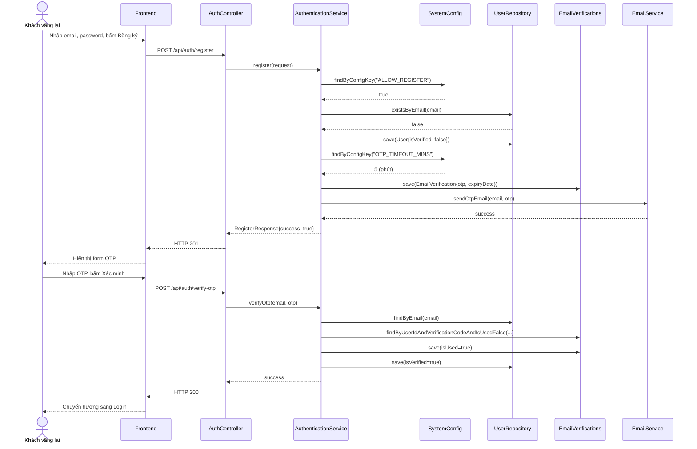
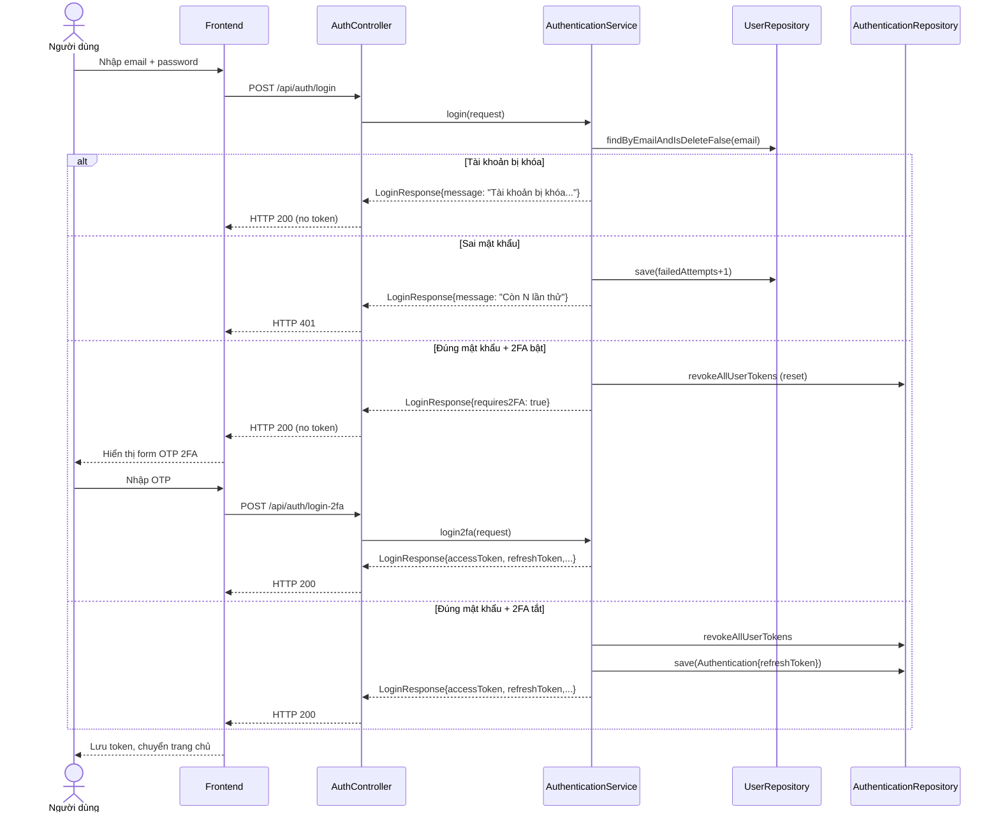

# UC-01 — Đăng Nhập & Đăng Ký (Authentication)

> **Feature:** `feat-auth` | **Trạng thái:** Published
> **Tham chiếu FR:** FR-AUTH-01 đến FR-AUTH-20

---

## 1. Tổng Quan

| Thuộc tính | Nội dung |
|:---|:---|
| **Mã Use Case** | UC-01 |
| **Tên** | Đăng Nhập & Đăng Ký (Authentication) |
| **Tác nhân chính** | Khách vãng lai (Guest), Người dùng (User) |
| **Mô tả ngắn** | Quản lý vòng đời xác thực của người dùng bao gồm: đăng ký tài khoản mới có xác thực OTP qua Email, đăng nhập bằng mật khẩu hoặc Google OAuth2, đăng nhập 2 bước (2FA), cấp phát và làm mới JWT Token theo cơ chế Token Rotation, khóa tài khoản sau nhiều lần đăng nhập sai, đăng xuất, và cấp lại mật khẩu khi quên. |
| **Độ ưu tiên** | Cao (P0) — cốt lõi bảo mật của toàn hệ thống |

---

## 2. Tác Nhân & Điều Kiện

### 2.1 Tác Nhân

| Tác nhân | Vai trò |
|:---|:---|
| **Khách vãng lai (Guest)** | Điền thông tin đăng ký, yêu cầu cấp lại mật khẩu |
| **Người dùng (User)** | Thực hiện đăng nhập bằng tài khoản hoạt động |
| **EmailService** | Gửi OTP qua email cho người dùng để xác thực |
| **Google OAuth2 Service** | Xác thực danh tính người dùng qua tài khoản Google |
| **SystemConfiguration** | Cung cấp tham số vận hành: `ALLOW_REGISTER`, `ALLOW_GOOGLE_LOGIN`, `OTP_TIMEOUT_MINS`, `MAX_LOGIN_RETRIES`, `LOCK_DURATION_MINS` |

### 2.2 Điều Kiện Tiền Quyết (Preconditions)

- Người dùng chưa đăng nhập hệ thống (đối với đăng ký/đăng nhập).
- Email đăng ký chưa tồn tại trong DB (dù tài khoản đó đã được kích hoạt hay chưa).

### 2.3 Hậu Điều Kiện (Postconditions)

- **Đăng ký:** Tạo bản ghi mới trong bảng `Users` với `isVerified = false`, gửi OTP thành công qua email.
- **Xác thực OTP:** Tài khoản chuyển sang trạng thái `isVerified = true`.
- **Đăng nhập thường:** Cấp `accessToken` (JWT) và `refreshToken`; lưu `refreshToken` vào bảng `Authentications` phía server.
- **Đăng nhập 2FA:** Gửi OTP đến email; trả về `requires2FA = true`; chưa cấp token.
- **Đăng nhập Google:** Tạo tài khoản mới nếu email chưa tồn tại, sau đó cấp token như đăng nhập thường.
- **Logout:** `refreshToken` bị đánh dấu `isRevoked = true` trong bảng `Authentications`.
- **Refresh Token:** Token cũ bị thu hồi, cấp cặp token mới (Token Rotation).

---

## 3. Luồng Xử Lý

### 3.1 Luồng Chính — Đăng Ký & Xác Thực OTP (Happy Path)

```
Bước 1  [Guest]:      Truy cập trang đăng ký, nhập Email, Mật khẩu (và các trường tùy chọn: fullName, phone), bấm "Đăng ký"
Bước 2  [Frontend]:   POST /api/auth/register { email, password, fullName?, phone?, role? }
Bước 3  [Backend]:    Check SystemConfig: ALLOW_REGISTER phải = true
                       Validate: email đúng định dạng, mật khẩu tối thiểu 6 ký tự
                       Check email trùng lặp trong DB → nếu tồn tại thì trả lỗi 400
                       Tạo tài khoản mới với isVerified = false, role mặc định = "Customer"
                       Tạo mã OTP (6 chữ số ngẫu nhiên), lưu vào bảng EmailVerifications
                         với expiryDate = now + OTP_TIMEOUT_MINS (từ SystemConfig, mặc định 5 phút)
                       Gọi EmailService gửi mã OTP về email của người dùng
                       Trả về: HTTP 201, { success: true, userId, email, fullName, message }
Bước 4  [Frontend]:   Điều hướng sang trang nhập mã OTP
Bước 5  [Guest]:      Nhập mã OTP từ email và nhấn "Xác minh"
Bước 6  [Frontend]:   POST /api/auth/verify-otp { email, otp }
Bước 7  [Backend]:    Tìm user theo email
                       Tìm bản ghi EmailVerification theo userId + otp + isUsed = false
                       Kiểm tra OTP chưa hết hạn (expiryDate > now)
                       Đánh dấu OTP đã dùng: isUsed = true
                       Cập nhật Users.isVerified = true
                       Trả về: HTTP 200, { success: true, message: "Xác thực tài khoản thành công" }
Bước 8  [Frontend]:   Chuyển hướng sang trang đăng nhập kèm thông báo kích hoạt thành công
```

### 3.2 Luồng Đăng Nhập (Standard)

```
Bước 1  [User]:       Nhập Email và Mật khẩu, bấm "Đăng nhập"
Bước 2  [Frontend]:   POST /api/auth/login { email, password }
Bước 3  [Backend]:    Tìm user theo email (isDelete = false)
                       → Không tìm thấy: trả về 401 "Email hoặc mật khẩu không chính xác"

                       Kiểm tra isLocked:
                         - isLocked = true + lockTime chưa hết → trả về 200 kèm thông báo khóa tạm thời
                         - isLocked = true + lockTime đã qua → tự động mở khóa (isLocked = false, failedAttempts = 0)
                         - isLocked = true + lockTime = null → khóa vĩnh viễn bởi Admin → trả về lỗi

                       Kiểm tra khớp mật khẩu (BCrypt):
                         - Sai: tăng failedAttempts + 1
                           + Nếu >= MAX_LOGIN_RETRIES → khóa tài khoản LOCK_DURATION_MINS phút
                           + Nếu < MAX_LOGIN_RETRIES → trả về số lần thử còn lại

                       Kiểm tra isVerified = true → nếu false: yêu cầu xác thực OTP trước

                       Đăng nhập thành công → reset failedAttempts = 0, lockTime = null

                       Nếu is2faEnabled = true:
                         → Tạo OTP mới, lưu EmailVerifications, gửi email
                         → Trả về: { requires2FA: true, message: "Vui lòng nhập mã OTP" }
                         → DỪNG, không cấp token

                       Thu hồi toàn bộ token cũ của user (revokeAllUserTokens)
                       Tạo accessToken + refreshToken (JWT)
                       Lưu refreshToken vào bảng Authentications (provider = "System")
                       Trả về: HTTP 200, { accessToken, refreshToken, userId, email, fullName, role, balanceVnd }
Bước 4  [Frontend]:   Lưu token, chuyển hướng về trang chủ theo role
```

### 3.3 Luồng Đăng Nhập 2FA (Bước 2)

```
Bước 1  [User]:       Nhập mã OTP nhận được qua email
Bước 2  [Frontend]:   POST /api/auth/login-2fa { email, password, otp }
Bước 3  [Backend]:    Xác thực lại email + password (BCrypt)
                       Kiểm tra isLocked và isVerified
                       Tìm OTP trong EmailVerifications (isUsed = false, chưa hết hạn)
                       Đánh dấu OTP isUsed = true
                       Thu hồi token cũ, tạo cặp token mới, lưu vào Authentications
                       Trả về: HTTP 200, { accessToken, refreshToken, userId, email, fullName, role, balanceVnd }
Bước 4  [Frontend]:   Lưu token, chuyển hướng về trang chủ
```

### 3.4 Luồng Đăng Nhập Google OAuth2

```
Bước 1  [User]:       Bấm "Đăng nhập bằng Google", hoàn thành Google Consent
Bước 2  [Frontend]:   POST /api/auth/google { code } (Authorization Code từ Google)
Bước 3  [Backend]:    Check SystemConfig: ALLOW_GOOGLE_LOGIN phải = true
                       Đổi code lấy id_token từ Google OAuth2 API
                       Decode id_token (JWT), lấy email và fullName
                       Tìm user theo email (isDelete = false):
                         - Chưa có: tạo tài khoản mới (isVerified = true, role = "Customer")
                         - Đã có + isLocked: trả lỗi "Tài khoản bị khóa"
                         - Đã có + bình thường: đăng nhập bình thường
                       Thu hồi token cũ, tạo cặp token mới (provider = "Google")
                       Trả về: HTTP 200, { accessToken, refreshToken, userId, email, fullName, role, balanceVnd }
Bước 4  [Frontend]:   Lưu token, chuyển hướng về trang chủ
```

### 3.5 Luồng Gửi Lại OTP

```
Bước 1  [User]:       Bấm "Gửi lại OTP" trên trang xác thực
Bước 2  [Frontend]:   POST /api/auth/resend-otp { email }
Bước 3  [Backend]:    Tìm user theo email
                       Tạo mã OTP mới, lưu vào EmailVerifications (isUsed = false)
                       Gửi email OTP mới
                       Trả về: HTTP 200, { success: true, message }
```

### 3.6 Luồng Quên Mật Khẩu

```
BƯỚC 1 — Yêu cầu mã OTP:
  [User]:      Bấm "Quên mật khẩu", nhập Email đăng ký
  [Frontend]:  POST /api/auth/forgot-password { email }
  [Backend]:   Tìm user theo email → không tìm thấy: throw lỗi
               Tạo OTP mới, lưu EmailVerifications
               Gửi email OTP dạng "Khôi phục mật khẩu"
               Trả về: HTTP 200, { success: true, message: "Mã khôi phục đã được gửi" }

BƯỚC 2 — Kiểm tra OTP (không đốt mã):
  [User]:      Nhập mã OTP nhận được
  [Frontend]:  POST /api/auth/check-reset-otp { email, otp }
  [Backend]:   Tìm OTP theo userId + otp (không yêu cầu isUsed = false trong query)
               Kiểm tra thủ công: isUsed = false, expiryDate > now
               Trả về: HTTP 200, { success: true/false }
               ⚠️ TUYỆT ĐỐI không đánh dấu isUsed = true ở bước này

BƯỚC 3 — Đặt mật khẩu mới:
  [User]:      Nhập mật khẩu mới
  [Frontend]:  POST /api/auth/reset-password { email, otp, newPassword }
  [Backend]:   Tìm user và OTP, kiểm tra lại isUsed và expiryDate
               Mã hóa mật khẩu mới bằng BCrypt, lưu vào Users
               Đánh dấu OTP isUsed = true (đốt mã chính thức)
               Trả về: HTTP 200, { success: true, message: "Đổi mật khẩu thành công" }
```

### 3.7 Luồng Đăng Xuất

```
Bước 1  [User]:       Bấm "Đăng xuất"
Bước 2  [Frontend]:   POST /api/auth/logout { refreshToken }
Bước 3  [Backend]:    Tìm bản ghi Authentications theo refreshToken
                       → Không tìm thấy: trả về 400 "Refresh token không hợp lệ"
                       Đánh dấu isRevoked = true
                       Trả về: HTTP 200, { success: true, message: "Đăng xuất thành công" }
Bước 4  [Frontend]:   Xóa token khỏi storage, redirect về trang login
```

### 3.8 Luồng Làm Mới Token (Refresh)

```
Bước 1  [Frontend]:   Phát hiện accessToken hết hạn
Bước 2  [Frontend]:   POST /api/auth/refresh { refreshToken }
Bước 3  [Backend]:    Tìm Authentications theo refreshToken
                       → Không tìm thấy hoặc isRevoked = true: trả về 401
                       Kiểm tra refreshTokenExpiryDate chưa hết hạn
                       Validate JWT signature và xác nhận là refreshToken (không phải accessToken)
                       Tìm user, kiểm tra isDelete = false và isLocked = false
                       Thu hồi token cũ (isRevoked = true) — Token Rotation
                       Tạo cặp accessToken + refreshToken mới, lưu vào Authentications
                       Trả về: HTTP 200, { accessToken, refreshToken, userId, email, fullName, role, balanceVnd }
```

---

## 4. Quy Tắc Nghiệp Vụ

| Mã | Quy tắc | Chi tiết |
|:---|:---|:---|
| BR-01-01 | Mật khẩu bắt buộc mã hóa | Sử dụng BCrypt trước khi lưu vào DB |
| BR-01-02 | OTP có thời hạn động | Thời gian hết hạn đọc từ `SystemConfigurations.OTP_TIMEOUT_MINS` (mặc định 5 phút nếu không cấu hình) |
| BR-01-03 | Email duy nhất | Không cho phép 2 tài khoản sử dụng chung 1 email (kể cả tài khoản chưa xác thực) |
| BR-01-04 | Kích hoạt tài khoản | Tài khoản `isVerified = false` không thể đăng nhập |
| BR-01-05 | Khóa tài khoản sau sai mật khẩu | Sau `MAX_LOGIN_RETRIES` lần sai liên tiếp, tài khoản bị khóa tạm thời `LOCK_DURATION_MINS` phút |
| BR-01-06 | Tự động mở khóa | Khi `lockTime` đã qua, tài khoản tự động mở khóa tại lần đăng nhập kế tiếp |
| BR-01-07 | Token Rotation | Mỗi lần refresh hoặc đăng nhập mới đều thu hồi toàn bộ token cũ của user |
| BR-01-08 | Kiểm soát đăng ký | Chức năng đăng ký có thể bị tắt qua `SystemConfigurations.ALLOW_REGISTER = false` |
| BR-01-09 | Kiểm soát đăng nhập Google | Google OAuth2 có thể bị tắt qua `SystemConfigurations.ALLOW_GOOGLE_LOGIN = false` |
| BR-01-10 | OTP reset chỉ bị đốt ở bước cuối | Endpoint `check-reset-otp` chỉ validate OTP, không đánh dấu `isUsed = true`; chỉ `reset-password` mới đốt mã |

---

## 5. Quy Tắc Kiểm Tra Đầu Vào

### POST /api/auth/register

| Trường | Kiểm tra | Lỗi khi vi phạm |
|:---|:---|:---|
| `email` | Bắt buộc, đúng định dạng email | "Email không đúng định dạng" |
| `password` | Bắt buộc, tối thiểu 6 ký tự | "Mật khẩu phải từ 6 ký tự trở lên" |
| `fullName` | Không bắt buộc | — |
| `phone` | Không bắt buộc | — |
| `role` | Không bắt buộc, mặc định "Customer" | — |

### POST /api/auth/login

| Trường | Kiểm tra | Lỗi khi vi phạm |
|:---|:---|:---|
| `email` | Bắt buộc, đúng định dạng | "Email không đúng định dạng" |
| `password` | Bắt buộc | "Mật khẩu không được để trống" |

---

## 6. Sơ Đồ Tuần Tự (Sequence Diagram)

### 6.1 Luồng Đăng Ký và Xác Thực OTP



### 6.2 Luồng Đăng Nhập (có 2FA branch)



---

## 7. Tham Chiếu API

| Phương thức | Endpoint | Mô tả | Auth Required |
|:---|:---|:---|:---|
| `POST` | `/api/auth/register` | Đăng ký tài khoản mới | ❌ |
| `POST` | `/api/auth/verify-otp` | Xác thực tài khoản bằng OTP đăng ký | ❌ |
| `POST` | `/api/auth/resend-otp` | Gửi lại mã OTP (tạo mã mới) | ❌ |
| `POST` | `/api/auth/login` | Đăng nhập nhận JWT Token | ❌ |
| `POST` | `/api/auth/login-2fa` | Đăng nhập bước 2 (xác thực 2FA OTP) | ❌ |
| `POST` | `/api/auth/google` | Đăng nhập bằng Google OAuth2 | ❌ |
| `POST` | `/api/auth/logout` | Đăng xuất (thu hồi refresh token) | ✅ |
| `POST` | `/api/auth/refresh` | Làm mới access token (Token Rotation) | ❌ |
| `POST` | `/api/auth/forgot-password` | Yêu cầu OTP khôi phục mật khẩu | ❌ |
| `POST` | `/api/auth/check-reset-otp` | Kiểm tra OTP khôi phục (không đốt mã) | ❌ |
| `POST` | `/api/auth/reset-password` | Đặt mật khẩu mới (đốt mã OTP) | ❌ |

---

## 8. Tiêu Chí Chấp Nhận (Acceptance Criteria)

### AC-01-01 — Đăng ký email trùng lặp bị từ chối

- **Cho trước:** Đã tồn tại tài khoản `test@example.com` trong hệ thống
- **Khi:** Gửi yêu cầu POST `/api/auth/register` với email `test@example.com`
- **Thì:** Hệ thống trả về lỗi HTTP 400 kèm thông điệp "Email này đã được đăng ký"

### AC-01-02 — Khóa tài khoản sau nhiều lần sai mật khẩu

- **Cho trước:** `MAX_LOGIN_RETRIES = 5`, tài khoản chưa bị khóa
- **Khi:** Đăng nhập sai mật khẩu 5 lần liên tiếp
- **Thì:** Tài khoản bị khóa tạm thời, response trả về thời điểm mở khóa

### AC-01-03 — Đăng nhập bị chặn khi chưa xác thực OTP

- **Cho trước:** Tài khoản `isVerified = false`
- **Khi:** Gửi POST `/api/auth/login` với email + password đúng
- **Thì:** Hệ thống trả về lỗi "Vui lòng xác thực email (OTP) trước khi đăng nhập"

### AC-01-04 — Google login tạo tài khoản mới tự động

- **Cho trước:** Email Google chưa tồn tại trong hệ thống
- **Khi:** Đăng nhập thành công qua Google OAuth2
- **Thì:** Tài khoản mới được tạo với `isVerified = true`, role = "Customer"

---

## 9. Ngoài Phạm Vi (Out of Scope)

- ❌ Liên kết tài khoản Facebook, Apple ID.
- ❌ Đăng nhập bằng vân tay/FaceID trên ứng dụng di động.
