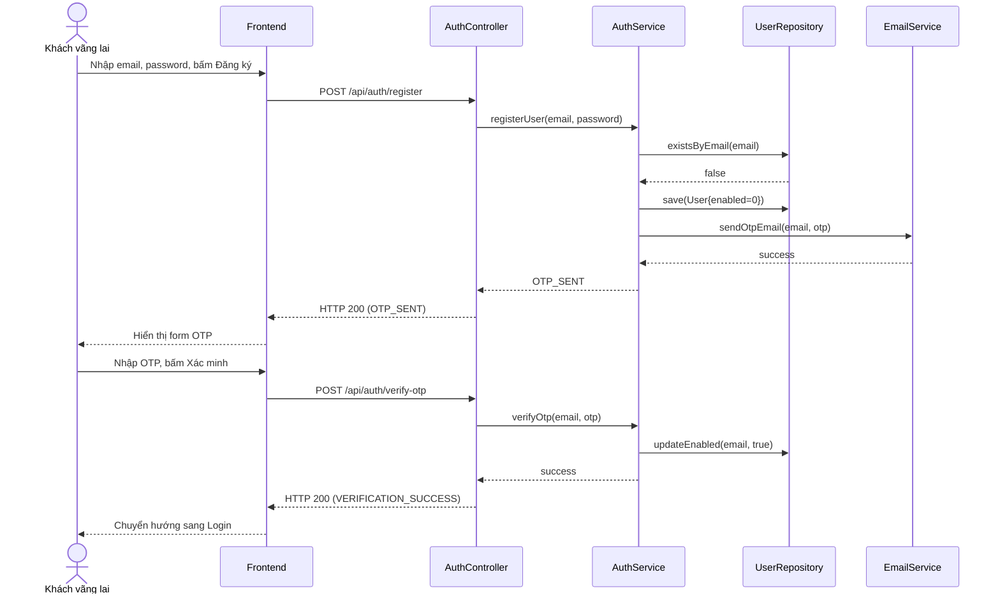

# UC-01 — Đăng Nhập & Đăng Ký (Authentication)

> **Feature:** `feat-auth` | **Phiên bản:** 1.0 | **Trạng thái:** Published
> **Tham chiếu FR:** FR-AUTH-01 đến FR-AUTH-15
> **Cập nhật:** 2026-06-30

---

## 1. Tổng Quan

| Thuộc tính | Nội dung |
|:---|:---|
| **Mã Use Case** | UC-01 |
| **Tên** | Đăng Nhập & Đăng Ký (Authentication) |
| **Tác nhân chính** | Khách vãng lai (Guest), Người dùng (User) |
| **Mô tả ngắn** | Quản lý vòng đời xác thực của người dùng bao gồm đăng ký tài khoản mới, xác thực qua mã OTP được gửi tới Email, đăng nhập hệ thống bảo mật bằng JWT và xử lý cấp lại mật khẩu khi quên. |
| **Độ ưu tiên** | Cao (P0) — cốt lõi bảo mật của toàn hệ thống |

---

## 2. Tác Nhân & Điều Kiện

### 2.1 Tác Nhân

| Tác nhân | Vai trò |
|:---|:---|
| **Khách vãng lai (Guest)** | Điền thông tin đăng ký, yêu cầu cấp lại mật khẩu |
| **Người dùng (User)** | Thực hiện đăng nhập bằng tài khoản hoạt động |
| **EmailService** | Gửi OTP qua email cho người dùng để xác thực |

### 2.2 Điều Kiện Tiền Quyết (Preconditions)

- Người dùng chưa đăng nhập hệ thống (đối với đăng ký/đăng nhập).
- Email đăng ký chưa tồn tại hoặc tài khoản chưa được kích hoạt (`enabled = 0`).

### 2.3 Hậu Điều Kiện (Postconditions)

- **Đăng ký:** Tạo bản ghi mới trong bảng `Users` với `enabled = 0`, gửi OTP thành công.
- **Xác thực OTP:** Tài khoản chuyển sang trạng thái `enabled = 1`.
- **Đăng nhập:** Cấp JWT Token lưu vào Client cookie/local storage.

---

## 3. Luồng Xử Lý

### 3.1 Luồng Chính — Đăng Ký & Xác Thực OTP (Happy Path)

```
Bước 1  [Guest]:      Truy cập trang đăng ký, nhập Email và Mật khẩu hợp lệ, bấm "Đăng ký"
Bước 2  [Frontend]:   POST /api/auth/register { email, password }
Bước 3  [Backend]:    Validate: email đúng định dạng, mật khẩu tối thiểu 6 ký tự
                       Check email trùng lặp trong DB
                       Tạo tài khoản mới với enabled = 0
                       Tạo mã OTP (6 số), lưu vào DB/Cache với thời gian hết hạn (5 phút)
                       Gọi EmailService gửi mã OTP về email của người dùng
                       Trả về: status = 200, message = "OTP_SENT"
Bước 4  [Frontend]:   Điều hướng sang trang nhập mã OTP
Bước 5  [Guest]:      Nhập mã OTP từ email và nhấn "Xác minh"
Bước 6  [Frontend]:   POST /api/auth/verify-otp { email, otpCode }
Bước 7  [Backend]:    Validate OTP khớp và chưa hết hạn
                       Cập nhật Users.enabled = 1 trong DB
                       Trả về: status = 200, message = "VERIFICATION_SUCCESS"
Bước 8  [Frontend]:   Chuyển hướng sang trang đăng nhập kèm thông báo kích hoạt thành công
```

### 3.2 Luồng Đăng Nhập

```
Bước 1  [Guest]:      Nhập Email và Mật khẩu, bấm "Đăng nhập"
Bước 2  [Frontend]:   POST /api/auth/login { email, password }
Bước 3  [Backend]:    Validate tài khoản tồn tại và enabled = 1
                       Kiểm tra khớp mật khẩu sử dụng BCrypt
                       Tạo JWT Token chứa thông tin userId, email, roles
                       Trả về: status = 200, token, userDetails
Bước 4  [Frontend]:   Lưu token vào Cookie/LocalStorage, chuyển hướng về trang chủ
```

### 3.3 Luồng Phụ A — Quên Mật Khẩu

```
Bước 1  [Guest]:      Bấm "Quên mật khẩu", nhập Email đăng ký và gửi
Bước 2  [Frontend]:   POST /api/auth/forgot-password { email }
Bước 3  [Backend]:    Tạo OTP/Reset Token mới và gửi qua Email
Bước 4  [Guest]:      Nhận OTP, nhập OTP và mật khẩu mới tại màn hình Reset Password
Bước 5  [Frontend]:   POST /api/auth/reset-password { email, otpCode, newPassword }
Bước 6  [Backend]:    Validate OTP và cập nhật mật khẩu mới (BCrypt mã hóa)
```

---

## 4. Quy Tắc Nghiệp Vụ

| Mã | Quy tắc | Chi tiết |
|:---|:---|:---|
| BR-01-01 | Mật khẩu bắt buộc mã hóa | Sử dụng thuật toán BCrypt trước khi lưu vào DB |
| BR-01-02 | OTP hết hạn sau 5 phút | Giao dịch xác thực quá 5 phút sẽ bị hủy và phải yêu cầu mã mới |
| BR-01-03 | Email duy nhất | Không cho phép 2 tài khoản sử dụng chung 1 email |
| BR-01-04 | Kích hoạt tài khoản | Tài khoản `enabled = 0` không thể thực hiện đăng nhập |
| BR-01-05 | Giới hạn gửi lại OTP | Yêu cầu thời gian chờ (cooldown) đếm ngược 60 giây giữa các lần gửi lại mã OTP để ngăn chặn spam |

---

## 5. Quy Tắc Kiểm Tra Đầu Vào

### POST /api/auth/register

| Trường | Kiểm tra | Lỗi khi vi phạm |
|:---|:---|:---|
| `email` | Bắt buộc, đúng định dạng email | "Email không đúng định dạng" |
| `password` | Bắt buộc, tối thiểu 6 ký tự | "Mật khẩu phải từ 6 ký tự trở lên" |

---

## 6. Sơ Đồ Tuần Tự (Sequence Diagram)

### Luồng Đăng Ký và Xác Thực OTP



---

## 7. Tham Chiếu API

| Phương thức | Endpoint | Mô tả |
|:---|:---|:---|
| `POST` | `/api/auth/register` | Đăng ký tài khoản mới |
| `POST` | `/api/auth/verify-otp` | Xác thực tài khoản bằng OTP |
| `POST` | `/api/auth/login` | Đăng nhập nhận JWT Token |
| `POST` | `/api/auth/forgot-password` | Yêu cầu cấp lại mật khẩu |

---

## 8. Tiêu Chí Chấp Nhận (Acceptance Criteria)

### AC-01-01 — Đăng ký email trùng lặp bị từ chối

- **Cho trước:** Đã tồn tại tài khoản `test@example.com` trong hệ thống
- **Khi:** Gửi yêu cầu POST `/api/auth/register` với email `test@example.com`
- **Thì:** Hệ thống trả về lỗi HTTP 400 kèm thông điệp "Email đã được sử dụng"

---

## 9. Ngoài Phạm Vi (Out of Scope)

- ❌ Liên kết tài khoản Facebook, Apple ID.
- ❌ Đăng nhập bằng vân tay/FaceID trên ứng dụng di động.
