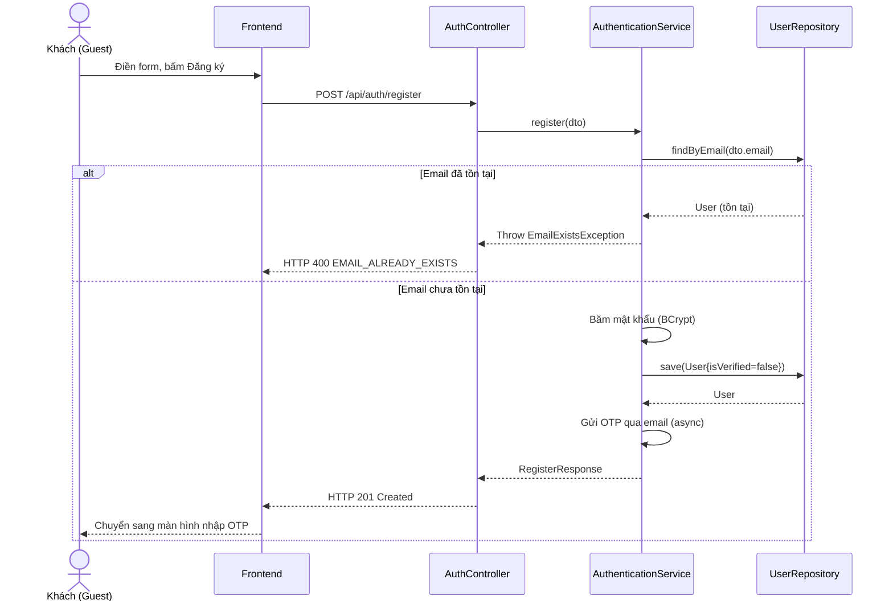

# UC-01 — Đăng Ký Tài Khoản (Register User Account)

> **Feature:** `feat-auth` | **Phiên bản:** 2.0 | **Trạng thái:** Published
> **Tham chiếu FR:** FR-AUTH-01 đến FR-AUTH-12
> **Cập nhật:** 2026-07-24

---

## 1. Tổng Quan

| Thuộc tính | Nội dung |
|:---|:---|
| **Mã Use Case** | UC-01 |
| **Tên** | Đăng Ký Tài Khoản (Register User Account) |
| **Tác nhân chính** | Khách (Guest) — người dùng chưa đăng nhập |
| **Mô tả ngắn** | Khách đăng ký tài khoản mới bằng địa chỉ Email cá nhân để tham gia giao dịch trên MMO Market. |
| **Độ ưu tiên** | Cao (P0) |

---

## 2. Tác Nhân & Điều Kiện

### 2.1 Tác Nhân
| Tác nhân | Vai trò |
|:---|:---|
| **Khách (Guest)** | Tác nhân chính thực hiện nghiệp vụ của hệ thống. |

### 2.2 Điều Kiện Tiền Quyết (Preconditions)
- Email đăng ký chưa tồn tại trong cơ sở dữ liệu hệ thống.

### 2.3 Hậu Điều Kiện (Postconditions)
- **Thành công:** Bản ghi người dùng được tạo mới trong bảng Users ở trạng thái chưa xác minh (isVerified = 0), mã OTP xác thực được gửi thành công đến email đăng ký.
- **Thất bại:** Trạng thái database không đổi, hệ thống trả về mã lỗi chi tiết.

---

## 3. Luồng Xử Lý (Sequence Steps)

### 3.1 Luồng Chính (Happy Path)
Bước 1 [Khách]:   Nhập Email, Mật khẩu, Tên hiển thị vào biểu mẫu Đăng ký và nhấn "Đăng ký".
Bước 2 [Frontend]: Kiểm tra dữ liệu UX cơ bản, gửi yêu cầu POST /api/auth/register.
Bước 3 [Backend]:  AuthController nhận yêu cầu, gọi AuthenticationService.register().
                     - Validate định dạng Email, độ mạnh mật khẩu và sự trùng lặp email.
                     - Mã hóa mật khẩu bằng thuật toán BCrypt.
                     - Tạo bản ghi mới trong bảng Users (isVerified = 0, isLocked = 0, balance_vnd = 0).
                     - Sinh mã OTP 6 chữ số và gửi email bất đồng bộ (async).
Bước 4 [Backend]:  Trả về HTTP 201 Created cùng RegisterResponse.
Bước 5 [Frontend]: Chuyển hướng người dùng sang màn hình nhập OTP để kích hoạt tài khoản.

### 3.2 Luồng Lỗi (Error Path)
| Tình huống | HTTP | Error Code | Xử lý |
|:---|:---:|:---|:---|
| Trùng email đăng ký | 400 | `EMAIL_ALREADY_EXISTS` | Báo lỗi email đã được sử dụng bởi tài khoản khác |
| Mật khẩu không đủ mạnh | 400 | `VALIDATION_FAILED` | Mật khẩu phải chứa ít nhất 6 ký tự |
| Lỗi hệ thống gửi thư | 500 | `EMAIL_SEND_FAILED` | Ghi log hệ thống và yêu cầu người dùng thử gửi lại OTP sau |

---

## 4. Quy Tắc Nghiệp Vụ (Business Rules)

| Mã | Quy tắc | Chi tiết |
|:---|:---|:---|
| BR-01-01 | Email độc nhất | Email đăng ký phải là duy nhất trong bảng Users |
| BR-01-02 | Mã hóa mật khẩu | Tất cả mật khẩu người dùng phải được băm bằng BCrypt (cost factor = 12) trước khi lưu trữ |

---

## 5. Quy Tắc Kiểm Tra Đầu Vào

| Trường | Kiểm tra | Thông báo lỗi nếu sai |
|:---|:---|:---|
| `email` | Bắt buộc, đúng định dạng email | "Địa chỉ email không hợp lệ" |
| `password` | Bắt buộc, tối thiểu 6 ký tự | "Mật khẩu phải chứa ít nhất 6 ký tự" |
| `fullName` | Bắt buộc, từ 2-50 ký tự | "Tên hiển thị phải từ 2 đến 50 ký tự" |

---

## 6. Sơ Đồ Tuần Tự (Sequence Diagram)

---

## 7. Tham Chiếu API

| Phương thức | Endpoint | Mô tả |
|:---|:---|:---|
| POST | `/api/auth/register` | Đăng ký tài khoản người dùng mới |

---

## 8. Tiêu Chỉ Chấp Nhận (Acceptance Criteria)

### AC-01-01 — Đăng ký tài khoản hợp lệ thành công
> **Tham chiếu:** FR-AUTH-01
- **Cho trước:** Địa chỉ email test@mmo.com chưa từng được đăng ký trong hệ thống.
- **Khi:** Khách gửi yêu cầu đăng ký với email trên và mật khẩu "123456".
- **Thì:** Hệ thống tạo bản ghi người dùng ở trạng thái chưa xác minh và gửi mã OTP kích hoạt đến mail thành công.

### AC-01-02 — Đăng ký thất bại do trùng email
> **Tham chiếu:** FR-AUTH-01
- **Cho trước:** Địa chỉ email test@mmo.com đã được sử dụng bởi một tài khoản khác.
- **Khi:** Khách gửi yêu cầu đăng ký bằng email test@mmo.com.
- **Thì:** Hệ thống ngăn chặn đăng ký và trả về lỗi HTTP 400 với mã lỗi EMAIL_ALREADY_EXISTS.

---

## 9. Ngoài Phạm Vi (Out of Scope)
- ❌ Đăng ký tài khoản bằng số điện thoại SMS.

---

## 10. Danh Sách SRS Use Cases Hạt Nhân Trực Thuộc (SRS Mapping)

| SRS UC ID | Tên Use Case SRS | Feature Module | Mô Tả Chức Năng Chi Tiết |
|:---|:---|:---|:---|
| **UC 1** | Register User Account | feat-auth | Khách đăng ký tài khoản mới bằng địa chỉ Email cá nhân để tham gia giao dịch trên MMO Market. |
