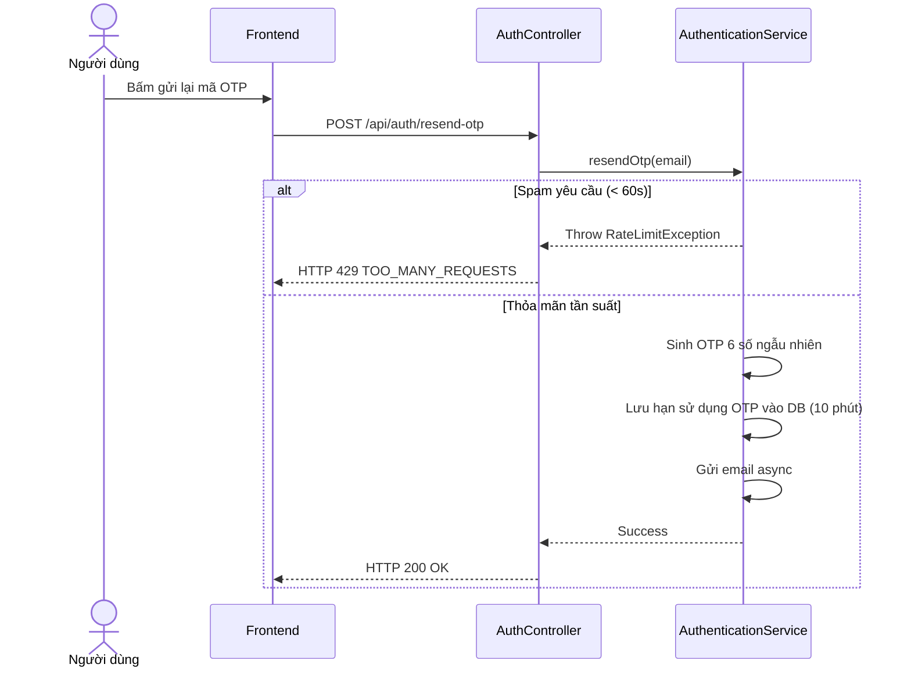

# UC-02 — Gửi OTP Xác Minh (Send OTP via email)

> **Feature:** `feat-auth` | **Phiên bản:** 2.0 | **Trạng thái:** Published
> **Tham chiếu FR:** FR-AUTH-01 đến FR-AUTH-12
> **Cập nhật:** 2026-07-24

---

## 1. Tổng Quan

| Thuộc tính | Nội dung |
|:---|:---|
| **Mã Use Case** | UC-02 |
| **Tên** | Gửi OTP Xác Minh (Send OTP via email) |
| **Tác nhân chính** | Khách (Guest) / Người dùng (User) |
| **Mô tả ngắn** | Hệ thống sinh mã OTP 6 chữ số ngẫu nhiên gửi về email của người dùng để xác minh tài khoản hoặc đổi mật khẩu. |
| **Độ ưu tiên** | Cao (P0) |

---

## 2. Tác Nhân & Điều Kiện

### 2.1 Tác Nhân
| Tác nhân | Vai trò |
|:---|:---|
| **Khách (Guest) / Người dùng (User)** | Tác nhân chính thực hiện nghiệp vụ của hệ thống. |

### 2.2 Điều Kiện Tiền Quyết (Preconditions)
- Email người dùng tồn tại trong hệ thống và ở trạng thái cần gửi OTP.

### 2.3 Hậu Điều Kiện (Postconditions)
- **Thành công:** Mã OTP được gửi thành công, ghi nhận thời hạn hết hạn 10 phút trong DB.
- **Thất bại:** Trạng thái database không đổi, hệ thống trả về mã lỗi chi tiết.

---

## 3. Luồng Xử Lý (Sequence Steps)

### 3.1 Luồng Chính (Happy Path)
Bước 1 [User]:       Nhấn nút "Gửi lại mã OTP" trên giao diện xác thực.
Bước 2 [Frontend]:   Gửi yêu cầu POST /api/auth/resend-otp { "email": "customer@mmo.com" }.
Bước 3 [Backend]:    AuthController nhận request, gọi AuthenticationService.resendOtp().
                       - Kiểm tra tần suất yêu cầu (cooldown 60s).
                       - Sinh mã ngẫu nhiên 6 chữ số, lưu trữ vào DB cùng hạn sử dụng 10 phút.
                       - Gửi mail chứa mã OTP thông qua JavaMailSender.
Bước 4 [Backend]:    Trả về HTTP 200 OK.
Bước 5 [Frontend]:   Hiển thị thông báo gửi OTP thành công và hiển thị bộ đếm ngược 60 giây gửi lại.

### 3.2 Luồng Lỗi (Error Path)
| Tình huống | HTTP | Error Code | Xử lý |
|:---|:---:|:---|:---|
| Email không tồn tại | 404 | `EMAIL_NOT_FOUND` | Báo lỗi email chưa được đăng ký |
| Yêu cầu quá nhanh | 429 | `TOO_MANY_REQUESTS` | Ngăn chặn spam gửi OTP liên tục (chưa hết 60s cooldown) |

---

## 4. Quy Tắc Nghiệp Vụ (Business Rules)

| Mã | Quy tắc | Chi tiết |
|:---|:---|:---|
| BR-02-01 | Cooldown gửi OTP | Cooldown bắt buộc là 60 giây giữa mỗi lần yêu cầu gửi lại OTP |
| BR-02-02 | Hạn sử dụng OTP | Mã OTP chỉ có hiệu lực tối đa trong vòng 10 phút kể từ lúc sinh |

---

## 5. Quy Tắc Kiểm Tra Đầu Vào

| Trường | Kiểm tra | Thông báo lỗi nếu sai |
|:---|:---|:---|
| `email` | Bắt buộc, định dạng email | "Địa chỉ email không hợp lệ" |

---

## 6. Sơ Đồ Tuần Tự (Sequence Diagram)

---

## 7. Tham Chiếu API

| Phương thức | Endpoint | Mô tả |
|:---|:---|:---|
| POST | `/api/auth/resend-otp` | Yêu cầu gửi lại mã OTP xác thực |

---

## 8. Tiêu Chỉ Chấp Nhận (Acceptance Criteria)

### AC-02-01 — Gửi lại OTP thành công
> **Tham chiếu:** FR-AUTH-03
- **Cho trước:** Tài khoản đang chờ kích hoạt.
- **Khi:** Yêu cầu gửi lại OTP sau 70 giây kể từ lần gửi trước.
- **Thì:** Hệ thống gửi OTP mới và trả về HTTP 200 OK.

---

## 9. Ngoài Phạm Vi (Out of Scope)
- ❌ Gửi mã OTP qua cuộc gọi điện thoại hoặc SMS.

---

## 10. Danh Sách SRS Use Cases Hạt Nhân Trực Thuộc (SRS Mapping)

| SRS UC ID | Tên Use Case SRS | Feature Module | Mô Tả Chức Năng Chi Tiết |
|:---|:---|:---|:---|
| **UC 2** | Send OTP via email | feat-auth | Hệ thống sinh mã OTP 6 chữ số ngẫu nhiên gửi về email của người dùng để xác minh tài khoản hoặc đổi mật khẩu. |
