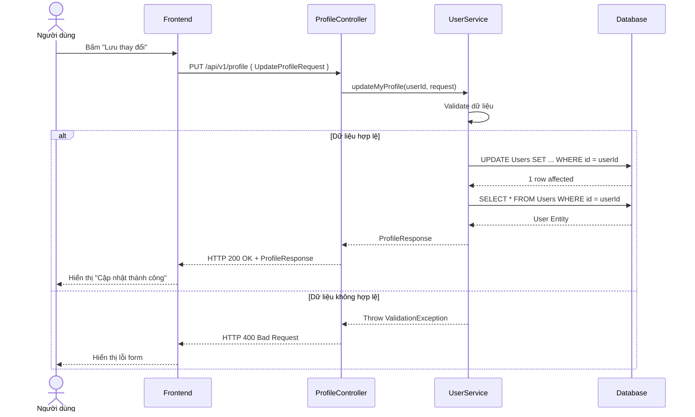

# UC-02 — Quản Lý Hồ Sơ Cá Nhân (User Profile Management)

> **Feature ID:** `feat-auth` | **Phiên bản:** 1.0 | **Trạng thái:** Published
> **Tham chiếu FR:** FR-PROFILE-01 đến FR-PROFILE-03
> **Cập nhật:** 2026-06-30

---

## 1. Tổng Quan

| Thuộc tính | Nội dung |
|:---|:---|
| **Mã Use Case** | UC-02 |
| **Tên** | Quản Lý Hồ Sơ Cá Nhân (User Profile Management) |
| **Tác nhân chính** | Người dùng (User) |
| **Mô tả ngắn** | Người dùng xem và cập nhật thông tin cá nhân cơ bản của tài khoản (Họ tên, ngày sinh, giới tính, số điện thoại, số CCCD, địa chỉ). Các thông tin nhạy cảm (Email, Vai trò, Số dư) bị khóa cập nhật tự do. |
| **Độ ưu tiên** | Trung bình (P1) |

---

## 2. Tác Nhân & Điều Kiện

### 2.1 Tác Nhân

| Tác nhân | Vai trò |
|:---|:---|
| **Người dùng (User)** | Xem hồ sơ và cung cấp thông tin mới để cập nhật |

### 2.2 Điều Kiện Tiền Quyết (Preconditions)

- Người dùng đã đăng nhập thành công vào hệ thống.
- Yêu cầu phải gửi kèm mã token xác thực (JWT) hợp lệ.

### 2.3 Hậu Điều Kiện (Postconditions)

- **Cập nhật thành công:** Thông tin cá nhân mới được lưu vào cơ sở dữ liệu và ghi đè dữ liệu cũ. Phản hồi trả về đối tượng Profile mới nhất.
- **Thất bại:** Dữ liệu cũ giữ nguyên, hệ thống trả về thông báo lỗi chi tiết.

---

## 3. Luồng Xử Lý

### 3.1 Luồng Chính — Xem Thông Tin Hồ Sơ (Happy Path)

```
Bước 1  [User]:       Truy cập trang thông tin cá nhân (Profile).
Bước 2  [Frontend]:   Gọi API GET /api/v1/profile
Bước 3  [Backend]:    Trích xuất userId từ JWT Token trong header.
                       Truy vấn bảng Users để lấy thông tin.
Bước 4  [Backend]:    Trả về ProfileResponse: Email, Họ tên, Giới tính, Ngày sinh, 
                       Số CCCD/CMND, Số điện thoại, Địa chỉ, Vai trò, Số dư khả dụng, 
                       Tình trạng xác thực KYC, Trạng thái Shop.
Bước 5  [Frontend]:   Hiển thị thông tin lên giao diện Chế độ xem (View Mode).
```

### 3.2 Luồng Chính — Cập Nhật Hồ Sơ (Happy Path)

```
Bước 1  [User]:       Tại trang Profile, bấm "Chỉnh sửa thông tin".
Bước 2  [Frontend]:   Chuyển sang Edit Mode, các ô input được mở khóa (trừ Email).
Bước 3  [User]:       Sửa thông tin Họ tên, Giới tính, Ngày sinh, Số CCCD, SĐT, Địa chỉ và bấm "Lưu".
Bước 4  [Frontend]:   Gọi API PUT /api/v1/profile kèm body JSON chứa các thông tin vừa sửa.
Bước 5  [Backend]:    Xác thực đầu vào (Validation) cho các trường dữ liệu.
Bước 6  [Backend]:    Cập nhật các trường tương ứng trong cơ sở dữ liệu.
                       Trả về ProfileResponse mới nhất với status 200 OK.
Bước 7  [Frontend]:   Hiển thị thông báo "Cập nhật thành công" và chuyển về View Mode.
```

### 3.3 Luồng Lỗi — Dữ Liệu Đầu Vào Không Hợp Lệ

```
Bước 4  [Frontend]:   Gọi API PUT /api/v1/profile
Bước 5  [Backend]:    Validation thất bại (ví dụ: SĐT sai định dạng, CCCD quá ngắn).
Bước 6  [Backend]:    Trả về HTTP 400 Bad Request kèm chi tiết lỗi (Ví dụ: "Số điện thoại không hợp lệ").
Bước 7  [Frontend]:   Hiển thị thông báo lỗi ngay dưới ô nhập liệu tương ứng trên form.
```

---

## 4. Quy Tắc Nghiệp Vụ

| Mã | Quy tắc | Chi tiết |
|:---|:---|:---|
| BR-02-01 | Khóa cập nhật Email | Email là thông tin dùng để đăng nhập và định danh tài khoản, không cho phép đổi qua API này. |
| BR-02-02 | Khóa cập nhật Vai trò | Quyền hạn (Role) do hệ thống tự động thăng hạng (ví dụ duyệt Shop), người dùng không thể tự đổi. |
| BR-02-03 | Khóa cập nhật Số dư | Số dư ví (balanceVnd) chỉ được thay đổi thông qua nghiệp vụ Nạp tiền/Giao dịch. |

---

## 5. Quy Tắc Kiểm Tra Đầu Vào (Validation)

### PUT /api/v1/profile

| Trường dữ liệu | Quy tắc kiểm tra (Validation) | Phản hồi lỗi nếu vi phạm |
|:---|:---|:---|
| `fullName` | Không rỗng, tối đa 100 ký tự | "Họ tên không được để trống" |
| `phone` | Phải khớp regex số điện thoại chuẩn VN (10 số, bắt đầu bằng 0) | "Số điện thoại không hợp lệ" |
| `nationalId` | Chỉ chứa chữ số, độ dài từ 9 đến 12 | "Số CCCD/CMND không hợp lệ" |
| `gender` | Tùy chọn (Nam, Nữ, Khác) | N/A |
| `dateOfBirth` | Định dạng YYYY-MM-DD | "Ngày sinh không đúng định dạng" |
| `address` | Tối đa 255 ký tự | "Địa chỉ quá dài" |

---

## 6. Sơ Đồ Tuần Tự (Sequence Diagram)



---

## 7. Tham Chiếu API

| Phương thức | Endpoint | Mô tả |
|:---|:---|:---|
| `GET` | `/api/v1/profile` | Lấy thông tin hồ sơ người dùng hiện tại |
| `PUT` | `/api/v1/profile` | Cập nhật thông tin hồ sơ cá nhân |

---

## 8. Tiêu Chí Chấp Nhận (Acceptance Criteria)

### AC-02-01 — Cập nhật hồ sơ thành công
- **Cho trước:** Người dùng đã đăng nhập và đang ở màn hình Cập nhật hồ sơ.
- **Khi:** Người dùng nhập đầy đủ Họ tên, Giới tính, SĐT, CCCD, Ngày sinh, Địa chỉ hợp lệ và nhấn "Lưu".
- **Thì:**
  - Hệ thống báo "Thành công".
  - Chuyển về chế độ xem và thông tin mới hiển thị chính xác.
  - Load lại trang thì dữ liệu vẫn là dữ liệu mới.

### AC-02-02 — Vô hiệu hóa thay đổi Email
- **Cho trước:** Người dùng đang ở màn hình Cập nhật hồ sơ.
- **Khi:** Người dùng cố tình can thiệp mã nguồn Frontend để sửa ô input Email và nhấn "Lưu".
- **Thì:**
  - Backend bỏ qua trường Email gửi lên.
  - Email trong database không bị thay đổi.