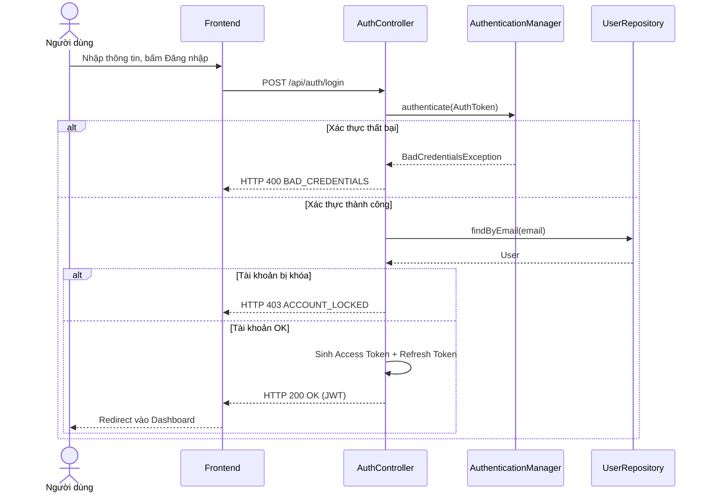

# UC-03 — Đăng Nhập (User Login)

> **Feature:** `feat-auth` | **Phiên bản:** 2.0 | **Trạng thái:** Published
> **Tham chiếu FR:** FR-AUTH-01 đến FR-AUTH-12
> **Cập nhật:** 2026-07-24

---

## 1. Tổng Quan

| Thuộc tính | Nội dung |
|:---|:---|
| **Mã Use Case** | UC-03 |
| **Tên** | Đăng Nhập (User Login) |
| **Tác nhân chính** | Khách (Guest) / Người dùng (User) |
| **Mô tả ngắn** | Xác thực thông tin tài khoản người dùng bằng Email/Password hoặc Google OAuth2 để cấp quyền phiên làm việc bằng JWT. |
| **Độ ưu tiên** | Cao (P0) |

---

## 2. Tác Nhân & Điều Kiện

### 2.1 Tác Nhân
| Tác nhân | Vai trò |
|:---|:---|
| **Khách (Guest) / Người dùng (User)** | Tác nhân chính thực hiện nghiệp vụ của hệ thống. |

### 2.2 Điều Kiện Tiền Quyết (Preconditions)
- Tài khoản của người dùng đã được verify (isVerified = 1) và không bị khóa (isLocked = 0).

### 2.3 Hậu Điều Kiện (Postconditions)
- **Thành công:** Trả về token JWT Access Token (hạn 15 phút) và Refresh Token (hạn 7 ngày) để truy cập các tài nguyên bảo mật.
- **Thất bại:** Trạng thái database không đổi, hệ thống trả về mã lỗi chi tiết.

---

## 3. Luồng Xử Lý (Sequence Steps)

### 3.1 Luồng Chính (Happy Path)
Bước 1 [User]:       Nhập Email và Mật khẩu trên màn hình đăng nhập, bấm "Đăng nhập".
Bước 2 [Frontend]:   Gửi yêu cầu POST /api/auth/login.
Bước 3 [Backend]:    AuthController tiếp nhận, sử dụng AuthenticationManager để kiểm chứng.
                       - Tìm user theo email, kiểm tra các trạng thái isVerified = 1, isLocked = 0.
                       - So sánh mật khẩu băm BCrypt.
                       - Sinh Access Token và Refresh Token.
                       - Lưu Refresh Token vào bảng Authentications.
Bước 4 [Backend]:    Trả về HTTP 200 OK kèm bộ Token.
Bước 5 [Frontend]:   Lưu trữ token và chuyển hướng người dùng vào Dashboard cá nhân.

### 3.2 Luồng Lỗi (Error Path)
| Tình huống | HTTP | Error Code | Xử lý |
|:---|:---:|:---|:---|
| Sai mật khẩu/email | 400 | `BAD_CREDENTIALS` | Trả về thông báo lỗi chung để bảo mật |
| Tài khoản chưa verify | 403 | `EMAIL_NOT_VERIFIED` | Chuyển hướng sang trang nhập OTP để xác minh |
| Tài khoản bị khóa | 403 | `ACCOUNT_LOCKED` | Báo lỗi tài khoản bị khóa do vi phạm hoặc đăng nhập sai quá nhiều |

---

## 4. Quy Tắc Nghiệp Vụ (Business Rules)

| Mã | Quy tắc | Chi tiết |
|:---|:---|:---|
| BR-03-01 | Khóa tài khoản | Khóa tài khoản tạm thời trong 15 phút nếu người dùng đăng nhập sai mật khẩu 5 lần liên tiếp |
| BR-03-02 | Bảo mật lỗi | Không phân biệt lỗi "Sai email" hay "Sai mật khẩu" để chống rò rỉ email người dùng |

---

## 5. Quy Tắc Kiểm Tra Đầu Vào

| Trường | Kiểm tra | Thông báo lỗi nếu sai |
|:---|:---|:---|
| `email` | Bắt buộc, đúng định dạng email | "Địa chỉ email không hợp lệ" |
| `password` | Bắt buộc | "Mật khẩu không được để trống" |

---

## 6. Sơ Đồ Tuần Tự (Sequence Diagram)

---

## 7. Tham Chiếu API

| Phương thức | Endpoint | Mô tả |
|:---|:---|:---|
| POST | `/api/auth/login` | Đăng nhập hệ thống bằng email và mật khẩu |

---

## 8. Tiêu Chỉ Chấp Nhận (Acceptance Criteria)

### AC-03-01 — Đăng nhập thành công với thông tin chính xác
> **Tham chiếu:** FR-AUTH-04
- **Cho trước:** Tài khoản customer@mmo.com đang hoạt động bình thường.
- **Khi:** Đăng nhập với mật khẩu chính xác.
- **Thì:** Hệ thống trả về token JWT hợp lệ và chuyển hướng đến Dashboard.

---

## 9. Ngoài Phạm Vi (Out of Scope)
- ❌ Đăng nhập không mật khẩu bằng mã OTP một lần (One-time password).

---

## 10. Danh Sách SRS Use Cases Hạt Nhân Trực Thuộc (SRS Mapping)

| SRS UC ID | Tên Use Case SRS | Feature Module | Mô Tả Chức Năng Chi Tiết |
|:---|:---|:---|:---|
| **UC 3** | Login | feat-auth | Xác thực thông tin tài khoản người dùng bằng Email/Password hoặc Google OAuth2 để cấp quyền phiên làm việc bằng JWT. |
