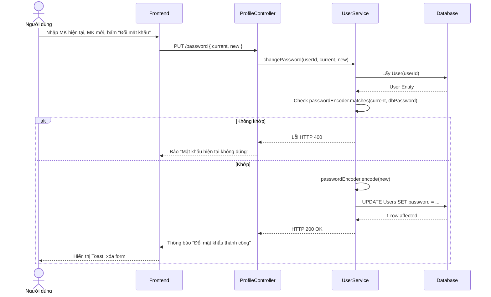

# UC-04 — Bảo Mật Tài Khoản (Account Security)

> **Feature ID:** `feat-auth` | **Trạng thái:** Published
> **Tham chiếu FR:** FR-SECURITY-01 đến FR-SECURITY-04

---

## 1. Tổng Quan

| Thuộc tính | Nội dung |
|:---|:---|
| **Mã Use Case** | UC-04 |
| **Tên** | Quản Lý Bảo Mật Tài Khoản (Account Security) |
| **Tác nhân chính** | Người dùng (User) |
| **Mô tả ngắn** | Cho phép người dùng chủ động nâng cao tính bảo mật của tài khoản thông qua việc thay đổi mật khẩu định kỳ và thiết lập tính năng xác thực hai lớp (2FA). |
| **Độ ưu tiên** | Cao (P0) — ảnh hưởng trực tiếp đến sự an toàn của tài khoản và giao dịch |

---

## 2. Tác Nhân & Điều Kiện

### 2.1 Tác Nhân

| Tác nhân | Vai trò |
|:---|:---|
| **Người dùng (User)** | Thực hiện thao tác đổi mật khẩu, yêu cầu bật/tắt 2FA |
| **Hệ thống Email** | Gửi OTP để xác thực thao tác kích hoạt 2FA |

### 2.2 Điều Kiện Tiền Quyết (Preconditions)

- Người dùng đã đăng nhập hệ thống thành công (có Token hợp lệ).
- Tài khoản ở trạng thái đang hoạt động (`enabled = 1`).

### 2.3 Hậu Điều Kiện (Postconditions)

- **Đổi mật khẩu:** Mật khẩu mới được mã hóa và lưu vào Database. Các phiên đăng nhập hiện tại có thể bị đăng xuất (tùy cấu hình).
- **Bật/Tắt 2FA:** Trạng thái 2FA của tài khoản được cập nhật trong Database (`is2faEnabled = 1` hoặc `0`).

---

## 3. Luồng Xử Lý

### 3.1 Luồng Đổi Mật Khẩu (Happy Path)

```
Bước 1  [User]:       Nhập mật khẩu hiện tại, mật khẩu mới và xác nhận mật khẩu mới, bấm "Đổi mật khẩu"
Bước 2  [Frontend]:   POST /api/v1/profile/password { currentPassword, newPassword }
Bước 3  [Backend]:    Trích xuất userId từ Token. Lấy thông tin tài khoản từ DB.
Bước 4  [Backend]:    So sánh currentPassword với mật khẩu mã hóa đang lưu. 
Bước 5  [Backend]:    Kiểm tra độ mạnh của newPassword. Mã hóa và lưu newPassword vào DB.
Bước 6  [Backend]:    Trả về thông báo thành công (HTTP 200).
Bước 7  [Frontend]:   Hiển thị thông báo "Đổi mật khẩu thành công" và dọn dẹp form.
```

### 3.2 Luồng Bật Bảo Mật 2 Lớp (2FA)

```
Bước 1  [User]:       Gạt công tắc bật 2FA trên giao diện.
Bước 2  [Frontend]:   POST /api/v1/profile/2fa/send-otp
Bước 3  [Backend]:    Tạo mã OTP ngẫu nhiên (6 số), lưu vào cache có thời hạn (5 phút).
Bước 4  [Backend]:    Gửi OTP qua email cho người dùng, trả về thông báo gửi thành công (HTTP 200).
Bước 5  [Frontend]:   Hiển thị Modal yêu cầu người dùng nhập OTP.
Bước 6  [User]:       Kiểm tra Email, lấy mã OTP, điền vào modal và bấm Xác nhận.
Bước 7  [Frontend]:   POST /api/v1/profile/2fa/enable { otp }
Bước 8  [Backend]:    Xác minh OTP khớp với cache. Cập nhật is2faEnabled = 1.
Bước 9  [Backend]:    Trả về thông báo thành công (HTTP 200).
Bước 10 [Frontend]:   Chuyển trạng thái UI sang "Đã kích hoạt".
```

### 3.3 Luồng Tắt Bảo Mật 2 Lớp (2FA)

```
Bước 1  [User]:       Gạt công tắc tắt 2FA trên giao diện.
Bước 2  [Frontend]:   POST /api/v1/profile/2fa/disable
Bước 3  [Backend]:    Xác thực token. Cập nhật is2faEnabled = 0.
Bước 4  [Backend]:    Trả về thông báo tắt thành công (HTTP 200).
Bước 5  [Frontend]:   Chuyển trạng thái UI sang "Chưa kích hoạt".
```

---

## 4. Quy Tắc Nghiệp Vụ

| Mã | Quy tắc | Chi tiết |
|:---|:---|:---|
| BR-04-01 | Yêu cầu Mật khẩu cũ | Khi đổi mật khẩu, bắt buộc phải cung cấp chính xác mật khẩu hiện tại (trừ trường hợp dùng tính năng "Quên mật khẩu"). |
| BR-04-02 | OTP kích hoạt 2FA | OTP gửi qua email để bật 2FA chỉ có hiệu lực trong vòng 5 phút. Nhập sai quá 5 lần sẽ khóa chức năng yêu cầu gửi lại OTP trong 30 phút. |
| BR-04-03 | Đăng xuất sau đổi Pass | Sau khi đổi mật khẩu thành công, có thể tự động hủy các Token JWT hiện tại (tùy chiến lược bảo mật). |

---

## 5. Quy Tắc Kiểm Tra Đầu Vào (Validation)

### Cập nhật Mật khẩu
| Trường | Kiểm tra | Lỗi khi vi phạm |
|:---|:---|:---|
| `currentPassword` | Bắt buộc, không được để trống | "Vui lòng nhập mật khẩu hiện tại" |
| `newPassword` | Tối thiểu 6 ký tự, gồm ít nhất 1 chữ hoa, 1 ký tự đặc biệt | "Mật khẩu mới không đạt yêu cầu bảo mật" |
| *So sánh Mật khẩu* | `currentPassword` phải trùng với DB | "Mật khẩu hiện tại không chính xác" |

### Kích hoạt 2FA
| Trường | Kiểm tra | Lỗi khi vi phạm |
|:---|:---|:---|
| `otp` | Bắt buộc, chuỗi số dài 6 ký tự | "Mã OTP không hợp lệ" |
| *So sánh OTP* | Mã OTP phải khớp với mã đã lưu trong hệ thống (Cache) và còn hạn | "Mã OTP không chính xác hoặc đã hết hạn" |

---

## 6. Sơ Đồ Tuần Tự (Sequence Diagram) — Luồng Đổi Mật Khẩu



---

## 7. Tham Chiếu API

| Phương thức | Endpoint | Mô tả |
|:---|:---|:---|
| `PUT` | `/api/v1/profile/password` | Thay đổi mật khẩu người dùng |
| `POST` | `/api/v1/profile/2fa/send-otp` | Gửi mã OTP xác nhận kích hoạt 2FA qua Email |
| `POST` | `/api/v1/profile/2fa/enable` | Xác nhận OTP và kích hoạt 2FA |
| `POST` | `/api/v1/profile/2fa/disable` | Vô hiệu hóa tính năng 2FA |

---

## 8. Tiêu Chí Chấp Nhận (Acceptance Criteria)

### AC-04-01 — Đổi mật khẩu
- **Cho trước:** Người dùng điền đầy đủ và đúng mật khẩu hiện tại, nhập mật khẩu mới hợp lệ.
- **Khi:** Nhấn nút "Lưu thay đổi".
- **Thì:** Dữ liệu cập nhật thành công, có thông báo. Lần đăng nhập kế tiếp bắt buộc dùng mật khẩu mới.

### AC-04-02 — Bật 2FA
- **Cho trước:** Tài khoản chưa kích hoạt 2FA.
- **Khi:** Bật nút switch sang phải -> Nhận OTP từ Email -> Nhập mã vào Modal.
- **Thì:** Toggle chuyển màu xanh. Ở lần đăng nhập (Login) tiếp theo, hệ thống sẽ yêu cầu thêm bước xác thực OTP phụ bên cạnh Mật khẩu.
