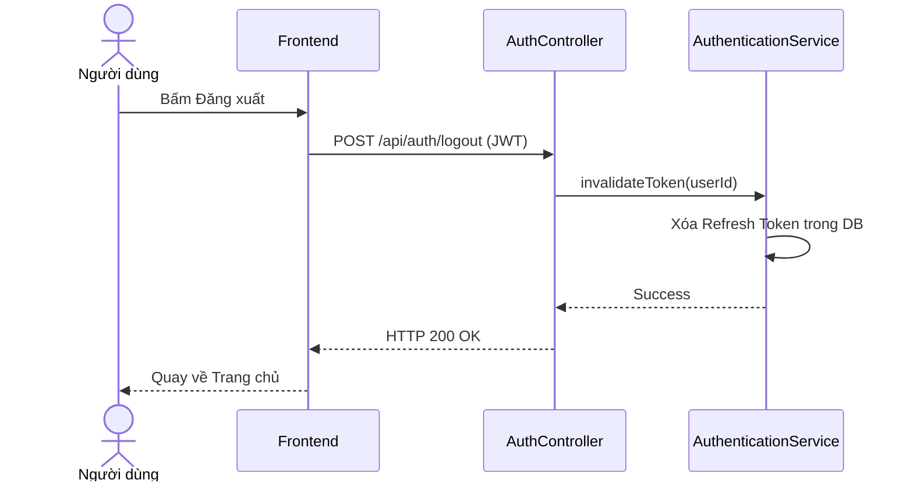

# UC-04 — Đăng Xuất (User Logout)

> **Feature:** `feat-auth` | **Phiên bản:** 2.0 | **Trạng thái:** Published
> **Tham chiếu FR:** FR-AUTH-01 đến FR-AUTH-12
> **Cập nhật:** 2026-07-24

---

## 1. Tổng Quan

| Thuộc tính | Nội dung |
|:---|:---|
| **Mã Use Case** | UC-04 |
| **Tên** | Đăng Xuất (User Logout) |
| **Tác nhân chính** | Người dùng (User) |
| **Mô tả ngắn** | Người dùng đăng xuất khỏi hệ thống để kết thúc phiên làm việc và hủy bỏ hiệu lực của Refresh Token. |
| **Độ ưu tiên** | Trung bình (P1) |

---

## 2. Tác Nhân & Điều Kiện

### 2.1 Tác Nhân
| Tác nhân | Vai trò |
|:---|:---|
| **Người dùng (User)** | Tác nhân chính thực hiện nghiệp vụ của hệ thống. |

### 2.2 Điều Kiện Tiền Quyết (Preconditions)
- Người dùng đang đăng nhập và gửi kèm token JWT hợp lệ.

### 2.3 Hậu Điều Kiện (Postconditions)
- **Thành công:** Refresh Token tương ứng bị xóa hoặc đánh dấu thu hồi (is_revoked = 1) trong DB.
- **Thất bại:** Trạng thái database không đổi, hệ thống trả về mã lỗi chi tiết.

---

## 3. Luồng Xử Lý (Sequence Steps)

### 3.1 Luồng Chính (Happy Path)
Bước 1 [User]:       Bấm nút "Đăng xuất" trên giao diện người dùng.
Bước 2 [Frontend]:   Gửi yêu cầu POST /api/auth/logout.
Bước 3 [Backend]:    AuthController nhận request, thu hồi Refresh Token của phiên làm việc trong bảng Authentications.
Bước 4 [Backend]:    Trả về HTTP 200 OK.
Bước 5 [Frontend]:   Xóa token trong LocalStorage/SessionStorage và chuyển hướng về trang chủ.

### 3.2 Luồng Lỗi (Error Path)
| Tình huống | HTTP | Error Code | Xử lý |
|:---|:---:|:---|:---|
| Token hết hạn | 401 | `UNAUTHORIZED` | Báo lỗi phiên xác thực không hợp lệ |

---

## 4. Quy Tắc Nghiệp Vụ (Business Rules)

| Mã | Quy tắc | Chi tiết |
|:---|:---|:---|
| BR-04-01 | Thu hồi phiên | Chỉ thu hồi Refresh Token của phiên hiện tại, không ảnh hưởng đến các thiết bị khác trừ khi yêu cầu |

---

## 5. Quy Tắc Kiểm Tra Đầu Vào

| Trường | Kiểm tra | Thông báo lỗi nếu sai |
|:---|:---|:---|
| None | | |

---

## 6. Sơ Đồ Tuần Tự (Sequence Diagram)

---

## 7. Tham Chiếu API

| Phương thức | Endpoint | Mô tả |
|:---|:---|:---|
| POST | `/api/auth/logout` | Đăng xuất khỏi hệ thống |

---

## 8. Tiêu Chỉ Chấp Nhận (Acceptance Criteria)

### AC-04-01 — Đăng xuất thành công giải phóng token
> **Tham chiếu:** FR-AUTH-05
- **Cho trước:** Người dùng đang có phiên hoạt động bình thường.
- **Khi:** Gửi yêu cầu đăng xuất.
- **Thì:** Hệ thống thu hồi token thành công và xóa dữ liệu session ở Frontend.

---

## 9. Ngoài Phạm Vi (Out of Scope)
- ❌ Đăng xuất đồng loạt tất cả mọi thiết bị khác.

---

## 10. Danh Sách SRS Use Cases Hạt Nhân Trực Thuộc (SRS Mapping)

| SRS UC ID | Tên Use Case SRS | Feature Module | Mô Tả Chức Năng Chi Tiết |
|:---|:---|:---|:---|
| **UC 4** | Logout | feat-auth | Người dùng đăng xuất khỏi hệ thống để kết thúc phiên làm việc và hủy bỏ hiệu lực của Refresh Token. |
