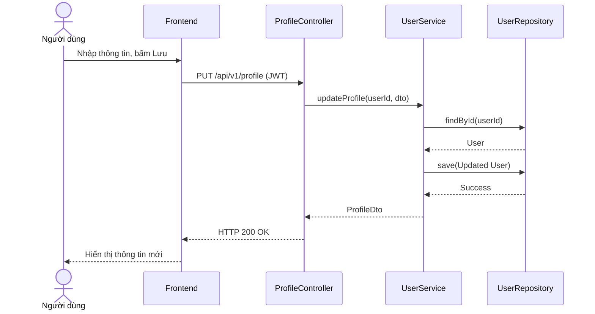

# UC-05 — Cập Nhật Hồ Sơ Người Dùng (Update User Profile)

> **Feature:** `feat-auth` | **Phiên bản:** 2.0 | **Trạng thái:** Published
> **Tham chiếu FR:** FR-AUTH-01 đến FR-AUTH-12
> **Cập nhật:** 2026-07-24

---

## 1. Tổng Quan

| Thuộc tính | Nội dung |
|:---|:---|
| **Mã Use Case** | UC-05 |
| **Tên** | Cập Nhật Hồ Sơ Người Dùng (Update User Profile) |
| **Tác nhân chính** | Người dùng (User) |
| **Mô tả ngắn** | Người dùng thay đổi các thông tin cá nhân của mình như tên hiển thị, địa chỉ, ảnh đại diện, số điện thoại. |
| **Độ ưu tiên** | Trung bình (P1) |

---

## 2. Tác Nhân & Điều Kiện

### 2.1 Tác Nhân
| Tác nhân | Vai trò |
|:---|:---|
| **Người dùng (User)** | Tác nhân chính thực hiện nghiệp vụ của hệ thống. |

### 2.2 Điều Kiện Tiền Quyết (Preconditions)
- Người dùng đã đăng nhập hệ thống và có Token JWT hợp lệ.

### 2.3 Hậu Điều Kiện (Postconditions)
- **Thành công:** Thông tin cá nhân được cập nhật thành công vào cơ sở dữ liệu.
- **Thất bại:** Trạng thái database không đổi, hệ thống trả về mã lỗi chi tiết.

---

## 3. Luồng Xử Lý (Sequence Steps)

### 3.1 Luồng Chính (Happy Path)
Bước 1 [User]:       Vào cài đặt tài khoản, sửa thông tin hiển thị và nhấn "Lưu thay đổi".
Bước 2 [Frontend]:   Gửi yêu cầu PUT /api/v1/profile.
Bước 3 [Backend]:    ProfileController nhận request, gọi UserService.updateMyProfile().
                       - Kiểm tra tính độc nhất của số điện thoại mới (nếu thay đổi).
                       - Cập nhật thông tin vào bảng Users.
Bước 4 [Backend]:    Trả về HTTP 200 OK kèm thông tin profile mới.
Bước 5 [Frontend]:   Hiển thị thông báo cập nhật thành công và cập nhật lại giao diện hiển thị.

### 3.2 Luồng Lỗi (Error Path)
| Tình huống | HTTP | Error Code | Xử lý |
|:---|:---:|:---|:---|
| Trùng số điện thoại | 400 | `PHONE_ALREADY_EXISTS` | Báo số điện thoại đã được đăng ký bởi user khác |
| Validate dữ liệu lỗi | 400 | `VALIDATION_FAILED` | Trả về danh sách chi tiết các trường bị lỗi định dạng |

---

## 4. Quy Tắc Nghiệp Vụ (Business Rules)

| Mã | Quy tắc | Chi tiết |
|:---|:---|:---|
| BR-05-01 | Số điện thoại duy nhất | Mỗi số điện thoại chỉ được liên kết với duy nhất 1 tài khoản trong hệ thống |

---

## 5. Quy Tắc Kiểm Tra Đầu Vào

| Trường | Kiểm tra | Thông báo lỗi nếu sai |
|:---|:---|:---|
| `fullName` | Bắt buộc, từ 2-50 ký tự | "Tên hiển thị phải từ 2 đến 50 ký tự" |
| `phone` | Tùy chọn, chuẩn số điện thoại VN | "Số điện thoại không đúng định dạng" |

---

## 6. Sơ Đồ Tuần Tự (Sequence Diagram)

---

## 7. Tham Chiếu API

| Phương thức | Endpoint | Mô tả |
|:---|:---|:---|
| PUT | `/api/v1/profile` | Cập nhật thông tin hồ sơ cá nhân |

---

## 8. Tiêu Chỉ Chấp Nhận (Acceptance Criteria)

### AC-05-01 — Cập nhật hồ sơ thành công
> **Tham chiếu:** FR-AUTH-06
- **Cho trước:** Tài khoản hoạt động bình thường.
- **Khi:** Người dùng cập nhật fullName thành "Nguyễn Văn B".
- **Thì:** Tên mới được ghi nhận vào DB và hiển thị trên thanh điều hướng.

---

## 9. Ngoài Phạm Vi (Out of Scope)
- ❌ Thay đổi địa chỉ email (phải qua luồng bảo mật riêng biệt).

---

## 10. Danh Sách SRS Use Cases Hạt Nhân Trực Thuộc (SRS Mapping)

| SRS UC ID | Tên Use Case SRS | Feature Module | Mô Tả Chức Năng Chi Tiết |
|:---|:---|:---|:---|
| **UC 5** | Update User Profile | feat-auth | Người dùng thay đổi các thông tin cá nhân của mình như tên hiển thị, địa chỉ, ảnh đại diện, số điện thoại. |
