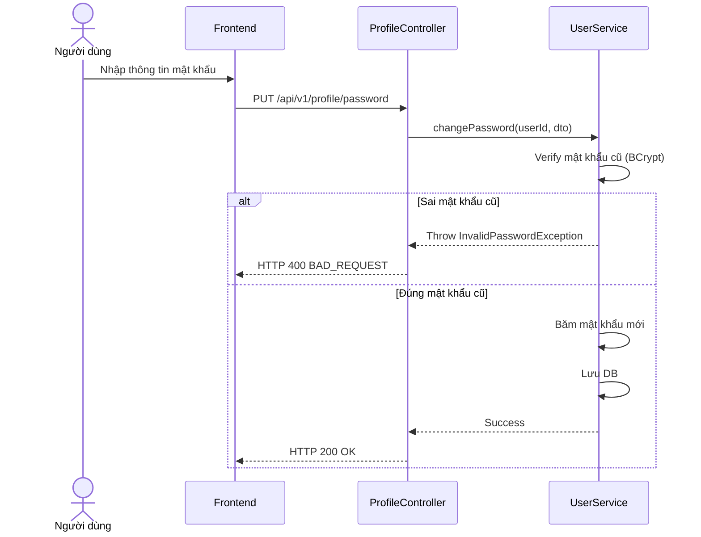

# UC-06 — Đổi & Đặt Lại Mật Khẩu (Change/Reset Password)

> **Feature:** `feat-auth` | **Phiên bản:** 2.0 | **Trạng thái:** Published
> **Tham chiếu FR:** FR-AUTH-01 đến FR-AUTH-12
> **Cập nhật:** 2026-07-24

---

## 1. Tổng Quan

| Thuộc tính | Nội dung |
|:---|:---|
| **Mã Use Case** | UC-06 |
| **Tên** | Đổi & Đặt Lại Mật Khẩu (Change/Reset Password) |
| **Tác nhân chính** | Người dùng (User) |
| **Mô tả ngắn** | Người dùng thực hiện thay đổi mật khẩu hiện tại khi đang đăng nhập, hoặc đặt lại mật khẩu mới thông qua mã OTP khi chọn quên mật khẩu. |
| **Độ ưu tiên** | Trung bình (P1) |

---

## 2. Tác Nhân & Điều Kiện

### 2.1 Tác Nhân
| Tác nhân | Vai trò |
|:---|:---|
| **Người dùng (User)** | Tác nhân chính thực hiện nghiệp vụ của hệ thống. |

### 2.2 Điều Kiện Tiền Quyết (Preconditions)
- Người dùng nhập đúng mật khẩu hiện tại (hoặc cung cấp đúng mã OTP khôi phục mật khẩu).

### 2.3 Hậu Điều Kiện (Postconditions)
- **Thành công:** Mật khẩu mới được mã hóa an toàn và lưu vào database.
- **Thất bại:** Trạng thái database không đổi, hệ thống trả về mã lỗi chi tiết.

---

## 3. Luồng Xử Lý (Sequence Steps)

### 3.1 Luồng Chính (Happy Path)
Bước 1 [User]:       Nhập mật khẩu cũ, mật khẩu mới và xác nhận mật khẩu mới.
Bước 2 [Frontend]:   Gửi yêu cầu PUT /api/v1/profile/password.
Bước 3 [Backend]:    ProfileController nhận request, gọi UserService.changePassword().
                       - So sánh mật khẩu cũ với password_hash bằng BCrypt.
                       - Băm mật khẩu mới bằng BCrypt và lưu vào DB.
Bước 4 [Backend]:    Trả về HTTP 200 OK.
Bước 5 [Frontend]:   Thông báo đổi mật khẩu thành công và yêu cầu người dùng đăng nhập lại.

### 3.2 Luồng Lỗi (Error Path)
| Tình huống | HTTP | Error Code | Xử lý |
|:---|:---:|:---|:---|
| Mật khẩu cũ sai | 400 | `BAD_REQUEST` | Báo lỗi mật khẩu cũ không đúng |
| Trùng mật khẩu cũ | 422 | `PASSWORD_UNCHANGED` | Báo lỗi mật khẩu mới không được trùng mật khẩu cũ |

---

## 4. Quy Tắc Nghiệp Vụ (Business Rules)

| Mã | Quy tắc | Chi tiết |
|:---|:---|:---|
| BR-06-01 | Kiểm tra độ trùng | Mật khẩu mới bắt buộc phải khác hoàn toàn mật khẩu cũ đang lưu trữ |

---

## 5. Quy Tắc Kiểm Tra Đầu Vào

| Trường | Kiểm tra | Thông báo lỗi nếu sai |
|:---|:---|:---|
| `newPassword` | Bắt buộc, tối thiểu 6 ký tự | "Mật khẩu mới phải chứa ít nhất 6 ký tự" |

---

## 6. Sơ Đồ Tuần Tự (Sequence Diagram)

---

## 7. Tham Chiếu API

| Phương thức | Endpoint | Mô tả |
|:---|:---|:---|
| PUT | `/api/v1/profile/password` | Đổi mật khẩu tài khoản người dùng |

---

## 8. Tiêu Chỉ Chấp Nhận (Acceptance Criteria)

### AC-06-01 — Thay đổi mật khẩu thành công
> **Tham chiếu:** FR-AUTH-07
- **Cho trước:** Đang đăng nhập tài khoản.
- **Khi:** Nhập đúng mật khẩu cũ và mật khẩu mới hợp lệ.
- **Thì:** Hệ thống lưu mật khẩu băm mới thành công.

---

## 9. Ngoài Phạm Vi (Out of Scope)
- ❌ Đặt lại mật khẩu không qua xác minh OTP.

---

## 10. Danh Sách SRS Use Cases Hạt Nhân Trực Thuộc (SRS Mapping)

| SRS UC ID | Tên Use Case SRS | Feature Module | Mô Tả Chức Năng Chi Tiết |
|:---|:---|:---|:---|
| **UC 6** | Change/Reset Password | feat-auth | Người dùng thực hiện thay đổi mật khẩu hiện tại khi đang đăng nhập, hoặc đặt lại mật khẩu mới thông qua mã OTP khi chọn quên mật khẩu. |
