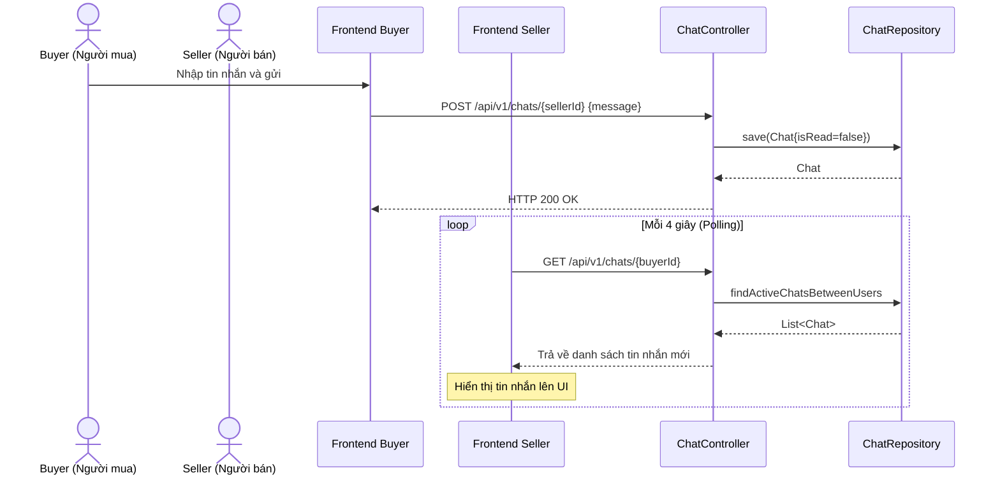

# UC-12 — Chat Trực Tiếp (Buyer-Seller Direct Chat)

> **Feature:** `feat-chat` | **Phiên bản:** 2.0 | **Trạng thái:** Published
> **Tham chiếu FR:** FR-CHAT-01 đến FR-CHAT-08
> **Cập nhật:** 2026-07-17

---

## 1. Tổng Quan

| Thuộc tính | Nội dung |
|:---|:---|
| **Mã Use Case** | UC-12 |
| **Tên** | Chat Trực Tiếp (Buyer-Seller Direct Chat) |
| **Tác nhân chính** | Người mua (Buyer), Người bán (Seller), Nhân viên (Staff) |
| **Mô tả ngắn** | Người mua và Người bán trao đổi tin nhắn trực tiếp qua giao thức REST API và HTTP Polling (chu kỳ 4 giây) để giải quyết các thắc mắc về sản phẩm hoặc phối hợp giao dịch. Nhân viên (Staff) có quyền đọc phòng chat đối chất tranh chấp (ID âm) nhưng không thể nhắn tin vào đó. |
| **Độ ưu tiên** | Trung bình (P1) — nâng cao trải nghiệm giao dịch và hỗ trợ người dùng |

---

## 2. Tác Nhân & Điều Kiện

### 2.1 Tác Nhân

| Tác nhân | Vai trò |
|:---|:---|
| **Người dùng (Buyer/Seller)** | Nhập chat, gửi câu hỏi, mute liên hệ, xóa lịch sử, nhận tin nhắn |
| **Nhân viên (Staff)** | Xem lịch sử các phòng chat đối chất tranh chấp (Read-only), nhắn tin hỗ trợ trực tiếp người dùng |

### 2.2 Điều Kiện Tiền Quyết (Preconditions)

- Người dùng đã đăng nhập hệ thống và JWT Token còn hiệu lực.

### 2.3 Hậu Điều Kiện (Postconditions)

- **Thành công:** Tin nhắn được lưu vào cơ sở dữ liệu bảng `Chats` với trạng thái chưa đọc (`isRead = false`). Trình duyệt bên nhận sẽ tải tin nhắn mới thông qua cơ chế Polling.

---

## 3. Luồng Xử Lý

### 3.1 Luồng Chính — Nhắn tin và nhận tin nhắn qua REST API & Polling (Happy Path)

```
Bước 1  [Buyer]:      Nhấp vào nút "Chat ngay" từ trang chi tiết sản phẩm hoặc đơn hàng
Bước 2  [Frontend]:   Mở hộp thoại Chat, gọi GET /api/v1/chats/{sellerId} để lấy lịch sử tin nhắn
Bước 3  [Backend]:    Truy vấn bảng Chats lấy danh sách tin nhắn hoạt động giữa hai bên, tự động đánh dấu đã đọc các tin nhắn đến, trả về list
Bước 4  [Frontend]:   Hiển thị lịch sử chat và kích hoạt cơ chế polling: gọi GET /api/v1/chats/{sellerId} mỗi 4 giây
Bước 5  [Buyer]:      Nhập tin nhắn và bấm gửi
Bước 6  [Frontend]:   POST /api/v1/chats/{sellerId} { message: "..." }
Bước 7  [Backend]:    Validate: không gửi cho chính mình
                       Lưu tin nhắn mới vào bảng Chats (isRead = false)
                       Trả về thông tin tin nhắn đã gửi (HTTP 200 OK)
Bước 8  [Frontend-S]: Phía Seller đang polling nhận được tin nhắn mới và hiển thị bong bóng thoại ngay lập tức
```

### 3.2 Luồng Chat Đối Chất Tranh Chấp (Dispute Group Chat)

```
Bước 1  [User]:       Vào trang chi tiết tranh chấp, click "Tham gia đối chất"
Bước 2  [Frontend]:   Mở khung chat đối chất với ID âm: contactId = -complaintId
Bước 3  [User]:       Nhập tin nhắn và bấm gửi
Bước 4  [Frontend]:   POST /api/v1/chats/-{complaintId} { message: "..." }
Bước 5  [Backend]:    Kiểm tra trạng thái khiếu nại phải là InProgress/In_Progress
                       Lưu tin nhắn vào DB với chatType = 'Complaint', liên kết complaint_id
                       Trả về tin nhắn thành công
Bước 6  [Staff]:      Nhân viên truy cập phòng chat đối chất qua GET /api/v1/staff/chat/-{complaintId} để đọc lịch sử
                       Hệ thống chặn không cho Staff gửi tin nhắn tại đây (trả về 403 Forbidden)
```

---

## 4. Quy Tắc Nghiệp Vụ

| Mã | Quy tắc | Chi tiết |
|:---|:---|:---|
| BR-12-01 | Lưu trữ bắt buộc | Tất cả tin nhắn trao đổi qua kênh chat bắt buộc lưu trữ vào DB để làm bằng chứng phân xử khi khiếu nại |
| BR-12-02 | Chỉ chat cá nhân | Không cho phép người dùng tự gửi tin nhắn chat cho chính bản thân mình |
| BR-12-03 | Đọc đối chất Staff | Nhân viên (Staff/Admin) có quyền Read-only đối với phòng chat đối chất, không được nhắn tin vào đó |

---

## 5. Quy Tắc Kiểm Tra Đầu Vào

### POST /api/v1/chats/{contactId}

| Trường | Kiểm tra | Lỗi khi vi phạm |
|:---|:---|:---|
| `message` | Bắt buộc, không rỗng, tối đa 2000 ký tự | "Nội dung tin nhắn không thể bỏ trống." |
| `productId` | Tùy chọn, kiểu số nguyên | Bỏ qua nếu định dạng không hợp lệ |

---

## 6. Sơ Đồ Tuần Tự (Sequence Diagram)

### Luồng Nhắn Tin REST API & Polling



---

## 7. Tham Chiếu API

| Phương thức | Endpoint | Mô tả |
|:---|:---|:---|
| `GET` | `/api/v1/chats` | Lấy danh bạ chat gần đây |
| `GET` | `/api/v1/chats/{contactId}` | Lấy lịch sử chat và đánh dấu đã đọc |
| `POST` | `/api/v1/chats/{contactId}` | Gửi tin nhắn mới |
| `DELETE` | `/api/v1/chats/{contactId}/history` | Xóa lịch sử chat phía mình |
| `GET` | `/api/v1/staff/chat/conversations` | Danh sách hội thoại của Staff |
| `GET` | `/api/v1/staff/chat/{targetUserId}` | Lịch sử chat của Staff |

---

## 8. Tiêu Chí Chấp Nhận (Acceptance Criteria)

### AC-12-01 — Nhận tin nhắn qua Polling sau tối đa 4 giây

- **Cho trước:** Buyer `User E` và Seller `User F` đang mở cửa sổ chat với nhau.
- **Khi:** `User E` gửi tin nhắn "Hello" qua POST `/api/v1/chats/{userFId}`
- **Thì:**
  - Hệ thống ghi nhận tin nhắn thành công vào CSDL.
  - Sau tối đa 4 giây, tiến trình Polling của `User F` tự động lấy được tin nhắn "Hello" và hiển thị lên màn hình.

---

## 9. Ngoài Phạm Vi (Out of Scope)

- ❌ Giao tiếp thời gian thực sử dụng WebSocket hoặc Server-Sent Events (SSE).
- ❌ Hỗ trợ gửi tin nhắn thoại (Voice Message), ảnh hoặc tệp tin đính kèm trong chat.
