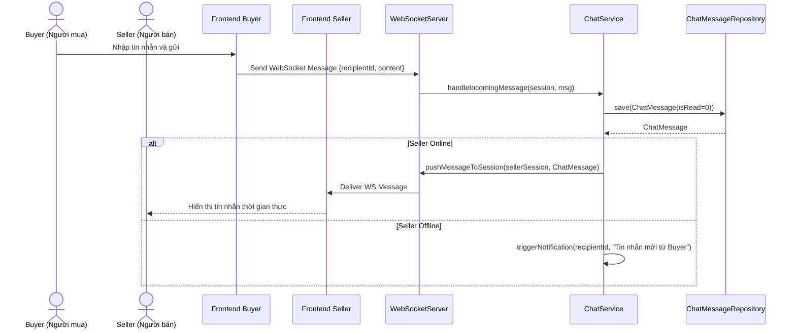

# UC-12 — Chat Trực Tiếp (Buyer-Seller Direct Chat)

> **Feature:** `feat-chat` | **Phiên bản:** 1.0 | **Trạng thái:** Published
> **Tham chiếu FR:** FR-CHAT-01 đến FR-CHAT-08
> **Cập nhật:** 2026-06-30

---

## 1. Tổng Quan

| Thuộc tính | Nội dung |
|:---|:---|
| **Mã Use Case** | UC-12 |
| **Tên** | Chat Trực Tiếp (Buyer-Seller Direct Chat) |
| **Tác nhân chính** | Người mua (Buyer), Người bán (Seller) |
| **Mô tả ngắn** | Người mua và Người bán trao đổi tin nhắn trực tiếp thời gian thực qua giao thức WebSocket để giải quyết các thắc mắc về sản phẩm hoặc phối hợp giao dịch. Lịch sử chat được lưu trữ vào DB. |
| **Độ ưu tiên** | Trung bình (P1) — nâng cao trải nghiệm giao dịch và hỗ trợ người dùng |

---

## 2. Tác Nhân & Điều Kiện

### 2.1 Tác Nhân

| Tác nhân | Vai trò |
|:---|:---|
| **Người mua (Buyer)** | Nhấp chat, gửi câu hỏi, nhận tin nhắn phản hồi |
| **Người bán (Seller)** | Nhận tin nhắn, trả lời thắc mắc |
| **WebSocketServer** | Xử lý điều phối tin nhắn real-time giữa các phiên kết nối |

### 2.2 Điều Kiện Tiền Quyết (Preconditions)

- Cả hai người dùng đều đã đăng nhập hệ thống và JWT Token còn hiệu lực.
- Kênh kết nối WebSocket đã thiết lập bắt tay (handshake) thành công.

### 2.3 Hậu Điều Kiện (Postconditions)

- **Thành công:** Tin nhắn được gửi real-time tới đối phương và được lưu lại trong bảng `ChatMessages` với trạng thái chưa đọc/đã đọc.

---

## 3. Luồng Xử Lý

### 3.1 Luồng Chính — Nhắn tin thời gian thực (Happy Path)

```
Bước 1  [Buyer]:      Nhấp vào nút "Chat với Shop" từ trang chi tiết sản phẩm
Bước 2  [Frontend]:   Mở hộp thoại Chat, thiết lập kết nối WebSocket:
                       ws://localhost:8080/ws/chat?token=jwt_token
Bước 3  [Backend]:    Xác thực JWT Token, lưu thông tin Session kết nối của Buyer
Bước 4  [Frontend]:   GET /api/v1/chat/history/{sellerId} để lấy lịch sử tin nhắn cũ
Bước 5  [Backend]:    Truy vấn bảng ChatMessages lấy 50 tin nhắn gần nhất giữa hai bên, trả về list
Bước 6  [Frontend]:   Hiển thị lịch sử chat
Bước 7  [Buyer]:      Nhập tin nhắn "Tài khoản có bảo hành không bạn?" và bấm gửi
Bước 8  [Frontend]:   Gửi gói tin JSON qua WebSocket:
                       { "recipientId": sellerId, "content": "Tài khoản có bảo hành không bạn?" }
Bước 9  [Backend]:    Nhận gói tin qua WebSocketHandler
                       Lưu tin nhắn vào bảng ChatMessages (is_read = 0)
                       Kiểm tra Seller có đang kết nối trực tuyến (Active Session)
                       Nếu Seller online:
                         Đẩy gói tin JSON chứa nội dung chat sang WebSocket Session của Seller
Bước 10 [Frontend-S]: Giao diện của Seller hiển thị tin nhắn mới ngay lập tức
```

### 3.2 Luồng Nhận Tin Nhắn Offline

```
Bước 9  [Backend]:    Nhận gói tin gửi cho Seller, kiểm tra thấy Seller hiện không trực tuyến
Bước 10 [Backend]:    Lưu tin nhắn vào DB với is_read = 0
                       Tạo một thông báo đẩy (Notification) loại CHAT gửi tới Seller để báo có tin nhắn mới
Bước 11 [Seller]:     Đăng nhập hệ thống sau đó, nhận được thông báo tin nhắn chưa đọc và mở hộp chat để tải tin nhắn offline
```

---

## 4. Quy Tắc Nghiệp Vụ

| Mã | Quy tắc | Chi tiết |
|:---|:---|:---|
| BR-12-01 | Lưu trữ bắt buộc | Tất cả tin nhắn trao đổi qua kênh chat bắt buộc lưu trữ vào DB để làm bằng chứng phân xử khi khiếu nại |
| BR-12-02 | Chặn chat rác | Giới hạn tần suất gửi tin nhắn (Rate Limit) tối đa 5 tin nhắn/giây để tránh spam |
| BR-12-03 | Chỉ chat cá nhân | Không cho phép người dùng tự gửi tin nhắn chat cho chính bản thân mình |

---

## 5. Quy Tắc Kiểm Tra Đầu Vào

### WebSocket Message (JSON)

| Trường | Kiểm tra | Lỗi khi vi phạm |
|:---|:---|:---|
| `recipientId` | Bắt buộc, `> 0` | Bỏ qua gói tin không hợp lệ |
| `content` | Bắt buộc, không rỗng, tối đa 1000 ký tự | Bỏ qua hoặc phản hồi báo lỗi nhập liệu |

---

## 6. Sơ Đồ Tuần Tự (Sequence Diagram)

### Luồng Gửi Tin Nhắn Qua WebSocket



---

## 7. Tham Chiếu API

| Phương thức | Endpoint | Mô tả |
|:---|:---|:---|
| `WS` | `/ws/chat` | Kênh kết nối WebSocket bắt tay |
| `GET` | `/api/v1/chat/history/{partnerId}` | Lấy lịch sử chat với đối tác |
| `POST` | `/api/v1/chat/mark-read/{partnerId}` | Đánh dấu đã đọc toàn bộ chat với đối tác |

---

## 8. Tiêu Chí Chấp Nhận (Acceptance Criteria)

### AC-12-01 — Nhận tin nhắn tức thời khi cả hai cùng online

- **Cho trước:** Buyer `User E` và Seller `User F` đang cùng mở cửa sổ chat và kết nối WebSocket trực tuyến
- **Khi:** `User E` gửi tin nhắn "Hello"
- **Thì:**
  - Hệ thống ghi nhận tin nhắn vào cơ sở dữ liệu
  - Trình duyệt của `User F` nhận và hiển thị chữ "Hello" ngay lập tức mà không cần tải lại trang.

---

## 9. Ngoài Phạm Vi (Out of Scope)

- ❌ Hỗ trợ gửi tin nhắn thoại (Voice Message).
- ❌ Hỗ trợ chia sẻ vị trí bản đồ trong chat.
