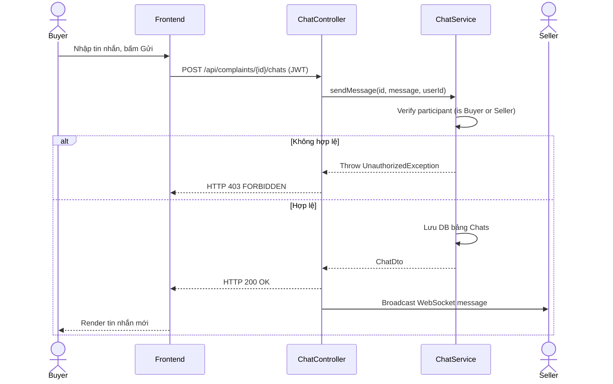

# UC-15 — Chat Đối Chất Tranh Chấp (Chat with Seller in Dispute)

> **Feature:** `feat-chat` | **Phiên bản:** 2.0 | **Trạng thái:** Published
> **Tham chiếu FR:** FR-CHAT-01 đến FR-CHAT-12
> **Cập nhật:** 2026-07-24

---

## 1. Tổng Quan

| Thuộc tính | Nội dung |
|:---|:---|
| **Mã Use Case** | UC-15 |
| **Tên** | Chat Đối Chất Tranh Chấp (Chat with Seller in Dispute) |
| **Tác nhân chính** | Người mua (Customer) / Người bán (Seller) |
| **Mô tả ngắn** | Mở phòng chat đối chất trực tiếp giữa Người mua và Người bán khi có tranh chấp/khiếu nại phát sinh đối với đơn hàng. |
| **Độ ưu tiên** | Trung bình (P1) |

---

## 2. Tác Nhân & Điều Kiện

### 2.1 Tác Nhân
| Tác nhân | Vai trò |
|:---|:---|
| **Người mua (Customer) / Người bán (Seller)** | Tác nhân chính thực hiện nghiệp vụ của hệ thống. |

### 2.2 Điều Kiện Tiền Quyết (Preconditions)
- Khiếu nại (Complaint) liên quan đến đơn hàng đang ở trạng thái OPEN hoặc DISPUTE.

### 2.3 Hậu Điều Kiện (Postconditions)
- **Thành công:** Tin nhắn được gửi đi thời gian thực (WebSocket) và ghi nhận vào cơ sở dữ liệu.
- **Thất bại:** Trạng thái database không đổi, hệ thống trả về mã lỗi chi tiết.

---

## 3. Luồng Xử Lý (Sequence Steps)

### 3.1 Luồng Chính (Happy Path)
Bước 1 [User]:       Vào phòng đối chất, nhập nội dung tin nhắn, bấm gửi.
Bước 2 [Frontend]:   POST /api/complaints/{id}/chats { "message": "Sai mật khẩu rồi shop ơi" } (JWT Header).
Bước 3 [Backend]:    ChatController nhận request, gọi ChatService.sendMessage().
                       - Xác minh người gửi là Buyer hoặc Seller của đơn hàng tương ứng.
                       - Lưu tin nhắn vào bảng Chats.
                       - Phát tin nhắn real-time thông qua WebSocket.
Bước 4 [Backend]:    Trả về thông báo gửi tin nhắn thành công.
Bước 5 [Frontend]:   Hiển thị tin nhắn mới trên màn hình chat của cả hai bên.

### 3.2 Luồng Lỗi (Error Path)
| Tình huống | HTTP | Error Code | Xử lý |
|:---|:---:|:---|:---|
| Người dùng ngoài cuộc | 403 | `FORBIDDEN` | Từ chối truy cập phòng chat đối chất |

---

## 4. Quy Tắc Nghiệp Vụ (Business Rules)

| Mã | Quy tắc | Chi tiết |
|:---|:---|:---|
| BR-15-01 | Quyền xem phòng chat | Chỉ có Buyer, Seller của đơn hàng, và Staff/Admin được quyền truy cập xem nội dung phòng chat này |

---

## 5. Quy Tắc Kiểm Tra Đầu Vào

| Trường | Kiểm tra | Thông báo lỗi nếu sai |
|:---|:---|:---|
| `message` | Bắt buộc, từ 1-500 ký tự | "Nội dung tin nhắn không được trống hoặc quá dài" |

---

## 6. Sơ Đồ Tuần Tự (Sequence Diagram)

---

## 7. Tham Chiếu API

| Phương thức | Endpoint | Mô tả |
|:---|:---|:---|
| POST | `/api/complaints/{id}/chats` | Gửi tin nhắn chat đối chất tranh chấp |

---

## 8. Tiêu Chỉ Chấp Nhận (Acceptance Criteria)

### AC-15-01 — Gửi tin nhắn đối chất thành công
> **Tham chiếu:** FR-CHAT-01
- **Cho trước:** Khiếu nại đang ở trạng thái OPEN.
- **Khi:** Người mua gửi tin nhắn.
- **Thì:** Tin nhắn hiển thị thành công trên màn hình của Người bán thời gian thực.

---

## 9. Ngoài Phạm Vi (Out of Scope)
- ❌ Thực hiện gọi video đối chất trực tiếp.

---

## 10. Danh Sách SRS Use Cases Hạt Nhân Trực Thuộc (SRS Mapping)

| SRS UC ID | Tên Use Case SRS | Feature Module | Mô Tả Chức Năng Chi Tiết |
|:---|:---|:---|:---|
| **UC 15** | Chat with Seller in Dispute | feat-chat | Mở phòng chat đối chất trực tiếp giữa Người mua và Người bán khi có tranh chấp/khiếu nại phát sinh đối với đơn hàng. |
