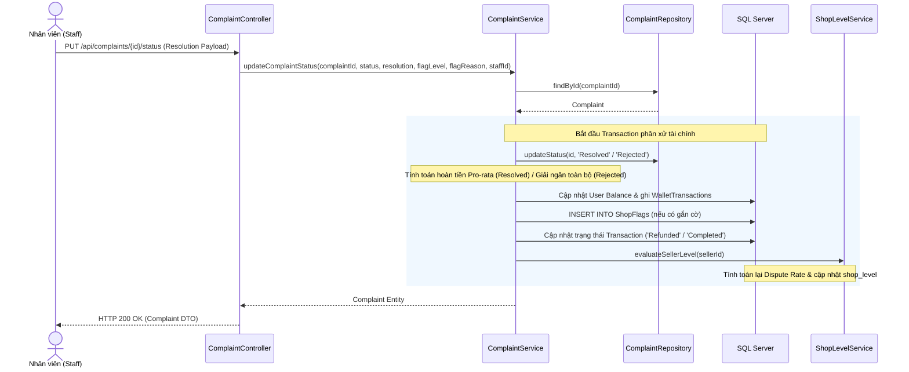

# UC-10 — Khiếu Nại & Tranh Chấp (Complaint & Dispute Resolution)

> **Feature:** `feat-complaint` | **Phiên bản:** 2.0 | **Trạng thái:** Published
> **Cập nhật:** 2026-07-16

---

## 1. Tổng Quan

| Thuộc tính | Nội dung |
|:---|:---|
| **Mã Use Case** | UC-10 |
| **Tên** | Khiếu Nại & Tranh Chấp (Complaint & Dispute Resolution) |
| **Tác nhân chính** | Người mua (Customer), Người bán (Seller), Nhân viên phân xử (Staff) |
| **Mô tả ngắn** | Người mua khiếu nại giao dịch lỗi trong thời hạn đóng băng bảo lãnh Escrow để tạm giữ tiền. Nhân viên vận hành (Staff) phê duyệt mở phòng chat đối chất, hỗ trợ hai bên thương lượng và đưa ra phán quyết hoàn tiền pro-rata cho Buyer, giải ngân Seller, tùy chọn gắn cờ cảnh cáo gian hàng và tự động đánh giá cấp độ Shop. |
| **Độ ưu tiên** | Cao (P1) — bảo vệ quyền lợi người mua và giải quyết tranh chấp công bằng |

---

## 2. Tác Nhân & Điều Kiện

### 2.1 Tác Nhân

| Tác nhân | Vai trò |
|:---|:---|
| **Người mua (Customer)** | Tạo khiếu nại, cung cấp mô tả chi tiết lỗi và bằng chứng bắt buộc |
| **Người bán (Seller)** | Xem khiếu nại của Shop, tham gia giải trình và đối chất qua chat |
| **Nhân viên (Staff)** | Tiếp nhận yêu cầu đối chất, phán quyết phân xử khiếu nại và cập nhật trạng thái |

### 2.2 Điều Kiện Tiền Quyết (Preconditions)

- Giao dịch hiện tại đang ở trạng thái bảo lãnh tạm giữ Escrow.
- Người gửi yêu cầu khiếu nại phải chính là chủ sở hữu giao dịch đó (Buyer).
- Giao dịch chưa từng bị khiếu nại trước đó (không ở trạng thái `Disputed`), chưa bị hủy (`Cancelled`) hoặc hoàn tiền (`Refunded`).
- Người khiếu nại cung cấp đầy đủ thông tin mô tả lỗi và bắt buộc phải có link bằng chứng hình ảnh/video (`evidence`).

### 2.3 Hậu Điều Kiện (Postconditions)

- **Khiếu nại được tạo:** Giao dịch tự động chuyển sang trạng thái `Disputed` để khóa/đóng băng tiền. Khiếu nại được tạo ở trạng thái mặc định `PENDING_REVIEW`.
- **Nhân viên tiếp nhận:** Chuyển trạng thái khiếu nại thành `In_Progress` và tự động kích hoạt phòng chat đối chất.
- **Giải quyết thành công (Resolved / Completed):**
  - Trạng thái khiếu nại chuyển thành `Resolved` hoặc `Completed`.
  - Thực hiện **phân chia tiền hoàn theo tỷ lệ (Pro-rata)**: Buyer nhận lại tiền hoàn theo số ngày chưa sử dụng (loại giao dịch `REFUND`), Seller nhận phần tiền còn lại tương ứng với số ngày đã sử dụng (loại giao dịch `PAYMENT`).
  - Giao dịch chuyển sang trạng thái `Refunded`.
  - Tự động đánh giá lại cấp độ của Shop (`shop_level`) dựa trên tỷ lệ khiếu nại sai phạm.
- **Từ chối khiếu nại (Rejected):**
  - Trạng thái khiếu nại chuyển thành `Rejected`.
  - Giải ngân toàn bộ số tiền thanh toán (sau khi trừ phí hoa hồng) cho ví khả dụng của Seller (loại giao dịch `PAYMENT`).
  - Giao dịch chuyển sang trạng thái `Completed`.

---

## 3. Luồng Xử Lý

### 3.1 Luồng Chính — Gửi Khiếu Nại & Đối Chất Phân Xử (Happy Path)

```
Bước 1  [Customer]:     Xem lịch sử đơn hàng, chọn đơn hàng bị lỗi, nhấn nút "Khiếu nại"
Bước 2  [Frontend]:     Hiển thị Form khiếu nại (mô tả chi tiết lỗi, link bằng chứng ảnh/video, đề xuất giải pháp)
Bước 3  [Customer]:     Nhập nội dung lỗi, chèn link ảnh bằng chứng bắt buộc, nhấn nút "Gửi khiếu nại"
Bước 4  [Frontend]:     Gửi yêu cầu POST /api/complaints { transactionId, description, evidence, preferredSolution }
Bước 5  [Backend]:      Validate thông tin: người gọi phải là buyer đơn hàng; trạng thái giao dịch khác Disputed/Cancelled/Refunded.
                         Evidence không được để trống.
                         Cập nhật trạng thái giao dịch thành "Disputed" để đóng băng tiền.
                         Tạo bản ghi Complaint với status = "PENDING_REVIEW".
                         Gửi thông báo (Notification) cảnh báo cho Buyer, Seller và Staff.
                         Trả về HTTP 200 OK kèm Complaint DTO.
Bước 6  [Staff]:        Nhận thông báo, truy cập trang chi tiết khiếu nại, nhấn "Bắt đầu đối chất"
Bước 7  [Frontend-ST]:  Gửi yêu cầu POST /api/complaints/{id}/start-dispute
Bước 8  [Backend]:      Chuyển trạng thái khiếu nại thành "In_Progress", tạo tin nhắn hệ thống kích hoạt phòng chat đối chất.
                         Gửi thông báo mở đối chất cho Buyer và Seller.
Bước 9  [Buyer/Seller]: Vào phòng chat đối chất (WebSocket) giải trình và gửi bằng chứng.
Bước 10 [Staff]:        Xác định phán quyết (ví dụ: Seller lỗi 1 phần), bấm "Cập nhật trạng thái"
                         Chọn trạng thái phán quyết = "Resolved", nhập nội dung kết luận phân xử, chọn gắn cờ "Warning" cho Shop
Bước 11 [Frontend-ST]:  Gửi yêu cầu PUT /api/complaints/{id}/status { status: "Resolved", resolution: "...", flagLevel: "Warning", flagReason: "..." }
Bước 12 [Backend]:      @Transactional:
                         - Cập nhật Complaint: status = "Resolved", resolution = "...", resolvedBy = staff, resolvedAt = LocalDateTime.now()
                         - Tạo thực thể ShopFlag lưu vào DB để ghi nhận cảnh cáo.
                         - Cập nhật trạng thái giao dịch: Transaction.status = "Refunded".
                         - Tính toán hoàn tiền theo tỷ lệ ngày sử dụng (Pro-rata):
                           + Parse tổng số ngày (totalDays) từ tên biến thể (ví dụ: "Netflix 1 tháng" -> 30 ngày).
                           + Tính số ngày đã sử dụng (daysUsed) từ lúc mua đến lúc khiếu nại.
                           + Tính tiền hoàn Buyer: refundAmount = amount / totalDays * daysRemaining.
                           + Tính tiền giải ngân Seller: sellerNetPayout = (amount - refundAmount) - commission.
                         - Cộng tiền ví và ghi nhận WalletTransactions tương ứng cho Buyer (REFUND) và Seller (PAYMENT).
                         - Gửi thông báo Notification (type = 'WALLET') cho cả Buyer và Seller.
                         - Gọi ShopLevelService.evaluateSellerLevel(sellerId) để tự động đánh giá lại cấp độ shop.
                         Trả về HTTP 200 OK.
```

---

## 4. Quy Tắc Nghiệp Vụ

| Mã | Quy tắc | Chi tiết |
|:---|:---|:---|
| BR-10-01 | Phân xử nguyên tử | Toàn bộ tiến trình phán quyết (Cập nhật trạng thái, lưu lý do, tính tiền hoàn/giải ngân, ghi lịch sử ví, gửi thông báo và đánh giá lại shop) phải nằm trong cùng một transaction `@Transactional` để đảm bảo tính toàn vẹn tài chính. |
| BR-10-02 | Hoàn tiền tỷ lệ | Áp dụng công thức hoàn tiền Pro-rata: `refundAmount = Math.ceil(amount / totalDays * (totalDays - daysUsed))` dựa trên thời hạn biến thể (năm = 365 ngày, 6 tháng = 180 ngày, 3 tháng = 90 ngày, 1 tháng = 30 ngày). |
| BR-10-03 | Đóng băng Escrow | Việc tạo khiếu nại bắt buộc phải khóa tiền giao dịch (status = `Disputed`) để tạm dừng thời hạn Escrow giải phóng tiền tự động cho Seller. |

---

## 5. Quy Tắc Kiểm Tra Đầu Vào (Validation)

### POST /api/complaints

| Trường | Kiểm tra | Lỗi khi vi phạm |
|:---|:---|:---|
| `transactionId` | Bắt buộc, không được để trống | "Mã giao dịch và chi tiết khiếu nại không được để trống." |
| `description` | Bắt buộc, không được để trống hoặc rỗng | "Mã giao dịch và chi tiết khiếu nại không được để trống." |
| `evidence` | Bắt buộc, không được để trống hoặc rỗng | "Bằng chứng hình ảnh/video là bắt buộc khi gửi khiếu nại." |

---

## 6. Sơ Đồ Tuần Tự (Sequence Diagram)

### Luồng Đối Chất & Phán Quyết Phân Xử Khiếu Nại (Staff Resolution)



---

## 7. Tham Chiếu API

| Phương thức | Endpoint | Mô tả |
|:---|:---|:---|
| `POST` | `/api/complaints` | Khách hàng tạo mới khiếu nại cho đơn hàng |
| `GET` | `/api/complaints` | Khách hàng lấy danh sách khiếu nại của mình |
| `GET` | `/api/complaints/{id}` | Lấy thông tin chi tiết một khiếu nại |
| `GET` | `/api/complaints/all` | Staff lấy danh sách khiếu nại toàn hệ thống |
| `POST` | `/api/complaints/{id}/start-dispute` | Staff tiếp nhận mở phòng đối chất |
| `PUT /` | `/api/complaints/{id}/status` | Staff cập nhật trạng thái phán quyết khiếu nại |
| `GET` | `/api/complaints/{id}/chats` | Lấy lịch sử tin nhắn phòng đối chất |

---

## 8. Tiêu Chí Chấp Nhận (Acceptance Criteria)

### AC-10-01 — Phán quyết Resolved hoàn tiền tỷ lệ thành công
- **Cho trước:** Khiếu nại ID `1` thuộc đơn hàng `200,000` VNĐ, biến thể `Netflix 1 tháng` (30 ngày), đã sử dụng `9` ngày kể từ lúc mua đến lúc khiếu nại.
- **Khi:** Staff thực hiện phán quyết `Resolved` cho khiếu nại.
- **Thì:**
  - Ví của Buyer được hoàn tiền `200,000 / 30 * (30 - 9) = 140,000` VNĐ (giao dịch `REFUND`).
  - Ví của Seller được giải ngân phần còn lại `200,000 - 140,000 = 60,000` VNĐ (trừ phí commission tương ứng) (giao dịch `PAYMENT`).
  - Giao dịch chuyển sang trạng thái `Refunded`.
  - Tự động gọi hàm đánh giá lại cấp độ shop của Seller.
