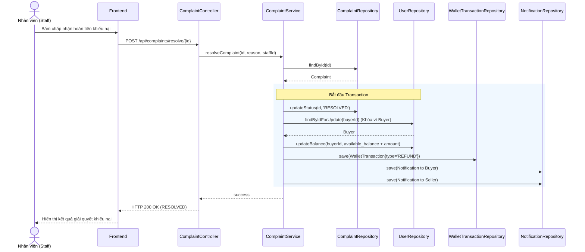

# UC-10 — Khiếu Nại & Tranh Chấp (Complaint & Dispute Resolution)

> **Feature:** `feat-complaint` | **Phiên bản:** 2.0 | **Trạng thái:** Published
> **Tham chiếu FR:** FR-COMP-01 đến FR-COMP-08, FR-COMPLAINT-REFUND-01 đến FR-COMPLAINT-REFUND-12
> **Cập nhật:** 2026-06-30

---

## 1. Tổng Quan

| Thuộc tính | Nội dung |
|:---|:---|
| **Mã Use Case** | UC-10 |
| **Tên** | Khiếu Nại & Tranh Chấp (Complaint & Dispute Resolution) |
| **Tác nhân chính** | Người mua (Customer), Người bán (Seller), Nhân viên phân xử (Staff) |
| **Mô tả ngắn** | Người mua khiếu nại giao dịch lỗi trong thời hạn 72h để đóng băng tiền tạm giữ. Staff tạo kênh chat đối chất giữa Buyer và Seller, sau đó đưa ra phán quyết hoàn tiền cho Buyer hoặc giải ngân cho Seller kèm ghi nhận lịch sử giao dịch và gửi thông báo. |
| **Độ ưu tiên** | Cao (P1) — bảo vệ quyền lợi người mua và giải quyết tranh chấp công bằng |

---

## 2. Tác Nhân & Điều Kiện

### 2.1 Tác Nhân

| Tác nhân | Vai trò |
|:---|:---|
| **Người mua (Customer)** | Tạo khiếu nại, cung cấp mô tả và bằng chứng lỗi |
| **Người bán (Seller)** | Xem khiếu nại liên quan, đưa ra bằng chứng đối chất |
| **Nhân viên (Staff)** | Xem xét tranh chấp và đưa ra phán quyết (Resolved/Rejected) |

### 2.2 Điều Kiện Tiền Quyết (Preconditions)

- Giao dịch đang ở trạng thái `Escrow` (chưa giải phóng tiền cho Seller).
- Người yêu cầu khiếu nại phải chính là Buyer của giao dịch đó.
- Giao dịch chưa có khiếu nại nào đang hoạt động (`status = 'OPEN'`).

### 2.3 Hậu Điều Kiện (Postconditions)

- **Đồng ý hoàn tiền (Resolved):** Cập nhật trạng thái khiếu nại thành `RESOLVED`, tạo giao dịch ví dạng `REFUND` cộng tiền vào ví khả dụng Buyer, gửi thông báo.
- **Từ chối khiếu nại (Rejected):** Cập nhật trạng thái khiếu nại thành `CLOSED` (hoặc Rejected), tạo giao dịch ví dạng `PAYMENT` cộng tiền vào ví khả dụng Seller (trừ phí), giải phóng hold balance, gửi thông báo.

---

## 3. Luồng Xử Lý

### 3.1 Luồng Chính — Gửi Khiếu Nại & Phán Quyết Hoàn Tiền (Happy Path)

```
Bước 1  [Customer]:   Mở Lịch sử đơn hàng, chọn đơn hàng lỗi, bấm "Khiếu nại"
Bước 2  [Frontend]:   Hiển thị biểu mẫu nhập mô tả lỗi và tải tệp ảnh/video bằng chứng
Bước 3  [Customer]:   Nhập mô tả lỗi "Mã thẻ cào đã được sử dụng từ trước" và tải lên ảnh lỗi, bấm gửi
Bước 4  [Frontend]:   POST /api/complaints { transactionId, description, evidence }
Bước 5  [Backend]:    Validate: user thực hiện cuộc gọi phải là Buyer của transaction
                       Validate: transaction.status = 'Escrow'
                       Tạo bản ghi trong Complaints với status = 'OPEN'
                       Tạm khóa/đóng băng tự động giải phóng tiền của đơn hàng
                       Tự động mở kênh chat WebSocket giữa Buyer, Seller và Staff
                       Trả về: status = 200, complaintId, status = "OPEN"
Bước 6  [Frontend]:   Hiển thị giao dịch chuyển sang trạng thái "Tranh chấp"
Bước 7  [Staff]:      Nhận thông báo tranh chấp mới, tham gia vào kênh chat đối chất
Bước 8  [Buyer/Seller]: Đưa ra các bằng chứng trao đổi
Bước 9  [Staff]:      Xác định lỗi thuộc về Seller, bấm "Chấp nhận hoàn tiền" (Resolved)
Bước 10 [Frontend]:   POST /api/complaints/resolve/{id} { resolutionReason }
Bước 11 [Backend]:    @Transactional (Atomicity):
                       - Cập nhật Complaints.status = 'RESOLVED' và lưu resolutionReason
                       - Hoàn tiền: cộng số tiền giao dịch vào available_balance của Buyer
                       - Tạo WalletTransactions (type = 'REFUND', amount, refCode: "REFUND-CMP-{id}")
                       - Tạo Notification (type = 'WALLET') gửi thông báo hoàn tiền thành công cho Buyer
                       - Tạo Notification (type = 'WALLET') gửi thông báo cho Seller
                       Trả về: status = 200, message = "RESOLVED"
```

### 3.2 Luồng Phụ A — Từ Chối Khiếu Nại (Giải Ngân Cho Seller)

```
Bước 9  [Staff]:      Xác định sản phẩm hoạt động tốt, lỗi do Buyer sử dụng sai cách, bấm "Từ chối khiếu nại" (Rejected)
Bước 10 [Frontend]:   POST /api/complaints/reject/{id} { resolutionReason }
Bước 11 [Backend]:    @Transactional:
                       - Cập nhật Complaints.status = 'CLOSED' và lưu resolutionReason
                       - Tính phí hoa hồng hệ thống của Seller
                       - Cộng tiền (amount - hoa hồng) vào available_balance của Seller
                       - Tạo WalletTransactions (type = 'PAYMENT', refCode: "PAYOUT-CMP-REJECTED-{id}")
                       - Tạo Notification (type = 'WALLET') gửi thông báo giải ngân cho Seller
                       - Tạo Notification (type = 'WALLET') gửi thông báo từ chối cho Buyer kèm lý do
                       Trả về: status = 200, message = "REJECTED"
```

---

## 4. Quy Tắc Nghiệp Vụ

| Mã | Quy tắc | Chi tiết |
|:---|:---|:---|
| BR-10-01 | Giao dịch nguyên tử | Phán quyết khiếu nại (resolved/rejected) phải xử lý nguyên tử (all-or-nothing) trong `@Transactional` |
| BR-10-02 | Ghi nhận REFUND | Giao dịch hoàn tiền khiếu nại resolved phải được tính vào thống kê "Tổng nạp" của ví Buyer |
| BR-10-03 | Đóng băng Escrow | Khi khiếu nại được tạo, bộ đếm ngược tự động giải phóng tiền 72h của giao dịch phải được tạm dừng |

---

## 5. Quy Tắc Kiểm Tra Đầu Vào

### POST /api/complaints

| Trường | Kiểm tra | Lỗi khi vi phạm |
|:---|:---|:---|
| `transactionId` | Bắt buộc, `> 0` | "Giao dịch không hợp lệ" |
| `description` | Bắt buộc, tối thiểu 10 ký tự | "Mô tả khiếu nại quá ngắn" |

---

## 6. Sơ Đồ Tuần Tự (Sequence Diagram)

### Luồng Hoàn Tiền Khiếu Nại (Resolve Complaint)



---

## 7. Tham Chiếu API

| Phương thức | Endpoint | Mô tả |
|:---|:---|:---|
| `POST` | `/api/complaints` | Người mua gửi yêu cầu khiếu nại |
| `GET` | `/api/complaints/my-complaints` | Lấy danh sách khiếu nại của tôi |
| `POST` | `/api/complaints/resolve/{id}` | Phán quyết hoàn tiền cho Buyer (Staff) |
| `POST` | `/api/complaints/reject/{id}` | Phán quyết từ chối khiếu nại (Staff) |

---

## 8. Tiêu Chỉ Chấp Nhận (Acceptance Criteria)

### AC-10-01 — Hoàn tiền khiếu nại thành công cập nhật số dư khả dụng người mua

- **Cho trước:** Khiếu nại ID `5` thuộc đơn hàng trị giá 200,000 VNĐ đang ở trạng thái `OPEN`
- **Khi:** Staff gọi POST `/api/complaints/resolve/5`
- **Thì:**
  - Trạng thái khiếu nại chuyển thành `RESOLVED`
  - Ví khả dụng `available_balance` của Buyer tăng thêm 200,000 VNĐ
  - Hệ thống ghi nhận 1 giao dịch ví loại `REFUND` và gửi thông báo cho cả Buyer và Seller.

---

## 9. Ngoài Phạm Vi (Out of Scope)

- ❌ Tự động nhận diện gian lận bằng AI qua lịch sử đối chất của người dùng.
- ❌ Hỗ trợ liên kết tài khoản ngân hàng bên thứ 3 để chuyển tiền trực tiếp ngoài ví MMO Market.
