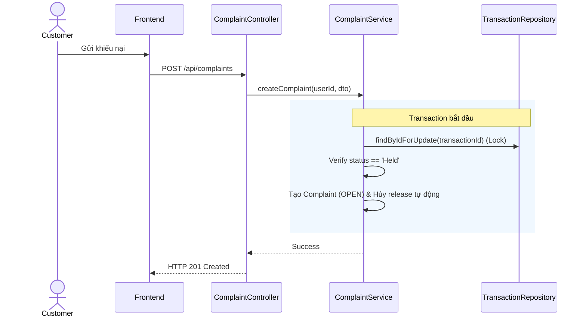

# UC-26 — Khởi Tạo Khiếu Nại Đơn Hàng (Request Complaint)

> **Feature:** `feat-complaint` | **Phiên bản:** 2.0 | **Trạng thái:** Published
> **Tham chiếu FR:** FR-COMPLAINT-01 đến FR-COMPLAINT-12
> **Cập nhật:** 2026-07-24

---

## 1. Tổng Quan

| Thuộc tính | Nội dung |
|:---|:---|
| **Mã Use Case** | UC-26 |
| **Tên** | Khởi Tạo Khiếu Nại Đơn Hàng (Request Complaint) |
| **Tác nhân chính** | Người mua (Customer) |
| **Mô tả ngắn** | Người mua gửi khiếu nại đối với đơn hàng bị lỗi để đóng băng tiền Escrow, ngăn chặn việc giải phóng về ví Seller. |
| **Độ ưu tiên** | Cao (P0) |

---

## 2. Tác Nhân & Điều Kiện

### 2.1 Tác Nhân
| Tác nhân | Vai trò |
|:---|:---|
| **Người mua (Customer)** | Tác nhân chính thực hiện nghiệp vụ của hệ thống. |

### 2.2 Điều Kiện Tiền Quyết (Preconditions)
- Đơn hàng đang ở trạng thái Held (trong thời hạn giam tiền Escrow). Người dùng là chủ đơn.

### 2.3 Hậu Điều Kiện (Postconditions)
- **Thành công:** Bản ghi Complaint được tạo ở trạng thái OPEN, lệnh giải phóng tiền tự động bị đóng băng vô thời hạn.
- **Thất bại:** Trạng thái database không đổi, hệ thống trả về mã lỗi chi tiết.

---

## 3. Luồng Xử Lý (Sequence Steps)

### 3.1 Luồng Chính (Happy Path)
Bước 1 [Customer]:   Tại lịch sử đơn hàng, bấm nút "Khiếu nại".
Bước 2 [Frontend]:   Gửi yêu cầu POST /api/complaints { "transactionId": 1, "title": "Lỗi pass", "description": "Tài khoản sai mật khẩu" }.
Bước 3 [Backend]:    ComplaintController nhận request, gọi ComplaintService.createComplaint().
                       @Transactional:
                         - Truy vấn giao dịch, xác thực status == 'Held'.
                         - Tạo bản ghi Complaint trạng thái 'OPEN'.
                         - Ghi WalletTransaction loại COMPLAINT_HOLD.
Bước 4 [Backend]:    Trả về thông tin khiếu nại vừa tạo.
Bước 5 [Frontend]:   Thông báo khiếu nại thành công và chuyển hướng sang phòng chat đối chất.

### 3.2 Luồng Lỗi (Error Path)
| Tình huống | HTTP | Error Code | Xử lý |
|:---|:---:|:---|:---|
| Hết hạn khiếu nại | 400 | `COMPLAINT_EXPIRED` | Báo lỗi do đã quá 72h/168h giam tiền Escrow của đơn hàng |

---

## 4. Quy Tắc Nghiệp Vụ (Business Rules)

| Mã | Quy tắc | Chi tiết |
|:---|:---|:---|
| BR-26-01 | Đóng băng Escrow | Hệ thống lập tức khóa lệnh giải phóng tiền của transaction tương ứng ngay khi khiếu nại OPEN |

---

## 5. Quy Tắc Kiểm Tra Đầu Vào

| Trường | Kiểm tra | Thông báo lỗi nếu sai |
|:---|:---|:---|
| `transactionId` | Bắt buộc | "Mã giao dịch không được trống" |
| `title` | Bắt buộc, chuỗi từ 5-100 ký tự | "Tiêu đề khiếu nại phải từ 5 đến 100 ký tự" |

---

## 6. Sơ Đồ Tuần Tự (Sequence Diagram)

---

## 7. Tham Chiếu API

| Phương thức | Endpoint | Mô tả |
|:---|:---|:---|
| POST | `/api/complaints` | Khởi tạo khiếu nại đơn hàng |

---

## 8. Tiêu Chỉ Chấp Nhận (Acceptance Criteria)

### AC-26-01 — Khởi tạo khiếu nại đơn hàng thành công
> **Tham chiếu:** FR-COMP-01
- **Cho trước:** Đơn hàng ID 10 đang trạng thái Held.
- **Khi:** Người mua gửi khiếu nại.
- **Thì:** Khiếu nại OPEN được tạo, khóa lệnh giải phóng tiền.

---

## 9. Ngoài Phạm Vi (Out of Scope)
- ❌ Tự động hoàn tiền mà không qua đối chất tranh chấp.

---

## 10. Danh Sách SRS Use Cases Hạt Nhân Trực Thuộc (SRS Mapping)

| SRS UC ID | Tên Use Case SRS | Feature Module | Mô Tả Chức Năng Chi Tiết |
|:---|:---|:---|:---|
| **UC 26** | Request Complaint | feat-complaint | Người mua gửi khiếu nại đối với đơn hàng bị lỗi để đóng băng tiền Escrow, ngăn chặn việc giải phóng về ví Seller. |
