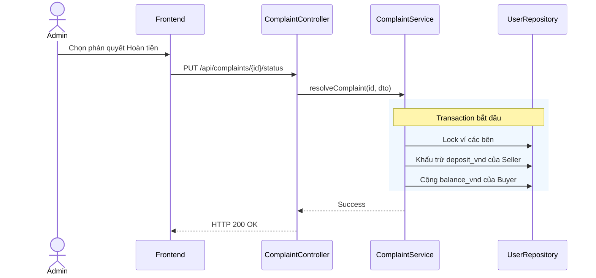

# UC-29 — Giải Quyết Khiếu Nại & Hoàn Tiền (Resolve Complaint & Refund)

> **Feature:** `feat-complaint` | **Phiên bản:** 2.0 | **Trạng thái:** Published
> **Tham chiếu FR:** FR-COMPLAINT-01 đến FR-COMPLAINT-12
> **Cập nhật:** 2026-07-24

---

## 1. Tổng Quan

| Thuộc tính | Nội dung |
|:---|:---|
| **Mã Use Case** | UC-29 |
| **Tên** | Giải Quyết Khiếu Nại & Hoàn Tiền (Resolve Complaint & Refund) |
| **Tác nhân chính** | Quản trị viên (Admin) / Nhân viên (Staff) |
| **Mô tả ngắn** | Admin/Staff phân định tranh chấp khiếu nại, thực hiện hoàn trả tiền cho Buyer hoặc giải phóng tiền bảo lãnh cho Seller. |
| **Độ ưu tiên** | Cao (P0) |

---

## 2. Tác Nhân & Điều Kiện

### 2.1 Tác Nhân
| Tác nhân | Vai trò |
|:---|:---|
| **Quản trị viên (Admin) / Nhân viên (Staff)** | Tác nhân chính thực hiện nghiệp vụ của hệ thống. |

### 2.2 Điều Kiện Tiền Quyết (Preconditions)
- Khiếu nại đang ở trạng thái OPEN hoặc DISPUTE. Staff/Admin đã đăng nhập.

### 2.3 Hậu Điều Kiện (Postconditions)
- **Thành công:** Complaint chuyển sang RESOLVED, tiền được hoàn trả hoặc giải phóng thành công.
- **Thất bại:** Trạng thái database không đổi, hệ thống trả về mã lỗi chi tiết.

---

## 3. Luồng Xử Lý (Sequence Steps)

### 3.1 Luồng Chính (Happy Path)
Bước 1 [Admin/Staff]: Xem nội dung khiếu nại, đối chất chat, bấm phán quyết "Hoàn tiền" hoặc "Bác bỏ".
Bước 2 [Frontend]:   Gửi yêu cầu PUT /api/complaints/{id}/status { "status": "APPROVED", "reason": "Tài khoản lỗi" }.
Bước 3 [Backend]:    ComplaintController nhận request, gọi ComplaintService.resolveComplaint().
                       @Transactional:
                         - Khóa giao dịch Transaction và ví các bên.
                         - Nếu APPROVED (Hoàn tiền):
                           - Chuyển tiền từ deposit_vnd của Seller hoàn trả về balance_vnd của Buyer.
                         - Nếu REJECTED (Bác bỏ khiếu nại):
                           - Giải phóng deposit_vnd sang balance_vnd của Seller (sau khi trừ phí hoa hồng).
                         - Cập nhật Complaint.status = 'RESOLVED'.
                         - Ghi AuditLog hành động.
Bước 4 [Backend]:    Trả về HTTP 200 OK.
Bước 5 [Frontend]:   Cập nhật trạng thái khiếu nại trên giao diện thành RESOLVED.

### 3.2 Luồng Lỗi (Error Path)
| Tình huống | HTTP | Error Code | Xử lý |
|:---|:---:|:---|:---|
| Khiếu nại đã đóng | 400 | `COMPLAINT_ALREADY_CLOSED` | Từ chối xử lý phán quyết lần 2 |

---

## 4. Quy Tắc Nghiệp Vụ (Business Rules)

| Mã | Quy tắc | Chi tiết |
|:---|:---|:---|
| BR-29-01 | Hoàn tiền đầy đủ | Khi hoàn tiền, hoàn trả 100% tiền giao dịch (bao gồm cả phí mua hàng) về ví khả dụng của Buyer |

---

## 5. Quy Tắc Kiểm Tra Đầu Vào

| Trường | Kiểm tra | Thông báo lỗi nếu sai |
|:---|:---|:---|
| `status` | Bắt buộc, thuộc [APPROVED, REJECTED] | "Trạng thái phán quyết không hợp lệ" |
| `reason` | Bắt buộc, tối thiểu 10 ký tự | "Lý do phán quyết phải từ 10 ký tự" |

---

## 6. Sơ Đồ Tuần Tự (Sequence Diagram)

---

## 7. Tham Chiếu API

| Phương thức | Endpoint | Mô tả |
|:---|:---|:---|
| PUT | `/api/complaints/{id}/status` | Phán quyết giải quyết khiếu nại |

---

## 8. Tiêu Chỉ Chấp Nhận (Acceptance Criteria)

### AC-29-01 — Hoàn tiền khi khiếu nại đúng
> **Tham chiếu:** FR-COMP-02
- **Cho trước:** Đơn hàng 100,000 VNĐ bị khiếu nại. Tiền đang đóng băng trong deposit_vnd của Seller.
- **Khi:** Admin phán quyết APPROVED.
- **Thì:** Ví khả dụng Buyer cộng lại 100k, ví đóng băng Seller bị trừ 100k.

---

## 9. Ngoài Phạm Vi (Out of Scope)
- ❌ Xử phạt tiền phạt vi phạm hành chính đối với gian hàng.

---

## 10. Danh Sách SRS Use Cases Hạt Nhân Trực Thuộc (SRS Mapping)

| SRS UC ID | Tên Use Case SRS | Feature Module | Mô Tả Chức Năng Chi Tiết |
|:---|:---|:---|:---|
| **UC 29** | Resolve Complaint & Refund | feat-complaint | Admin/Staff phân định tranh chấp khiếu nại, thực hiện hoàn trả tiền cho Buyer hoặc giải phóng tiền bảo lãnh cho Seller. |
