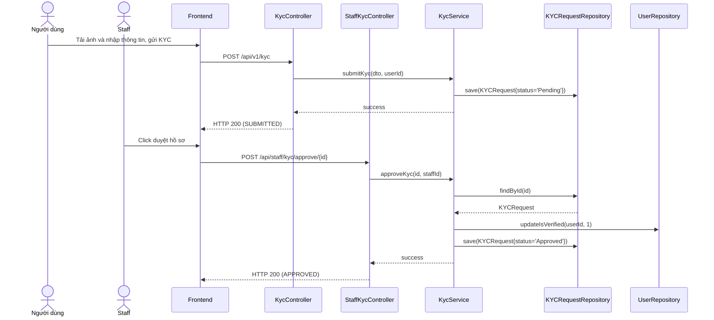

# UC-03 — Xác Thực Danh Tính (KYC Verification)

> **Feature:** `feat-kyc` | **Phiên bản:** 1.0 | **Trạng thái:** Published
> **Tham chiếu FR:** FR-KYC-01 đến FR-KYC-06
> **Cập nhật:** 2026-06-30

---

## 1. Tổng Quan

| Thuộc tính | Nội dung |
|:---|:---|
| **Mã Use Case** | UC-03 |
| **Tên** | Xác Thực Danh Tính (KYC Verification) |
| **Tác nhân chính** | Người dùng (User), Nhân viên kiểm duyệt (Staff) |
| **Mô tả ngắn** | Người dùng gửi tài liệu cá nhân (CCCD/CMND) và ảnh chân dung để xác minh danh tính. Nhân viên hệ thống (Staff) sẽ tiến hành kiểm duyệt hồ sơ và duyệt/từ chối yêu cầu. |
| **Độ ưu tiên** | Cao (P1) — bắt buộc đối với luồng rút tiền và đăng ký gian hàng bán hàng |

---

## 2. Tác Nhân & Điều Kiện

### 2.1 Tác Nhân

| Tác nhân | Vai trò |
|:---|:---|
| **Người dùng (User)** | Tải lên các tệp ảnh tài liệu và gửi yêu cầu xác thực |
| **Nhân viên (Staff)** | Xem danh sách hồ sơ cần duyệt, thực hiện phê duyệt hoặc từ chối |
| **UploadService** | Tiếp nhận và lưu trữ các tệp tin hình ảnh tải lên |

### 2.2 Điều Kiện Tiền Quyết (Preconditions)

- Người dùng đã đăng nhập hệ thống và tài khoản đã được kích hoạt (`enabled = 1`).
- Người dùng chưa có yêu cầu KYC nào đang ở trạng thái `Pending`.

### 2.3 Hậu Điều Kiện (Postconditions)

- **Thành công (Approve):** Cập nhật trạng thái người dùng thành `isVerified = 1`.
- **Từ chối (Reject):** Lưu vết lý do từ chối, người dùng có thể gửi lại yêu cầu mới.

---

## 3. Luồng Xử Lý

### 3.1 Luồng Chính — Gửi Yêu Cầu KYC (Happy Path)

```
Bước 1  [User]:       Truy cập mục "Thông tin cá nhân", chọn "Xác thực KYC"
Bước 2  [Frontend]:   GET /api/v1/kyc/me để kiểm tra trạng thái hiện tại
Bước 3  [Backend]:    Trả về trạng thái chưa KYC (status: NOT_SUBMITTED)
Bước 4  [User]:       Nhập Họ tên, Số định danh CCCD và tải lên 3 ảnh:
                       - Mặt trước CCCD
                       - Mặt sau CCCD
                       - Ảnh selfie chân dung
Bước 5  [Frontend]:   Tải các tệp ảnh qua API upload, sau đó gửi yêu cầu:
                       POST /api/v1/kyc { fullName, citizenId, frontImage, backImage, selfieImage }
Bước 6  [Backend]:    Validate: citizenId từ 9 đến 12 chữ số
                       Lưu hồ sơ vào bảng KYCRequests với status = 'Pending'
                       Trả về: status = 200, message = "SUBMITTED"
Bước 7  [Frontend]:   Hiển thị thông báo gửi hồ sơ thành công, trạng thái "Đang chờ duyệt"
```

### 3.2 Luồng Duyệt KYC (Staff)

```
Bước 1  [Staff]:      Vào màn hình Admin/Staff, chọn danh sách KYC cần duyệt
Bước 2  [Frontend]:   GET /api/staff/kyc?status=Pending
Bước 3  [Backend]:    Trả về danh sách phân trang các hồ sơ KYC chờ duyệt
Bước 4  [Staff]:      Nhấp vào hồ sơ của User, so sánh ảnh CCCD với chân dung thực tế
Bước 5  [Staff]:      Nhấn nút "Duyệt"
Bước 6  [Frontend]:   POST /api/staff/kyc/approve/{kycId}
Bước 7  [Backend]:    @Transactional:
                       - Cập nhật KYCRequests.status = 'Approved'
                       - Cập nhật Users.isVerified = 1
                       - Tạo thông báo hệ thống gửi cho User
                       Trả về: status = 200, message = "APPROVED"
```

### 3.3 Luồng Lỗi — Từ Chối KYC (Staff)

```
Bước 5  [Staff]:      Nhập lý do từ chối (ví dụ: "Ảnh bị mờ không rõ số") và nhấn "Từ chối"
Bước 6  [Frontend]:   POST /api/staff/kyc/reject/{kycId} { reason }
Bước 7  [Backend]:    Validate reason không rỗng
                       Cập nhật KYCRequests.status = 'Rejected' và lưu rejection_reason
                       Gửi thông báo từ chối cho User
```

---

## 4. Quy Tắc Nghiệp Vụ

| Mã | Quy tắc | Chi tiết |
|:---|:---|:---|
| BR-03-01 | Chỉ gửi 1 yêu cầu | Không được gửi yêu cầu mới khi có hồ sơ đang ở trạng thái `Pending` |
| BR-03-02 | citizenId từ 9-12 số | Bắt buộc kiểm tra độ dài mã định danh công dân |
| BR-03-03 | Quyền Staff | Chỉ các tài khoản có vai trò `Staff` hoặc `Admin` mới gọi được API duyệt |

---

## 5. Quy Tắc Kiểm Tra Đầu Vào

### POST /api/v1/kyc

| Trường | Kiểm tra | Lỗi khi vi phạm |
|:---|:---|:---|
| `fullName` | Bắt buộc, tối đa 100 ký tự | "Họ tên không được rỗng" |
| `citizenId` | Bắt buộc, định dạng số 9-12 ký tự | "Số CCCD/CMND không hợp lệ" |
| `frontImage` | Bắt buộc tệp ảnh hợp lệ | "Ảnh mặt trước là bắt buộc" |

---

## 6. Sơ Đồ Tuần Tự (Sequence Diagram)

### Luồng Gửi và Duyệt KYC



---

## 7. Tham Chiếu API

| Phương thức | Endpoint | Mô tả |
|:---|:---|:---|
| `POST` | `/api/v1/kyc` | Gửi hồ sơ KYC mới |
| `GET` | `/api/v1/kyc/me` | Lấy thông tin KYC hiện tại của tôi |
| `POST` | `/api/staff/kyc/approve/{id}` | Phê duyệt hồ sơ KYC (Staff) |
| `POST` | `/api/staff/kyc/reject/{id}` | Từ chối hồ sơ KYC kèm lý do (Staff) |

---

## 8. Tiêu Chí Chấp Nhận (Acceptance Criteria)

### AC-03-01 — Kiểm duyệt thành công nâng cấp tài khoản

- **Cho trước:** Người dùng `User A` gửi hồ sơ KYC ở trạng thái `Pending`
- **Khi:** Staff gọi POST `/api/staff/kyc/approve/{kycId}`
- **Thì:**
  - Trạng thái yêu cầu chuyển sang `Approved`
  - Trường `isVerified` của `User A` chuyển thành `1` (true)

---

## 9. Ngoài Phạm Vi (Out of Scope)

- ❌ Tự động nhận diện khuôn mặt qua AI (eKYC).
- ❌ Kết nối API trực tiếp với cơ sở dữ liệu quốc gia về dân cư.
