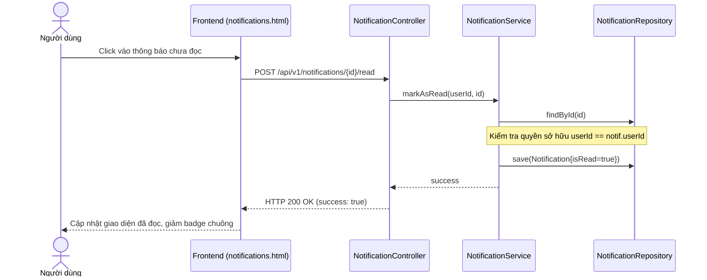

# UC-13 — Thông Báo Tài Khoản (Account Notifications)

> **Feature:** `feat-notification` | **Phiên bản:** 2.0 | **Trạng thái:** Published
> **Tham chiếu FR:** FR-NOTI-01 đến FR-NOTI-05
> **Cập nhật:** 2026-07-16

---

## 1. Tổng Quan

| Thuộc tính | Nội dung |
|:---|:---|
| **Mã Use Case** | UC-13 |
| **Tên** | Thông Báo Tài Khoản (Account Notifications) |
| **Tác nhân chính** | Người dùng (User), Hệ thống (System) |
| **Mô tả ngắn** | Hệ thống tự động đẩy thông báo biến động số dư ví, cập nhật trạng thái đơn hàng, kết quả kiểm duyệt tới người dùng đích hoặc hiển thị thông báo broadcast hệ thống lên chuông thông báo cá nhân của người dùng, hỗ trợ đánh dấu đã đọc. |
| **Độ ưu tiên** | Cao (P0) — Cung cấp phản hồi trạng thái hoạt động tức thì cho người dùng |

---

## 2. Tác Nhân & Điều Kiện

### 2.1 Tác Nhân

| Tác nhân | Vai trò |
|:---|:---|
| **Người dùng (User)** | Nhận thông báo cá nhân/broadcast hệ thống, xem danh sách thông báo và đánh dấu đã đọc |
| **Hệ thống (System)** | Tự động kích hoạt tạo thông báo dựa trên các sự kiện nghiệp vụ (KYC_APPROVED, TOPUP_SUCCESS, WITHDRAWAL_COMPLETED, ORDER_PAID...) |

### 2.2 Điều Kiện Tiền Quyết (Preconditions)

- Người dùng đã đăng nhập tài khoản.

### 2.3 Hậu Điều Kiện (Postconditions)

- **Thành công:** Thông báo mới hiển thị lên danh sách thông báo của User, số đếm chưa đọc trên biểu tượng Chuông tăng lên. Khi user đánh dấu đọc, trạng thái chuyển thành `isRead = 1`.

---

## 3. Luồng Xử Lý

### 3.1 Luồng Chính — Xem và Đọc thông báo cá nhân (Happy Path)

```
Bước 1  [System]:     Giao dịch nạp tiền thành công, kích hoạt sự kiện ví
Bước 2  [Backend]:    Tạo bản ghi mới trong bảng Notifications:
                       { user_id: 42, title: "Nạp tiền thành công", content: "Tài khoản của bạn đã được cộng 50,000đ", type: "wallet", isRead: 0, severity: "SUCCESS" }
                       Kiểm tra User 42 đang online
                       Cập nhật badge số thông báo chưa đọc
Bước 3  [User]:       Nhấp vào biểu tượng Chuông thông báo trên Header hoặc menu Sidebar
Bước 4  [Frontend]:   Chuyển hướng đến trang /account/notifications và gọi GET /api/v1/notifications
Bước 5  [Backend]:    Truy vấn bảng Notifications lấy các thông báo của user_id = 42 và các thông báo broadcast hệ thống (do Admin/Staff gửi)
                       Trả về danh sách sắp xếp theo thời gian mới nhất
Bước 6  [Frontend]:   Hiển thị danh sách thông báo lên màn hình với phân loại màu sắc theo severity (INFO, WARNING, DANGER, SUCCESS)
Bước 7  [User]:       Nhấp vào một thông báo chưa đọc cụ thể để xem chi tiết
Bước 8  [Frontend]:   POST /api/v1/notifications/{notiId}/read
Bước 9  [Backend]:    Cập nhật Notifications.isRead = 1
                       Trả về: status = 200, success = true
Bước 10 [Frontend]:   Chuyển trạng thái hiển thị của thông báo đó thành "Đã đọc", giảm số lượng thông báo chưa đọc trên badge chuông
```

### 3.2 Luồng Đánh dấu đọc tất cả (Mark All As Read)

```
Bước 1  [User]:       Ở trang thông báo cá nhân, nhấn nút "Đánh dấu tất cả đã đọc"
Bước 2  [Frontend]:   POST /api/v1/notifications/mark-all-read
Bước 3  [Backend]:    Cập nhật isRead = 1 cho tất cả các thông báo cá nhân chưa đọc của user hiện tại
                       Trả về: status = 200, success = true
Bước 4  [Frontend]:   Cập nhật lại giao diện, đặt badge chuông về 0 và chuyển trạng thái các item thành đã đọc
```

---

## 4. Quy Tắc Nghiệp Vụ

| Mã | Quy tắc | Chi tiết |
|:---|:---|:---|
| BR-13-01 | Phân tách loại thông báo | Thông báo cá nhân liên quan ví, đơn hàng có link điều hướng `targetUrl` đến trang tương ứng để tăng trải nghiệm người dùng |
| BR-13-02 | Xóa mềm | Khi người dùng xóa thông báo, hệ thống chỉ cập nhật cờ `isDelete = 1`, không xóa vật lý |

---

## 5. Quy Tắc Kiểm Tra Đầu Vào

### POST /api/v1/notifications/{id}/read
- `id` phải tồn tại trong bảng `Notifications` và thuộc sở hữu của người dùng hiện tại (trừ trường hợp thông báo broadcast).

---

## 6. Sơ Đồ Tuần Tự (Sequence Diagram)

### Luồng Đọc Thông Báo Cá Nhân



---

## 7. Tham Chiếu API

| Phương thức | Endpoint | Mô tả |
|:---|:---|:---|
| `GET` | `/api/v1/notifications` | Lấy danh sách thông báo của tôi (cá nhân + broadcast) |
| `POST` | `/api/v1/notifications/{id}/read` | Đánh dấu đã đọc thông báo cá nhân |
| `POST` | `/api/v1/notifications/mark-all-read` | Đánh dấu đọc tất cả thông báo cá nhân |

---

## 8. Tiêu Chí Chấp Nhận (Acceptance Criteria)

### AC-13-01 — Đánh dấu đã đọc thành công và giảm số đếm badge
- **Cho trước:** Người dùng đang có badge chuông hiển thị số 3 chưa đọc.
- **Khi:** Người dùng nhấn vào một thông báo có ID 15 của họ.
- **Thì:**
  - Database cập nhật `isRead = 1` cho thông báo 15.
  - Số đếm badge chuông giảm xuống còn 2.
  - HTTP trả về 200 OK.
