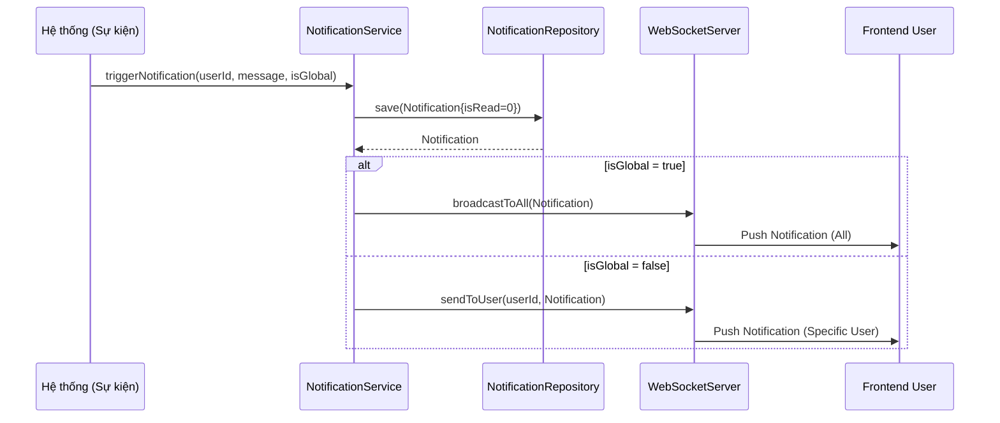

# UC-13 — Thông Báo Hệ Thống (System Notifications)

> **Feature:** `feat-notification` | **Phiên bản:** 1.0 | **Trạng thái:** Published
> **Tham chiếu FR:** FR-NOTI-01 đến FR-NOTI-07
> **Cập nhật:** 2026-06-30

---

## 1. Tổng Quan

| Thuộc tính | Nội dung |
|:---|:---|
| **Mã Use Case** | UC-13 |
| **Tên** | Thông Báo Hệ Thống (System Notifications) |
| **Tác nhân chính** | Người dùng (User), Hệ thống (System) |
| **Mô tả ngắn** | Hệ thống tự động gửi thông báo biến động số dư ví, cập nhật trạng thái đơn hàng, kết quả kiểm duyệt tới người dùng đích hoặc toàn bộ người dùng hệ thống (Global) thông qua cơ chế phân phối thời gian thực và lưu trữ. |
| **Độ ưu tiên** | Trung bình (P1) — cải thiện tương tác người dùng và tính minh bạch thông tin |

---

## 2. Tác Nhân & Điều Kiện

### 2.1 Tác Nhân

| Tác nhân | Vai trò |
|:---|:---|
| **Người dùng (User)** | Nhận thông báo, xem danh sách thông báo và đánh dấu đã đọc |
| **Hệ thống (System)** | Tự động kích hoạt tạo thông báo dựa trên các sự kiện nghiệp vụ |

### 2.2 Điều Kiện Tiền Quyết (Preconditions)

- Người dùng đã đăng nhập tài khoản.
- Có các sự kiện nghiệp vụ xảy ra (nạp tiền, rút tiền, khiếu nại, duyệt KYC, v.v.).

### 2.3 Hậu Điều Kiện (Postconditions)

- **Thành công:** Thông báo mới được lưu vào bảng `Notifications` (status `is_read = 0`), hiển thị lên chuông thông báo của User đích.

---

## 3. Luồng Xử Lý

### 3.1 Luồng Chính — Gửi và Xem thông báo (Happy Path)

```
Bước 1  [System]:     Giao dịch nạp tiền thành công, kích hoạt sự kiện TOPUP_SUCCESS
Bước 2  [Backend]:    Tạo bản ghi mới trong bảng Notifications:
                       { user_id: 42, message: "Tài khoản của bạn đã được cộng 50,000đ", is_read: 0, is_global: 0 }
                       Kiểm tra User 42 đang online
                       Đẩy thông báo real-time qua WebSocket/SSE
Bước 3  [User]:       Đang duyệt web, nghe tiếng chuông và số đếm đỏ trên chuông tăng lên 1
Bước 4  [User]:       Nhấp vào biểu tượng Chuông thông báo
Bước 5  [Frontend]:   GET /api/v1/notifications
Bước 6  [Backend]:    Truy vấn bảng Notifications lấy các thông báo của user_id = 42 và các thông báo global (is_global = 1)
                       Trả về danh sách sắp xếp theo thời gian mới nhất
Bước 7  [Frontend]:   Hiển thị danh sách thông báo
Bước 8  [User]:       Nhấp vào thông báo cụ thể để xem chi tiết đơn hàng/ví
Bước 9  [Frontend]:   POST /api/v1/notifications/{notiId}/read
Bước 10 [Backend]:    Cập nhật Notifications.is_read = 1
                       Trả về: status = 200, message = "READ"
Bước 11 [Frontend]:   Giảm số lượng thông báo chưa đọc trên biểu tượng chuông
```

### 3.2 Luồng Gửi Thông Báo Toàn Hệ Thống (Global Notification)

```
Bước 1  [Admin]:      Tạo thông báo bảo trì hệ thống từ trang quản trị
Bước 2  [Frontend]:   POST /api/admin/notifications/global { message: "Hệ thống sẽ bảo trì từ 2h-4h sáng ngày mai." }
Bước 3  [Backend]:    Lưu bản ghi Notifications với user_id = NULL, is_global = 1
                       Gửi thông báo real-time qua kênh broadcast tới toàn bộ client đang kết nối
Bước 4  [Mọi User]:   Nhận được thông báo hiển thị trên chuông
```

---

## 4. Quy Tắc Nghiệp Vụ

| Mã | Quy tắc | Chi tiết |
|:---|:---|:---|
| BR-13-01 | Lưu trữ vĩnh viễn | Thông báo không được xóa vật lý (`isDelete = 1` nếu người dùng ẩn, mặc định giữ lại để tra cứu lịch sử) |
| BR-13-02 | Tải bất đồng bộ | Quá trình tạo thông báo trong hệ thống nên chạy bất đồng bộ để tránh làm chậm luồng xử lý giao dịch chính |

---

## 5. Quy Tắc Kiểm Tra Đầu Vào

### POST /api/admin/notifications/global

| Trường | Kiểm tra | Lỗi khi vi phạm |
|:---|:---|:---|
| `message` | Bắt buộc, không rỗng, tối đa 500 ký tự | "Nội dung thông báo không được để trống" |

---

## 6. Sơ Đồ Tuần Tự (Sequence Diagram)

### Luồng Phân Phối Thông Báo



---

## 7. Tham Chiếu API

| Phương thức | Endpoint | Mô tả |
|:---|:---|:---|
| `GET` | `/api/v1/notifications` | Lấy danh sách thông báo của tôi |
| `POST` | `/api/v1/notifications/{id}/read` | Đánh dấu đã đọc thông báo |
| `POST` | `/api/admin/notifications/global` | Gửi thông báo toàn hệ thống (Admin) |

---

## 8. Tiêu Chí Chấp Nhận (Acceptance Criteria)

### AC-13-01 — Đánh dấu đã đọc thông báo thành công

- **Cho trước:** Người dùng có thông báo ID `12` đang ở trạng thái chưa đọc (`is_read = 0`)
- **Khi:** Gọi POST `/api/v1/notifications/12/read`
- **Thì:**
  - Trạng thái thông báo trong DB chuyển thành `is_read = 1`
  - HTTP 200 OK

---

## 9. Ngoài Phạm Vi (Out of Scope)

- ❌ Gửi thông báo qua tin nhắn SMS điện thoại.
- ❌ Gửi thông báo đẩy trên ứng dụng di động qua Firebase Cloud Messaging (FCM).
