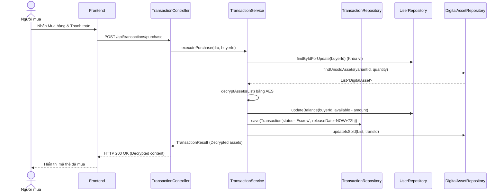

# UC-08 — Mua Hàng Tạm Giữ (Order Checkout & Escrow)

> **Feature:** `feat-order` | **Phiên bản:** 1.0 | **Trạng thái:** Published
> **Tham chiếu FR:** FR-ORD-01 đến FR-ORD-05
> **Cập nhật:** 2026-06-30

---

## 1. Tổng Quan

| Thuộc tính | Nội dung |
|:---|:---|
| **Mã Use Case** | UC-08 |
| **Tên** | Mua Hàng Tạm Giữ (Order Checkout & Escrow) |
| **Tác nhân chính** | Người mua (Customer) |
| **Mô tả ngắn** | Khách hàng mua sản phẩm số, hệ thống khấu trừ ví của người mua và đưa tiền vào quỹ tạm giữ Escrow. Đồng thời tự động giải mã sản phẩm số và bàn giao. Hệ thống giữ tiền trong 72 giờ trước khi cộng vào ví Seller. |
| **Độ ưu tiên** | Cao (P0) — cốt lõi kinh doanh sàn giao dịch sản phẩm số |

---

## 2. Tác Nhân & Điều Kiện

### 2.1 Tác Nhân

| Tác nhân | Vai trò |
|:---|:---|
| **Người mua (Customer)** | Chọn sản phẩm, xác nhận mua và nhận mã sản phẩm |
| **WalletService** | Xử lý khóa tiền, chuyển khoản tạm giữ Escrow |
| **EncryptionService** | Thực hiện giải mã nội dung sản phẩm số (AES) để bàn giao |

### 2.2 Điều Kiện Tiền Quyết (Preconditions)

- Người mua có đủ số dư ví khả dụng (`available_balance >= amount`).
- Biến thể sản phẩm số còn tồn kho khả dụng (`stock > 0`).

### 2.3 Hậu Điều Kiện (Postconditions)

- **Giao dịch tạo thành công:** Tạo hóa đơn `Transaction` (status = 'Escrow'), trích xuất và bàn giao `DigitalAsset` cho người mua, thiết lập `escrow_release_date = NOW() + 72h`.

---

## 3. Luồng Xử Lý

### 3.1 Luồng Chính — Mua hàng tự động (Happy Path)

```
Bước 1  [Customer]:   Xem sản phẩm, chọn biến thể cần mua, nhấn "Mua ngay"
Bước 2  [Frontend]:   Hiển thị trang xác nhận thanh toán (không thu phí dịch vụ người mua)
Bước 3  [Customer]:   Nhấn "Thanh toán bằng số dư ví"
Bước 4  [Frontend]:   POST /api/transactions/purchase { productId, variantId, quantity }
Bước 5  [Backend]:    Validate: sản phẩm tồn tại, isDelete = 0
                       Validate: tồn kho khả dụng của variant >= quantity
                       Validate: available_balance của Buyer >= tổng tiền (price * quantity)
                       - @Transactional:
                         - Thực hiện khóa Pessimistic Lock số dư ví Buyer
                         - Khấu trừ available_balance của Buyer
                         - Tạo bản ghi Transactions ở trạng thái 'Escrow'
                         - Thiết lập escrow_release_date = server time NOW() + 72 giờ
                         - Lấy ra các bản ghi DigitalAssets chưa bán từ DB
                         - Gán transaction_id, cập nhật is_sold = 1 cho các DigitalAssets đó
                         - Giải mã nội dung asset_content bằng khóa bảo mật AES
                         - Tạo WalletTransactions (type = 'PURCHASE_ESCROW')
                       Trả về: status = 200, transactionId, status = "Escrow", amount, decryptedAssets[]
Bước 6  [Frontend]:   Hiển thị thông báo mua thành công và hiển thị danh sách mã thẻ/tài khoản đã giải mã cho người mua
```

### 3.2 Luồng Giải Phóng Tiền Tự Động (Cron Job sau 72h)

```
Bước 1  [System]:     Cron job định kỳ chạy quét các Transactions có status = 'Escrow' và escrow_release_date <= server NOW()
Bước 2  [Backend]:    Với mỗi giao dịch thỏa mãn:
                       - Tính phí hoa hồng hệ thống của Seller từ SystemConfiguration
                       - Cộng tiền (amount - hoa hồng) vào available_balance của Seller
                       - Cập nhật Transaction.status = 'Completed'
                       - Gửi thông báo cộng tiền thành công cho Seller
```

### 3.3 Luồng Giải Phóng Tiền Sớm (Buyer Xác Nhận)

```
Bước 1  [Customer]:   Vào trang "Lịch sử mua hàng", chọn đơn hàng đang tạm giữ, bấm "Đã nhận hàng và hài lòng"
Bước 2  [Frontend]:   POST /api/transactions/{id}/confirm-received
Bước 3  [Backend]:    Validate Customer chính là người mua của giao dịch
                       Cập nhật status = 'Completed', giải phóng ngay lập tức số tiền về ví Seller (trừ phí hoa hồng)
                       Gửi thông báo cộng tiền cho Seller
```

---

## 4. Quy Tắc Nghiệp Vụ

| Mã | Quy tắc | Chi tiết |
|:---|:---|:---|
| BR-08-01 | Giam tiền 72h | Tiền mua hàng bắt buộc bị giam trong ví hệ thống 72 giờ để đề phòng người mua khiếu nại |
| BR-08-02 | Phí người mua bằng 0 | Hệ thống không được thu thêm bất kỳ khoản phí dịch vụ nào đối với người mua |
| BR-08-03 | Mã hóa nội dung nhạy cảm | Nội dung nhạy cảm (mật mã, code) phải lưu trữ mã hóa trong DB và giải mã động khi bàn giao |

---

## 5. Quy Tắc Kiểm Tra Đầu Vào

### POST /api/transactions/purchase

| Trường | Kiểm tra | Lỗi khi vi phạm |
|:---|:---|:---|
| `productId` | Bắt buộc, `> 0` | "productId không hợp lệ" |
| `variantId` | Bắt buộc, `> 0` | "variantId không hợp lệ" |
| `quantity` | Bắt buộc, `> 0` | "Số lượng phải lớn hơn 0" |

---

## 6. Sơ Đồ Tuần Tự (Sequence Diagram)

### Luồng Đặt Hàng và Giam Tiền



---

## 7. Tham Chiếu API

| Phương thức | Endpoint | Mô tả |
|:---|:---|:---|
| `POST` | `/api/transactions/purchase` | Thực hiện mua hàng và thanh toán |
| `POST` | `/api/transactions/{id}/confirm-received` | Người mua xác nhận đã nhận hàng sớm |
| `GET` | `/api/transactions/my-orders` | Xem danh sách đơn hàng đã mua của tôi |

---

## 8. Tiêu Chí Chấp Nhận (Acceptance Criteria)

### AC-08-01 — Không đủ số dư khả dụng bị chặn mua hàng

- **Cho trước:** Tài khoản `User D` có `available_balance = 50,000` VNĐ
- **Khi:** Gửi yêu cầu mua biến thể sản phẩm trị giá 60,000 VNĐ
- **Thì:** Hệ thống chặn giao dịch và trả về lỗi HTTP 422 kèm thông điệp "Số dư khả dụng không đủ"

---

## 9. Ngoài Phạm Vi (Out of Scope)

- ❌ Thanh toán trực tiếp qua ví MoMo, thẻ tín dụng Visa (phải nạp tiền vào ví trước).
- ❌ Hỗ trợ mua nhiều sản phẩm khác Shop cùng một lúc (chưa có giỏ hàng liên shop).
