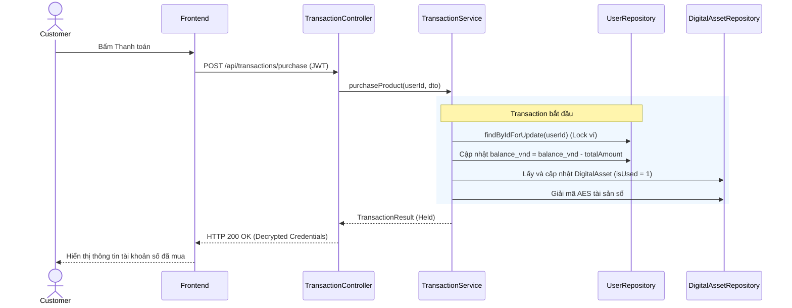

# UC-12 — Đặt Mua & Thanh Toán Đơn Hàng (Make Order & Payment)

> **Feature:** `feat-order` | **Phiên bản:** 2.0 | **Trạng thái:** Published
> **Tham chiếu FR:** FR-ORDER-01 đến FR-ORDER-12
> **Cập nhật:** 2026-07-24

---

## 1. Tổng Quan

| Thuộc tính | Nội dung |
|:---|:---|
| **Mã Use Case** | UC-12 |
| **Tên** | Đặt Mua & Thanh Toán Đơn Hàng (Make Order & Payment) |
| **Tác nhân chính** | Người mua (Customer) |
| **Mô tả ngắn** | Khấu trừ ví khả dụng (balance_vnd), giam tiền trong ví tạm giữ bảo lãnh Escrow (Held) và phân cấp tài sản số tự động. |
| **Độ ưu tiên** | Cao (P0) |

---

## 2. Tác Nhân & Điều Kiện

### 2.1 Tác Nhân
| Tác nhân | Vai trò |
|:---|:---|
| **Người mua (Customer)** | Tác nhân chính thực hiện nghiệp vụ của hệ thống. |

### 2.2 Điều Kiện Tiền Quyết (Preconditions)
- Ví khả dụng balance_vnd >= tổng tiền thanh toán + phí dịch vụ mua hàng.

### 2.3 Hậu Điều Kiện (Postconditions)
- **Thành công:** Ví người mua bị trừ, tiền chuyển sang ví đóng băng (deposit_vnd) của Seller, tạo Transaction trạng thái Held, bàn giao tài khoản số giải mã.
- **Thất bại:** Trạng thái database không đổi, hệ thống trả về mã lỗi chi tiết.

---

## 3. Luồng Xử Lý (Sequence Steps)

### 3.1 Luồng Chính (Happy Path)
Bước 1 [Customer]:   Chọn gói biến thể cần mua, số lượng, bấm "Thanh toán ngay".
Bước 2 [Frontend]:   Gửi yêu cầu POST /api/transactions/purchase.
Bước 3 [Backend]:    TransactionController nhận request, gọi TransactionService.purchaseProduct().
                       @Transactional:
                         - Khóa Pessimistic Lock số dư ví người mua.
                         - Khấu trừ balance_vnd: balance_vnd = balance_vnd - totalAmount.
                         - Giảm tồn kho biến thể sản phẩm.
                         - Sinh Transaction trạng thái 'Held' có thời hạn Escrow (72h hoặc 168h).
                         - Cấp phát tài sản số từ bảng DigitalAssets (isUsed = 1, gán transaction_id).
                         - Giải mã AES thông tin đăng nhập tài khoản.
Bước 4 [Backend]:    Trả về thông tin tài sản đã giải mã.
Bước 5 [Frontend]:   Hiển thị thông báo mua thành công và thông tin tài khoản số thô.

### 3.2 Luồng Lỗi (Error Path)
| Tình huống | HTTP | Error Code | Xử lý |
|:---|:---:|:---|:---|
| Ví không đủ số dư | 422 | `INSUFFICIENT_BALANCE` | Báo lỗi số dư khả dụng không đủ |
| Biến thể hết hàng | 400 | `OUT_OF_STOCK` | Báo lỗi biến thể sản phẩm số đã hết hàng trong kho |

---

## 4. Quy Tắc Nghiệp Vụ (Business Rules)

| Mã | Quy tắc | Chi tiết |
|:---|:---|:---|
| BR-12-01 | Thu phí cố định người mua | Tự động cộng thêm FLAT_BUYER_FEE_VND từ SystemConfigurations vào tổng giá trị trừ ví |
| BR-12-02 | Cơ chế giam tiền Escrow | Mặc định giam giữ tiền giao dịch trong 72h (168h cho shop mới/shop bị cảnh cáo) để đảm bảo quyền lợi khiếu nại của Buyer |

---

## 5. Quy Tắc Kiểm Tra Đầu Vào

| Trường | Kiểm tra | Thông báo lỗi nếu sai |
|:---|:---|:---|
| `productId` | Bắt buộc | "ID sản phẩm không được trống" |
| `quantity` | Bắt buộc, số nguyên dương | "Số lượng phải lớn hơn 0" |

---

## 6. Sơ Đồ Tuần Tự (Sequence Diagram)

---

## 7. Tham Chiếu API

| Phương thức | Endpoint | Mô tả |
|:---|:---|:---|
| POST | `/api/transactions/purchase` | Đặt mua và thanh toán đơn hàng sản phẩm số |

---

## 8. Tiêu Chỉ Chấp Nhận (Acceptance Criteria)

### AC-12-01 — Đặt mua và thanh toán thành công
> **Tham chiếu:** FR-ORD-01
- **Cho trước:** Người mua có 200,000 VNĐ khả dụng. Giá biến thể là 100,000 VNĐ, phí mua hàng 5,000 VNĐ.
- **Khi:** Gửi yêu cầu mua.
- **Thì:** Ví bị trừ 105,000 VNĐ, nhận được tài khoản giải mã thành công.

---

## 9. Ngoài Phạm Vi (Out of Scope)
- ❌ Mua hàng trực tiếp không qua số dư ví (phải nạp tiền trước).

---

## 10. Danh Sách SRS Use Cases Hạt Nhân Trực Thuộc (SRS Mapping)

| SRS UC ID | Tên Use Case SRS | Feature Module | Mô Tả Chức Năng Chi Tiết |
|:---|:---|:---|:---|
| **UC 12** | Make Order & Payment | feat-order | Khấu trừ ví khả dụng (balance_vnd), giam tiền trong ví tạm giữ bảo lãnh Escrow (Held) và phân cấp tài sản số tự động. |
