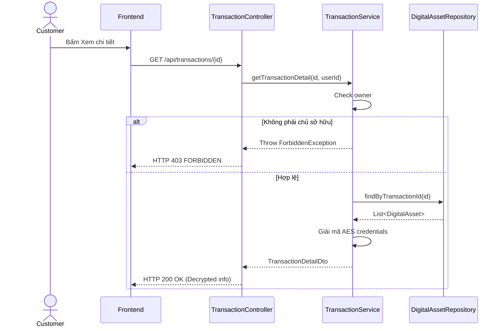

# UC-13 — Xem Chi Tiết Đơn Hàng & Giải Mã Tài Sản Số (View Order Details & Decrypt Assets)

> **Feature:** `feat-order` | **Phiên bản:** 2.0 | **Trạng thái:** Published
> **Tham chiếu FR:** FR-ORDER-01 đến FR-ORDER-12
> **Cập nhật:** 2026-07-24

---

## 1. Tổng Quan

| Thuộc tính | Nội dung |
|:---|:---|
| **Mã Use Case** | UC-13 |
| **Tên** | Xem Chi Tiết Đơn Hàng & Giải Mã Tài Sản Số (View Order Details & Decrypt Assets) |
| **Tác nhân chính** | Người mua (Customer) |
| **Mô tả ngắn** | Người mua xem thông tin chi tiết đơn hàng đã mua và lấy thông tin tài khoản/key đã được giải mã AES từ DB. |
| **Độ ưu tiên** | Cao (P0) |

---

## 2. Tác Nhân & Điều Kiện

### 2.1 Tác Nhân
| Tác nhân | Vai trò |
|:---|:---|
| **Người mua (Customer)** | Tác nhân chính thực hiện nghiệp vụ của hệ thống. |

### 2.2 Điều Kiện Tiền Quyết (Preconditions)
- Người dùng đã đăng nhập và là chủ sở hữu của đơn hàng cần xem.

### 2.3 Hậu Điều Kiện (Postconditions)
- **Thành công:** Thông tin đơn hàng hiển thị thành công kèm tài sản số đã giải mã rõ ràng.
- **Thất bại:** Trạng thái database không đổi, hệ thống trả về mã lỗi chi tiết.

---

## 3. Luồng Xử Lý (Sequence Steps)

### 3.1 Luồng Chính (Happy Path)
Bước 1 [Customer]:   Tại màn hình Lịch sử đơn hàng, chọn "Xem chi tiết" đơn hàng.
Bước 2 [Frontend]:   Gửi yêu cầu GET /api/transactions/{id}.
Bước 3 [Backend]:    TransactionController gọi TransactionService.getTransactionDetail().
                       - Kiểm tra quyền sở hữu đơn hàng (customer_id == current_user_id).
                       - Lấy danh sách DigitalAssets gán cho transaction.
                       - Giải mã trường credentials bằng thuật toán đối xứng AES.
Bước 4 [Backend]:    Trả về Transaction details kèm List<DecryptedAsset>.
Bước 5 [Frontend]:   Render giao diện hiển thị credentials tài khoản số đã mua.

### 3.2 Luồng Lỗi (Error Path)
| Tình huống | HTTP | Error Code | Xử lý |
|:---|:---:|:---|:---|
| Không phải chủ đơn | 403 | `FORBIDDEN` | Từ chối hiển thị credentials tài sản số |
| Đơn không tồn tại | 404 | `TRANSACTION_NOT_FOUND` | Trả về lỗi không tìm thấy đơn hàng |

---

## 4. Quy Tắc Nghiệp Vụ (Business Rules)

| Mã | Quy tắc | Chi tiết |
|:---|:---|:---|
| BR-13-01 | Bảo mật thông tin | Tuyệt đối không trả về thông tin credentials giải mã ở API danh sách đơn hàng |

---

## 5. Quy Tắc Kiểm Tra Đầu Vào

| Trường | Kiểm tra | Thông báo lỗi nếu sai |
|:---|:---|:---|
| `id` | Bắt buộc, số nguyên lớn | "Mã giao dịch không hợp lệ" |

---

## 6. Sơ Đồ Tuần Tự (Sequence Diagram)

---

## 7. Tham Chiếu API

| Phương thức | Endpoint | Mô tả |
|:---|:---|:---|
| GET | `/api/transactions/{id}` | Xem chi tiết giao dịch đơn hàng và giải mã tài sản số |

---

## 8. Tiêu Chỉ Chấp Nhận (Acceptance Criteria)

### AC-13-01 — Xem chi tiết đơn hàng thành công
> **Tham chiếu:** FR-ORD-03
- **Cho trước:** Người dùng sở hữu đơn hàng ID 10 có chứa 1 Key Game.
- **Khi:** Xem chi tiết đơn hàng ID 10.
- **Thì:** Nhận được Key Game giải mã rõ ràng.

---

## 9. Ngoài Phạm Vi (Out of Scope)
- ❌ Cho phép tài khoản Staff xem thông tin credentials đã giải mã.

---

## 10. Danh Sách SRS Use Cases Hạt Nhân Trực Thuộc (SRS Mapping)

| SRS UC ID | Tên Use Case SRS | Feature Module | Mô Tả Chức Năng Chi Tiết |
|:---|:---|:---|:---|
| **UC 13** | View Order Details & Decrypt Assets | feat-order | Người mua xem thông tin chi tiết đơn hàng đã mua và lấy thông tin tài khoản/key đã được giải mã AES từ DB. |
