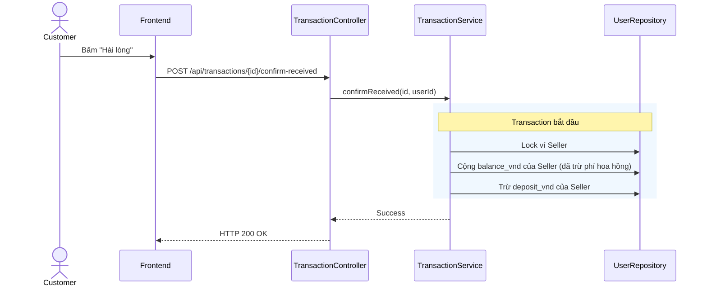

# UC-14 — Xác Nhận Hoàn Thành Đơn Sớm (Confirm Received Early)

> **Feature:** `feat-order` | **Phiên bản:** 2.0 | **Trạng thái:** Published
> **Tham chiếu FR:** FR-ORDER-01 đến FR-ORDER-12
> **Cập nhật:** 2026-07-24

---

## 1. Tổng Quan

| Thuộc tính | Nội dung |
|:---|:---|
| **Mã Use Case** | UC-14 |
| **Tên** | Xác Nhận Hoàn Thành Đơn Sớm (Confirm Received Early) |
| **Tác nhân chính** | Người mua (Customer) |
| **Mô tả ngắn** | Người mua xác nhận đã nhận hàng và hài lòng, yêu cầu giải phóng tiền tạm giữ Escrow sớm cho Seller. |
| **Độ ưu tiên** | Cao (P0) |

---

## 2. Tác Nhân & Điều Kiện

### 2.1 Tác Nhân
| Tác nhân | Vai trò |
|:---|:---|
| **Người mua (Customer)** | Tác nhân chính thực hiện nghiệp vụ của hệ thống. |

### 2.2 Điều Kiện Tiền Quyết (Preconditions)
- Giao dịch đơn hàng ở trạng thái Held (trong thời hạn giam tiền Escrow). Người dùng là chủ đơn.

### 2.3 Hậu Điều Kiện (Postconditions)
- **Thành công:** Giao dịch cập nhật trạng thái Completed. Tiền được cộng vào ví khả dụng (balance_vnd) của Seller.
- **Thất bại:** Trạng thái database không đổi, hệ thống trả về mã lỗi chi tiết.

---

## 3. Luồng Xử Lý (Sequence Steps)

### 3.1 Luồng Chính (Happy Path)
Bước 1 [Customer]:   Tại giao diện chi tiết đơn hàng, bấm nút "Đã nhận hàng & Hài lòng".
Bước 2 [Frontend]:   Gửi yêu cầu POST /api/transactions/{id}/confirm-received.
Bước 3 [Backend]:    TransactionController gọi TransactionService.confirmReceived().
                       @Transactional:
                         - Truy vấn và khóa Transaction.
                         - Kiểm chứng trạng thái giao dịch phải là 'Held'.
                         - Tính toán phí dịch vụ commission của Seller trích từ tổng tiền.
                         - Cộng tiền khả dụng cho Seller: balance_vnd = balance_vnd + (amount - commission).
                         - Khấu trừ tiền đóng băng: deposit_vnd = deposit_vnd - amount.
                         - Cập nhật Transaction.status = 'Completed'.
Bước 4 [Backend]:    Trả về thông báo hoàn thành thành công.
Bước 5 [Frontend]:   Cập nhật trạng thái đơn hàng trên giao diện thành 'Completed'.

### 3.2 Luồng Lỗi (Error Path)
| Tình huống | HTTP | Error Code | Xử lý |
|:---|:---:|:---|:---|
| Đơn không phải Held | 400 | `BAD_REQUEST` | Báo lỗi trạng thái đơn hàng không hợp lệ để hoàn thành |

---

## 4. Quy Tắc Nghiệp Vụ (Business Rules)

| Mã | Quy tắc | Chi tiết |
|:---|:---|:---|
| BR-14-01 | Phí hoa hồng sàn | Phí hoa hồng hệ thống (commission) được tính động từ cấu hình hệ thống và tự động trích trước khi cộng tiền cho Seller |

---

## 5. Quy Tắc Kiểm Tra Đầu Vào

| Trường | Kiểm tra | Thông báo lỗi nếu sai |
|:---|:---|:---|
| `id` | Bắt buộc, số nguyên lớn | "Mã giao dịch không hợp lệ" |

---

## 6. Sơ Đồ Tuần Tự (Sequence Diagram)

---

## 7. Tham Chiếu API

| Phương thức | Endpoint | Mô tả |
|:---|:---|:---|
| POST | `/api/transactions/{id}/confirm-received` | Xác nhận đã nhận hàng và giải phóng tiền bảo lãnh sớm |

---

## 8. Tiêu Chỉ Chấp Nhận (Acceptance Criteria)

### AC-14-01 — Giải phóng tiền Escrow sớm thành công
> **Tham chiếu:** FR-ORD-04
- **Cho trước:** Lệnh mua Netflix 100,000 VNĐ đang ở trạng thái Held.
- **Khi:** Người mua bấm xác nhận hài lòng.
- **Thì:** Ví đóng băng Seller giảm 100k, ví khả dụng Seller tăng 95k (phí 5%), đơn hàng chuyển sang Completed.

---

## 9. Ngoài Phạm Vi (Out of Scope)
- ❌ Hủy bỏ xác nhận hoàn thành sau khi đã thực hiện.

---

## 10. Danh Sách SRS Use Cases Hạt Nhân Trực Thuộc (SRS Mapping)

| SRS UC ID | Tên Use Case SRS | Feature Module | Mô Tả Chức Năng Chi Tiết |
|:---|:---|:---|:---|
| **UC 14** | Confirm Received Early | feat-order | Người mua xác nhận đã nhận hàng và hài lòng, yêu cầu giải phóng tiền tạm giữ Escrow sớm cho Seller. |
