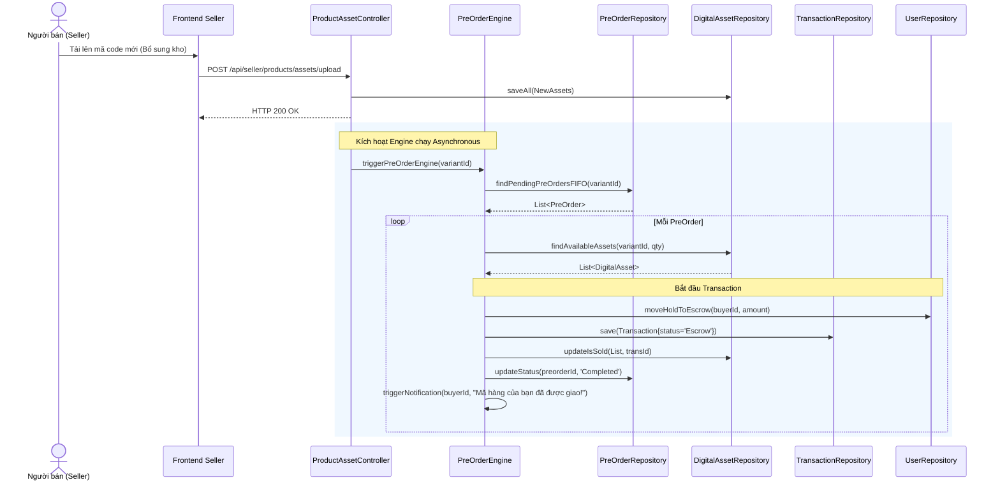

# UC-16 — Đặt Mua Trước (Pre-Order Engine)

> **Feature:** `feat-preorder` | **Phiên bản:** 1.0 | **Trạng thái:** Published
> **Tham chiếu FR:** FR-PRE-01 đến FR-PRE-10
> **Cập nhật:** 2026-06-30

---

## 1. Tổng Quan

| Thuộc tính | Nội dung |
|:---|:---|
| **Mã Use Case** | UC-16 |
| **Tên** | Đặt Mua Trước (Pre-Order Engine) |
| **Tác nhân chính** | Người mua (Customer), Người bán (Seller) |
| **Mô tả ngắn** | Khi kho hàng biến thể sản phẩm số bằng 0, người mua có thể gửi yêu cầu mua trước và đóng băng số tiền thanh toán. Khi người bán bổ sung kho hàng (tải lên tài sản số mới), hệ thống tự động giao hàng cho người mua theo thứ tự FIFO. |
| **Độ ưu tiên** | Trung bình (P1) — tối ưu hóa doanh số khi hết hàng tạm thời |

---

## 2. Tác Nhân & Điều Kiện

### 2.1 Tác Nhân

| Tác nhân | Vai trò |
|:---|:---|
| **Người mua (Customer)** | Đăng ký mua trước, bị đóng băng số dư |
| **Người bán (Seller)** | Tải lên tài sản số mới để bổ sung kho hàng |
| **PreOrderEngine (System)** | Quét và tự động khớp đơn hàng mua trước khi có kho mới |

### 2.2 Điều Kiện Tiền Quyết (Preconditions)

- Biến thể sản phẩm số đã kích hoạt tính năng Pre-order.
- Số lượng tồn kho hiện tại của biến thể bằng `0`.
- Số dư khả dụng của Buyer đủ thanh toán (`available_balance >= amount`).

### 2.3 Hậu Điều Kiện (Postconditions)

- **Đăng ký thành công:** Tạo bản ghi trong `PreOrders` (status = 'Pending'), đóng băng ví của Buyer.
- **Khớp hàng thành công:** Chuyển đổi trạng thái `PreOrders.status = 'Completed'`, tạo `Transaction` (status = 'Escrow'), trích xuất và bàn giao tài sản số, gửi thông báo.

---

## 3. Luồng Xử Lý

### 3.1 Luồng Chính — Đăng ký và Tự động giao hàng (Happy Path)

```
Bước 1  [Customer]:   Xem chi tiết biến thể sản phẩm, thấy số lượng tồn kho bằng 0, nhấn "Đặt mua trước"
Bước 2  [Frontend]:   Hiển thị biểu mẫu xác nhận đặt trước (số lượng, tổng tiền)
Bước 3  [Customer]:   Nhấn nút "Xác nhận đặt trước"
Bước 4  [Frontend]:   POST /api/preorders/request { variantId, quantity }
Bước 5  [Backend]:    Validate: available_balance của Buyer >= tổng giá trị
                       - @Transactional:
                         - Khóa Pessimistic Lock ví Buyer
                         - Khấu trừ available_balance của Buyer và đưa vào hold_balance mua trước
                         - Tạo bản ghi PreOrders ở trạng thái 'Pending'
                       Trả về: status = 200, preorderId, status = "Pending"
Bước 6  [Frontend]:   Hiển thị thông báo đăng ký mua trước thành công, số tiền đã tạm khóa
Bước 7  [Seller]:     Tải lên danh sách mã code/tài khoản mới để bổ sung kho
Bước 8  [Frontend-S]: POST /api/seller/products/assets/upload (Batch upload)
Bước 9  [Backend]:    Lưu trữ tài sản số mới (DigitalAssets), tự động kích hoạt PreOrderEngine chạy bất đồng bộ
Bước 10 [Engine]:     Quét danh sách PreOrders đang Pending của biến thể này sắp xếp theo created_at tăng dần (FIFO)
                       Với mỗi PreOrder:
                         - Lấy ra số lượng DigitalAssets mới tương ứng
                         - @Transactional:
                           - Chuyển số tiền từ hold_balance của Buyer sang ví tạm giữ Escrow của hệ thống
                           - Gán transaction_id, cập nhật is_sold = 1 cho các DigitalAssets
                           - Giải mã mã code bằng AES
                           - Cập nhật PreOrders.status = 'Completed'
                           - Tạo Transactions (status = 'Escrow')
                           - Gửi thông báo bàn giao mã thẻ đã giải mã cho Buyer qua Notification
```

---

## 4. Quy Tắc Nghiệp Vụ

| Mã | Quy tắc | Chi tiết |
|:---|:---|:---|
| BR-16-01 | Ưu tiên thời gian (FIFO) | Việc trả hàng mua trước bắt buộc thực hiện đúng thứ tự thời gian đăng ký (đăng ký trước được nhận trước) |
| BR-16-02 | Hoàn tiền khi hủy | Nếu người dùng thực hiện hủy yêu cầu mua trước khi chưa được giao hàng, hệ thống giải phóng hold_balance hoàn trả lại available_balance cho Buyer |

---

## 5. Quy Tắc Kiểm Tra Đầu Vào

### POST /api/preorders/request

| Trường | Kiểm tra | Lỗi khi vi phạm |
|:---|:---|:---|
| `variantId` | Bắt buộc, `> 0` | "Biến thể không hợp lệ" |
| `quantity` | Bắt buộc, `> 0` | "Số lượng mua trước không hợp lệ" |

---

## 6. Sơ Đồ Tuần Tự (Sequence Diagram)

### Luồng Xử Lý Pre-Order Tự Động Khi Có Kho Mới



---

## 7. Tham Chiếu API

| Phương thức | Endpoint | Mô tả |
|:---|:---|:---|
| `POST` | `/api/preorders/request` | Yêu cầu đăng ký mua trước |
| `POST` | `/api/preorders/{id}/cancel` | Hủy yêu cầu mua trước |

---

## 8. Tiêu Chí Chấp Nhận (Acceptance Criteria)

### AC-16-01 — Đăng ký thành công đóng băng tiền người mua

- **Cho trước:** Biến thể `Netflix 1 tháng` có số lượng tồn kho là 0. `User G` có `available_balance = 100,000` VNĐ.
- **Khi:** `User G` thực hiện gửi yêu cầu mua trước 1 sản phẩm trị giá 80,000 VNĐ
- **Thì:**
  - Hệ thống tạo bản ghi `PreOrders` ở trạng thái `Pending`
  - Ví của `User G` chuyển thành `available_balance = 20000` VNĐ và `hold_balance = 80000` VNĐ.

---

## 9. Ngoài Phạm Vi (Out of Scope)

- ❌ Hủy đăng ký mua trước tự động do quá hạn chờ (chỉ hỗ trợ khách hàng tự hủy thủ công).
- ❌ Hỗ trợ mua trước các sản phẩm không có tùy chọn phân loại (non-variant).
