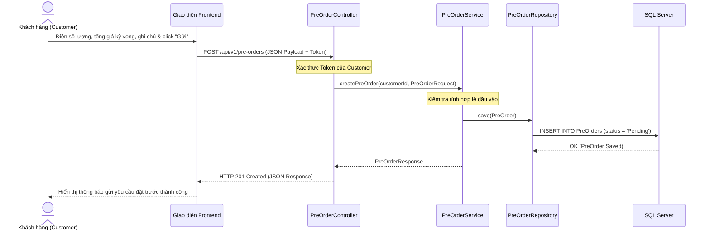

# UC-16 — Đặt Mua Trước (Pre-Order Engine)

> **Feature:** `feat-preorder` | **Phiên bản:** 1.0 | **Trạng thái:** Published
> **Cập nhật:** 2026-07-16

---

## 1. Tổng Quan

| Thuộc tính | Nội dung |
|:---|:---|
| **Mã Use Case** | UC-16 |
| **Tên** | Đặt Mua Trước (Pre-Order Engine) |
| **Tác nhân chính** | Người mua (Customer), Người bán (Seller) |
| **Mô tả ngắn** | Khi kho hàng sản phẩm số tạm thời hết hàng (bằng 0), người mua có thể gửi yêu cầu đặt trước (ghi rõ số lượng mong muốn, tổng giá dự kiến, ghi chú nhu cầu). Người bán tiếp nhận yêu cầu đặt trước để chủ động bổ sung nguồn hàng kỹ thuật số phù hợp. |
| **Độ ưu tiên** | Trung bình (P1) — tối ưu hóa thu thập nhu cầu khi hết hàng tạm thời |

---

## 2. Tác Nhân & Điều Kiện

### 2.1 Tác Nhân

| Tác nhân | Vai trò |
|:---|:---|
| **Người mua (Customer)** | Đăng ký thông tin yêu cầu đặt hàng trước đối với sản phẩm hết hàng |
| **Người bán (Seller)** | Theo dõi danh sách yêu cầu đặt trước của khách hàng để chuẩn bị hàng hóa và bổ sung tồn kho |

### 2.2 Điều Kiện Tiền Quyết (Preconditions)

- Biến thể sản phẩm số hiện tại đang ở trạng thái hết hàng (`stock = 0`) hoặc chưa có sẵn trên sàn.
- Người mua đã đăng nhập vào hệ thống (có Access Token hợp lệ).

### 2.3 Hậu Điều Kiện (Postconditions)

- Yêu cầu được ghi nhận thành công trong cơ sở dữ liệu (`PreOrders` có status mặc định là `'Pending'`).
- Người bán nhận được thông tin để chuẩn bị hàng. Khách hàng theo dõi tiến trình qua danh sách đơn đặt trước.

---

## 3. Luồng Xử Lý

### 3.1 Luồng Chính — Đăng ký nhu cầu đặt mua trước (Happy Path)

```
Bước 1  [Customer]:   Xem trang chi tiết sản phẩm, thấy kho hàng bằng 0, nhấn nút "Đặt trước sản phẩm"
Bước 2  [Frontend]:   Chuyển hướng sang trang đặt trước /pre-orders/new?productId={id}&price={price}...
Bước 3  [Customer]:   Nhập số lượng (quantity) mong muốn, tổng giá dự kiến (expectedPriceVnd) và Ghi chú (notes) cho Seller
Bước 4  [Customer]:   Nhấn nút "Gửi yêu cầu đặt trước"
Bước 5  [Frontend]:   Gửi yêu cầu POST /api/v1/pre-orders với body: { productId, quantity, expectedPriceVnd, notes } kèm token
Bước 6  [Backend]:    Validate thông tin đầu vào (quantity >= 1, expectedPriceVnd >= 1, kiểm tra tài khoản và sản phẩm tồn tại)
Bước 7  [Backend]:    Tạo bản ghi trong bảng PreOrders với trạng thái mặc định 'Pending', gán customer_id từ token
Bước 8  [Backend]:    Trả về thông tin PreOrderResponse vừa được lưu thành công (HTTP 201 Created)
Bước 9  [Frontend]:   Ẩn form đăng ký, hiển thị hộp thoại thông báo thành công và cung cấp nút liên kết tới danh sách đơn đặt trước
Bước 10 [Customer]:   Nhấn nút "Xem đơn đặt trước" để đi tới trang /pre-orders theo dõi danh sách
```

---

## 4. Quy Tắc Nghiệp Vụ

| Mã | Quy tắc | Chi tiết |
|:---|:---|:---|
| BR-16-01 | Ghi nhận nhu cầu | Luồng Pre-order hiện tại hoạt động theo cơ chế **Thu thập nhu cầu** (wishlist/request collector), hệ thống không thực hiện trừ tiền hoặc giữ tiền ví của người mua tại thời điểm tạo đơn đặt trước. |
| BR-16-02 | Trạng thái mặc định | Mọi đơn đặt hàng trước khi được tạo mới luôn mang trạng thái mặc định ban đầu là `'Pending'`. |

---

## 5. Quy Tắc Kiểm Tra Đầu Vào (Validation)

### POST /api/v1/pre-orders

| Trường | Kiểm tra | Lỗi khi vi phạm |
|:---|:---|:---|
| `productId` | Bắt buộc, không được để trống | "Sản phẩm không được để trống." |
| `quantity` | Bắt buộc, phải là số nguyên `min = 1` | "Số lượng phải lớn hơn 0." |
| `expectedPriceVnd` | Bắt buộc, phải là số nguyên lớn `min = 1` | "Tổng giá đặt trước phải lớn hơn 0." |
| `notes` | Tùy chọn, tối đa 2000 ký tự | "Ghi chú không được vượt quá 2000 ký tự" |

---

## 6. Sơ Đồ Tuần Tự Tương Tác (Sequence Diagram)



---

## 7. Tham Chiếu API

| Phương thức | Endpoint | Mô tả |
|:---|:---|:---|
| `POST` | `/api/v1/pre-orders` | Gửi yêu cầu đăng ký đặt mua sản phẩm trước |
| `GET` | `/api/v1/pre-orders` | Xem danh sách các yêu cầu đặt trước cá nhân của Buyer |

---

## 8. Tiêu Chí Chấp Nhận (Acceptance Criteria)

### AC-16-01 — Gửi yêu cầu thành công lưu trữ dữ liệu
- **Cho trước:** Người dùng `Customer A` đã đăng nhập và đang xem sản phẩm `Tài khoản Premium Netflix` hết hàng.
- **Khi:** `Customer A` điền form đặt mua với số lượng `2`, tổng tiền `300000` VNĐ, ghi chú `"Giao tài khoản trong ngày"`.
- **Thì:**
  - Hệ thống ghi nhận tạo mới 1 dòng dữ liệu trong bảng `PreOrders` với `status = 'Pending'`.
  - Trả về mã phản hồi `201 Created` kèm theo dữ liệu đối tượng dạng DTO hiển thị đầy đủ thông tin vừa tạo.
