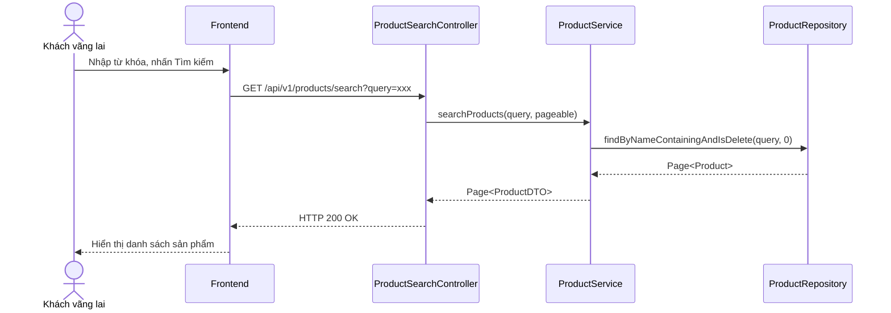

# UC-05 — Khám Phá Sản Phẩm (Product Discovery)

> **Feature:** `feat-product` | **Phiên bản:** 1.0 | **Trạng thái:** Published
> **Tham chiếu FR:** FR-PROD-01 đến FR-PROD-10
> **Cập nhật:** 2026-06-30

---

## 1. Tổng Quan

| Thuộc tính | Nội dung |
|:---|:---|
| **Mã Use Case** | UC-05 |
| **Tên** | Khám Phá Sản Phẩm (Product Discovery) |
| **Tác nhân chính** | Khách vãng lai (Guest), Người mua (Customer) |
| **Mô tả ngắn** | Khách truy cập duyệt danh sách sản phẩm, tìm kiếm từ khóa, lọc theo danh mục (ACCOUNT, KEY, GAME_CARD, SERVICE) và xem thông tin chi tiết các sản phẩm số đăng bán. Người mua có thể nhấn theo dõi Shop của Seller. |
| **Độ ưu tiên** | Cao (P0) — cốt lõi tăng trưởng lưu lượng và chuyển đổi đơn hàng |

---

## 2. Tác Nhân & Điều Kiện

### 2.1 Tác Nhân

| Tác nhân | Vai trò |
|:---|:---|
| **Khách vãng lai (Guest)** | Xem trang chủ, tìm kiếm từ khóa, xem chi tiết sản phẩm |
| **Người mua (Customer)** | Thực hiện hành động theo dõi (Follow) cửa hàng người bán |

### 2.2 Điều Kiện Tiền Quyết (Preconditions)

- Sản phẩm hiển thị phải ở trạng thái đang mở bán (`isDelete = 0` và có tồn kho đối với các loại tài sản tự động).
- Để theo dõi Shop, người dùng phải đăng nhập hệ thống (`Customer`).

### 2.3 Hậu Điều Kiện (Postconditions)

- **Theo dõi Shop thành công:** Lưu quan hệ follow giữa Customer và Seller vào DB, cập nhật số lượng theo dõi của Shop.

---

## 3. Luồng Xử Lý

### 3.1 Luồng Chính — Khám Phá và Tìm Kiếm Sản Phẩm (Happy Path)

```
Bước 1  [Guest]:      Truy cập Trang chủ của MMO Market
Bước 2  [Frontend]:   GET /api/v1/products/public (hoặc lọc danh mục)
Bước 3  [Backend]:    Truy vấn DB lấy danh sách sản phẩm (chỉ lấy isDelete = 0 và seller.isDelete = 0 và seller.shopStatus NOT IN ('Locked', 'Banned', 'Pending'))
                       Trả về danh sách sản phẩm kèm tên shop, khoảng giá, và số lượng tồn kho
Bước 4  [Guest]:      Nhập từ khóa "Netflix" vào ô tìm kiếm, bấm Enter
Bước 5  [Frontend]:   GET /api/v1/products/search?query=Netflix
Bước 6  [Backend]:    Tìm kiếm kết quả theo tên/mô tả sản phẩm, lọc bỏ các shop bị khóa/banned/pending (shopStatus in Locked, Banned, Pending)
                       Trả về danh sách kết quả phù hợp
Bước 7  [Guest]:      Nhấp vào một sản phẩm cụ thể để xem chi tiết
Bước 8  [Frontend]:   GET /api/v1/products/{productId}
Bước 9  [Backend]:    Trả về thông tin chi tiết sản phẩm, danh sách các biến thể, đánh giá từ người mua trước, và thông tin Shop người bán
```

### 3.2 Luồng Theo Dõi Cửa Hàng (Shop Follow)

```
Bước 1  [Customer]:   Tại trang chi tiết sản phẩm, nhấp vào tên gian hàng để sang trang của Seller
Bước 2  [Frontend]:   Hiển thị thông tin shop và nút "Theo dõi"
Bước 3  [Customer]:   Nhấp chọn "Theo dõi"
Bước 4  [Frontend]:   POST /api/v1/seller/{sellerId}/follow (Header chứa JWT)
Bước 5  [Backend]:    Validate Customer khác Seller
                       Lưu mối quan hệ follow vào DB
                       Trả về: status = 200, message = "FOLLOW_SUCCESS"
Bước 6  [Frontend]:   Đổi trạng thái nút thành "Đang theo dõi"
```

---

## 4. Quy Tắc Nghiệp Vụ

| Mã | Quy tắc | Chi tiết |
|:---|:---|:---|
| BR-05-01 | Lọc Shop vi phạm | Không hiển thị sản phẩm của các Shop đang bị khóa (Locked do ví âm), bị cấm (Banned) hoặc chưa được duyệt (Pending) |
| BR-05-02 | Tự theo dõi chính mình | Không cho phép Seller tự nhấn theo dõi Shop của chính bản thân |
| BR-05-03 | Lọc sản phẩm đã xóa | Luôn áp dụng điều kiện `isDelete = 0` (của cả sản phẩm, biến thể và người bán) khi truy vấn danh sách sản phẩm |

---

## 5. Quy Tắc Kiểm Tra Đầu Vào

### GET /api/v1/products/search

| Trường | Kiểm tra | Lỗi khi vi phạm |
|:---|:---|:---|
| `query` | Tùy chọn, tối đa 100 ký tự | "Từ khóa tìm kiếm quá dài" |
| `page` | Định dạng số `>= 0` | "Số trang không hợp lệ" |

---

## 6. Sơ Đồ Tuần Tự (Sequence Diagram)

### Luồng Tìm Kiếm và Xem Chi Tiết



---

## 7. Tham Chiếu API

| Phương thức | Endpoint | Mô tả |
|:---|:---|:---|
| `GET` | `/api/v1/products/public` | Lấy danh sách sản phẩm công khai |
| `GET` | `/api/v1/products/search` | Tìm kiếm sản phẩm theo bộ lọc |
| `GET` | `/api/v1/products/{id}` | Xem thông tin chi tiết một sản phẩm |
| `POST` | `/api/v1/seller/{sellerId}/follow` | Theo dõi Shop người bán |

---

## 8. Tiêu Chí Chấp Nhận (Acceptance Criteria)

### AC-05-01 — Tìm kiếm trả về đúng danh sách sản phẩm hợp lệ

- **Cho trước:** Có 5 sản phẩm chứa từ khóa "Spotify" đang mở bán, 1 sản phẩm "Spotify" đã xóa (`isDelete = 1`)
- **Khi:** Gọi GET `/api/v1/products/search?query=Spotify`
- **Thì:** Hệ thống chỉ trả về đúng 5 sản phẩm đang mở bán, không chứa sản phẩm đã xóa.

---

## 9. Ngoài Phạm Vi (Out of Scope)

- ❌ Gợi ý sản phẩm thông minh dựa trên lịch sử xem của AI (Personalized Recommendation).
- ❌ Nhúng trực tiếp livestream bán hàng của Seller trên trang chủ.
