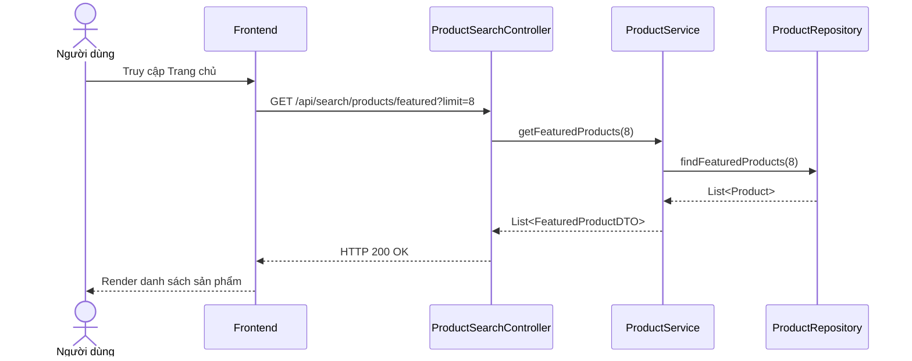

# UC-07 — Xem Trang Chủ & Sản Phẩm Nổi Bật (View Homepage & Featured Products)

> **Feature:** `feat-product` | **Phiên bản:** 2.0 | **Trạng thái:** Published
> **Tham chiếu FR:** FR-PRODUCT-01 đến FR-PRODUCT-12
> **Cập nhật:** 2026-07-24

---

## 1. Tổng Quan

| Thuộc tính | Nội dung |
|:---|:---|
| **Mã Use Case** | UC-07 |
| **Tên** | Xem Trang Chủ & Sản Phẩm Nổi Bật (View Homepage & Featured Products) |
| **Tác nhân chính** | Khách (Guest) / Người mua (Customer) |
| **Mô tả ngắn** | Khách và người mua truy cập trang chủ để xem danh sách sản phẩm nổi bật dựa trên tổng lượng giao dịch bán ra. |
| **Độ ưu tiên** | Cao (P0) |

---

## 2. Tác Nhân & Điều Kiện

### 2.1 Tác Nhân
| Tác nhân | Vai trò |
|:---|:---|
| **Khách (Guest) / Người mua (Customer)** | Tác nhân chính thực hiện nghiệp vụ của hệ thống. |

### 2.2 Điều Kiện Tiền Quyết (Preconditions)
- None

### 2.3 Hậu Điều Kiện (Postconditions)
- **Thành công:** Danh sách sản phẩm bán chạy nhất hiển thị thành công.
- **Thất bại:** Trạng thái database không đổi, hệ thống trả về mã lỗi chi tiết.

---

## 3. Luồng Xử Lý (Sequence Steps)

### 3.1 Luồng Chính (Happy Path)
Bước 1 [Khách]:    Truy cập Trang chủ MMO Market.
Bước 2 [Frontend]:   Gửi yêu cầu GET /api/search/products/featured?limit=8.
Bước 3 [Backend]:    ProductSearchController nhận request, gọi ProductService.getFeaturedProducts().
                       - Lọc các sản phẩm thuộc Shop đang hoạt động (shop_status = 'Active') và chưa bị xóa (isDelete = 0).
                       - Sắp xếp theo số lượt mua giảm dần trong DB.
Bước 4 [Backend]:    Trả về danh sách FeaturedProductDTO.
Bước 5 [Frontend]:   Render danh sách sản phẩm nổi bật lên Grid trang chủ.

### 3.2 Luồng Lỗi (Error Path)
| Tình huống | HTTP | Error Code | Xử lý |
|:---|:---:|:---|:---|
| Lỗi cơ sở dữ liệu | 500 | `INTERNAL_SERVER_ERROR` | Hiển thị lỗi hệ thống |

---

## 4. Quy Tắc Nghiệp Vụ (Business Rules)

| Mã | Quy tắc | Chi tiết |
|:---|:---|:---|
| BR-07-01 | Trạng thái hiển thị | Chỉ hiển thị sản phẩm của shop hoạt động (shop_status = 'Active') và chưa bị xóa |

---

## 5. Quy Tắc Kiểm Tra Đầu Vào

| Trường | Kiểm tra | Thông báo lỗi nếu sai |
|:---|:---|:---|
| `limit` | Tùy chọn, số nguyên dương | "Limit phải là số nguyên dương" |

---

## 6. Sơ Đồ Tuần Tự (Sequence Diagram)

---

## 7. Tham Chiếu API

| Phương thức | Endpoint | Mô tả |
|:---|:---|:---|
| GET | `/api/search/products/featured` | Lấy danh sách sản phẩm nổi bật |

---

## 8. Tiêu Chỉ Chấp Nhận (Acceptance Criteria)

### AC-07-01 — Hiển thị sản phẩm bán chạy thành công
> **Tham chiếu:** FR-PROD-01
- **Cho trước:** Hệ thống hoạt động bình thường.
- **Khi:** Người dùng truy cập trang chủ.
- **Thì:** Tải đúng 8 sản phẩm bán chạy nhất lên màn hình.

---

## 9. Ngoài Phạm Vi (Out of Scope)
- ❌ Gợi ý sản phẩm thông minh cá nhân hóa bằng AI.

---

## 10. Danh Sách SRS Use Cases Hạt Nhân Trực Thuộc (SRS Mapping)

| SRS UC ID | Tên Use Case SRS | Feature Module | Mô Tả Chức Năng Chi Tiết |
|:---|:---|:---|:---|
| **UC 7** | View Homepage & Featured Products | feat-product | Khách và người mua truy cập trang chủ để xem danh sách sản phẩm nổi bật dựa trên tổng lượng giao dịch bán ra. |
