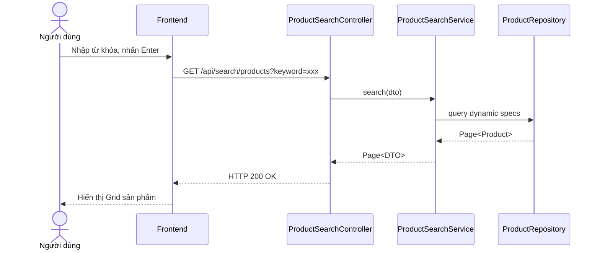

# UC-08 — Tìm Kiếm & Lọc Sản Phẩm (Search & Filter Products)

> **Feature:** `feat-product` | **Phiên bản:** 2.0 | **Trạng thái:** Published
> **Tham chiếu FR:** FR-PRODUCT-01 đến FR-PRODUCT-12
> **Cập nhật:** 2026-07-24

---

## 1. Tổng Quan

| Thuộc tính | Nội dung |
|:---|:---|
| **Mã Use Case** | UC-08 |
| **Tên** | Tìm Kiếm & Lọc Sản Phẩm (Search & Filter Products) |
| **Tác nhân chính** | Khách (Guest) / Người mua (Customer) |
| **Mô tả ngắn** | Người dùng tìm kiếm sản phẩm số theo từ khóa, danh mục, giá cả và đánh giá sao. |
| **Độ ưu tiên** | Cao (P0) |

---

## 2. Tác Nhân & Điều Kiện

### 2.1 Tác Nhân
| Tác nhân | Vai trò |
|:---|:---|
| **Khách (Guest) / Người mua (Customer)** | Tác nhân chính thực hiện nghiệp vụ của hệ thống. |

### 2.2 Điều Kiện Tiền Quyết (Preconditions)
- None

### 2.3 Hậu Điều Kiện (Postconditions)
- **Thành công:** Kết quả tìm kiếm sản phẩm được hiển thị phân trang.
- **Thất bại:** Trạng thái database không đổi, hệ thống trả về mã lỗi chi tiết.

---

## 3. Luồng Xử Lý (Sequence Steps)

### 3.1 Luồng Chính (Happy Path)
Bước 1 [Khách]:    Nhập từ khóa và bấm tìm kiếm hoặc chọn lọc theo danh mục.
Bước 2 [Frontend]:   Gửi yêu cầu GET /api/search/products?keyword=xxx&categoryId=yyy.
Bước 3 [Backend]:    ProductSearchController nhận request, gọi ProductSearchService.searchProducts().
                       - Tạo câu lệnh SQL động lọc bảng Products có isDelete = 0.
Bước 4 [Backend]:    Trả về DTO phân trang Page.
Bước 5 [Frontend]:   Hiển thị danh sách kết quả lên màn hình Grid.

### 3.2 Luồng Lỗi (Error Path)
| Tình huống | HTTP | Error Code | Xử lý |
|:---|:---:|:---|:---|
| Lọc khoảng giá sai | 400 | `VALIDATION_FAILED` | Khoảng giá min không được lớn hơn max |

---

## 4. Quy Tắc Nghiệp Vụ (Business Rules)

| Mã | Quy tắc | Chi tiết |
|:---|:---|:---|
| BR-08-01 | Điều kiện hiển thị | Loại bỏ toàn bộ sản phẩm của shop đang bị khóa (shop_status = 'Banned') khỏi kết quả tìm kiếm |

---

## 5. Quy Tắc Kiểm Tra Đầu Vào

| Trường | Kiểm tra | Thông báo lỗi nếu sai |
|:---|:---|:---|
| `keyword` | Tùy chọn, chuỗi | "Từ khóa không hợp lệ" |

---

## 6. Sơ Đồ Tuần Tự (Sequence Diagram)

---

## 7. Tham Chiếu API

| Phương thức | Endpoint | Mô tả |
|:---|:---|:---|
| GET | `/api/search/products` | Tìm kiếm và lọc danh sách sản phẩm |

---

## 8. Tiêu Chỉ Chấp Nhận (Acceptance Criteria)

### AC-08-01 — Tìm kiếm theo tên sản phẩm thành công
> **Tham chiếu:** FR-PROD-02
- **Cho trước:** Có sản phẩm tên "Key Win 11".
- **Khi:** Tìm kiếm từ khóa "Win 11".
- **Thì:** Hệ thống hiển thị đúng sản phẩm "Key Win 11" trong kết quả.

---

## 9. Ngoài Phạm Vi (Out of Scope)
- ❌ Tìm kiếm theo mô tả ảnh hoặc giọng nói.

---

## 10. Danh Sách SRS Use Cases Hạt Nhân Trực Thuộc (SRS Mapping)

| SRS UC ID | Tên Use Case SRS | Feature Module | Mô Tả Chức Năng Chi Tiết |
|:---|:---|:---|:---|
| **UC 8** | Search & Filter Products | feat-product | Người dùng tìm kiếm sản phẩm số theo từ khóa, danh mục, giá cả và đánh giá sao. |
