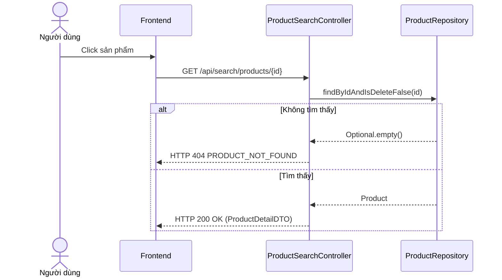

# UC-09 — Xem Chi Tiết Sản Phẩm & Biến Thể (View Product Details & Variants)

> **Feature:** `feat-product` | **Phiên bản:** 2.0 | **Trạng thái:** Published
> **Tham chiếu FR:** FR-PRODUCT-01 đến FR-PRODUCT-12
> **Cập nhật:** 2026-07-24

---

## 1. Tổng Quan

| Thuộc tính | Nội dung |
|:---|:---|
| **Mã Use Case** | UC-09 |
| **Tên** | Xem Chi Tiết Sản Phẩm & Biến Thể (View Product Details & Variants) |
| **Tác nhân chính** | Khách (Guest) / Người mua (Customer) |
| **Mô tả ngắn** | Người dùng xem chi tiết thông tin mô tả, hướng dẫn sử dụng sản phẩm và các biến thể giá cả tương ứng. |
| **Độ ưu tiên** | Cao (P0) |

---

## 2. Tác Nhân & Điều Kiện

### 2.1 Tác Nhân
| Tác nhân | Vai trò |
|:---|:---|
| **Khách (Guest) / Người mua (Customer)** | Tác nhân chính thực hiện nghiệp vụ của hệ thống. |

### 2.2 Điều Kiện Tiền Quyết (Preconditions)
- Sản phẩm tồn tại trong hệ thống (isDelete = 0).

### 2.3 Hậu Điều Kiện (Postconditions)
- **Thành công:** Thông tin chi tiết sản phẩm và các biến thể hiển thị đầy đủ.
- **Thất bại:** Trạng thái database không đổi, hệ thống trả về mã lỗi chi tiết.

---

## 3. Luồng Xử Lý (Sequence Steps)

### 3.1 Luồng Chính (Happy Path)
Bước 1 [Khách]:    Click chọn xem một sản phẩm cụ thể.
Bước 2 [Frontend]:   Gửi yêu cầu GET /api/search/products/{productId}.
Bước 3 [Backend]:    ProductSearchController gọi ProductRepository.findByIdAndIsDeleteFalse().
                       - Lấy thông tin sản phẩm và các biến thể (ProductVariants).
                       - Lấy số sao đánh giá trung bình.
Bước 4 [Backend]:    Trả về ProductDetailDTO.
Bước 5 [Frontend]:   Hiển thị chi tiết sản phẩm và bảng giá các gói biến thể lên màn hình.

### 3.2 Luồng Lỗi (Error Path)
| Tình huống | HTTP | Error Code | Xử lý |
|:---|:---:|:---|:---|
| Sản phẩm không có | 404 | `PRODUCT_NOT_FOUND` | Báo lỗi sản phẩm đã bị xóa hoặc không tồn tại |

---

## 4. Quy Tắc Nghiệp Vụ (Business Rules)

| Mã | Quy tắc | Chi tiết |
|:---|:---|:---|
| BR-09-01 | Biến thể hoạt động | Chỉ lấy các biến thể của sản phẩm có cờ isDelete = 0 |

---

## 5. Quy Tắc Kiểm Tra Đầu Vào

| Trường | Kiểm tra | Thông báo lỗi nếu sai |
|:---|:---|:---|
| `productId` | Bắt buộc, số nguyên lớn | "ID sản phẩm không hợp lệ" |

---

## 6. Sơ Đồ Tuần Tự (Sequence Diagram)

---

## 7. Tham Chiếu API

| Phương thức | Endpoint | Mô tả |
|:---|:---|:---|
| GET | `/api/search/products/{productId}` | Lấy thông tin chi tiết của sản phẩm |

---

## 8. Tiêu Chỉ Chấp Nhận (Acceptance Criteria)

### AC-09-01 — Xem thông tin chi tiết sản phẩm hợp lệ
> **Tham chiếu:** FR-PROD-03
- **Cho trước:** Sản phẩm ID 1 đang hoạt động.
- **Khi:** Nhấp chọn xem sản phẩm ID 1.
- **Thì:** Tải đúng thông tin tên, mô tả và danh sách biến thể.

---

## 9. Ngoài Phạm Vi (Out of Scope)
- ❌ Xem thông tin đăng nhập của các gói tài sản số trước khi mua hàng.

---

## 10. Danh Sách SRS Use Cases Hạt Nhân Trực Thuộc (SRS Mapping)

| SRS UC ID | Tên Use Case SRS | Feature Module | Mô Tả Chức Năng Chi Tiết |
|:---|:---|:---|:---|
| **UC 9** | View Product Details & Variants | feat-product | Người dùng xem chi tiết thông tin mô tả, hướng dẫn sử dụng sản phẩm và các biến thể giá cả tương ứng. |
