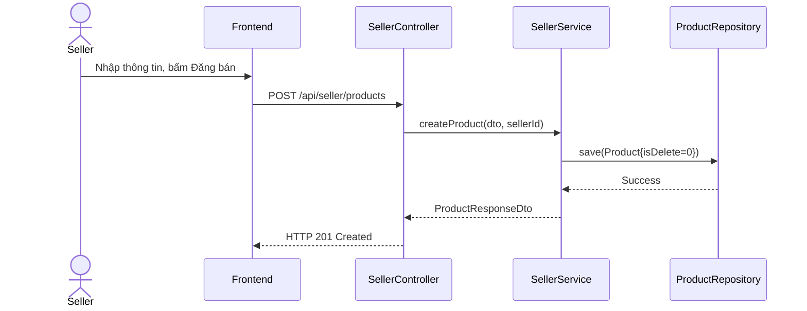

# UC-23 — Quản Lý Sản Phẩm (Manage Products)

> **Feature:** `feat-product` | **Phiên bản:** 2.0 | **Trạng thái:** Published
> **Tham chiếu FR:** FR-PRODUCT-01 đến FR-PRODUCT-12
> **Cập nhật:** 2026-07-24

---

## 1. Tổng Quan

| Thuộc tính | Nội dung |
|:---|:---|
| **Mã Use Case** | UC-23 |
| **Tên** | Quản Lý Sản Phẩm (Manage Products) |
| **Tác nhân chính** | Người bán (Seller) |
| **Mô tả ngắn** | Seller thực hiện thêm mới, cập nhật mô tả hoặc xóa mềm các sản phẩm đăng bán. |
| **Độ ưu tiên** | Cao (P0) |

---

## 2. Tác Nhân & Điều Kiện

### 2.1 Tác Nhân
| Tác nhân | Vai trò |
|:---|:---|
| **Người bán (Seller)** | Tác nhân chính thực hiện nghiệp vụ của hệ thống. |

### 2.2 Điều Kiện Tiền Quyết (Preconditions)
- Seller đang hoạt động (shop_status = 'Active').

### 2.3 Hậu Điều Kiện (Postconditions)
- **Thành công:** Sản phẩm được tạo mới hoặc cập nhật trạng thái trong database (isDelete = 0).
- **Thất bại:** Trạng thái database không đổi, hệ thống trả về mã lỗi chi tiết.

---

## 3. Luồng Xử Lý (Sequence Steps)

### 3.1 Luồng Chính (Happy Path)
Bước 1 [Seller]:    Tại giao diện Seller, chọn Thêm sản phẩm, điền tên, mô tả và chọn danh mục.
Bước 2 [Frontend]:  Gửi yêu cầu POST /api/seller/products.
Bước 3 [Backend]:   SellerController gọi SellerService.createProduct().
                     - Validate danh mục.
                     - Gán sellerId của Seller hiện tại.
                     - Lưu bản ghi vào bảng Products với cờ isDelete = 0.
Bước 4 [Backend]:   Trả về ProductResponseDTO.
Bước 5 [Frontend]:   Hiển thị thông báo đăng bán sản phẩm thành công.

### 3.2 Luồng Lỗi (Error Path)
| Tình huống | HTTP | Error Code | Xử lý |
|:---|:---:|:---|:---|
| Danh mục không có | 404 | `CATEGORY_NOT_FOUND` | Báo lỗi không tìm thấy danh mục sản phẩm tương ứng |

---

## 4. Quy Tắc Nghiệp Vụ (Business Rules)

| Mã | Quy tắc | Chi tiết |
|:---|:---|:---|
| BR-23-01 | Xóa mềm | Khi Seller thực hiện xóa sản phẩm, chỉ cập nhật cờ isDelete = 1, không dùng câu lệnh DELETE vật lý |

---

## 5. Quy Tắc Kiểm Tra Đầu Vào

| Trường | Kiểm tra | Thông báo lỗi nếu sai |
|:---|:---|:---|
| `name` | Bắt buộc, từ 5-255 ký tự | "Tên sản phẩm phải từ 5 đến 255 ký tự" |

---

## 6. Sơ Đồ Tuần Tự (Sequence Diagram)

---

## 7. Tham Chiếu API

| Phương thức | Endpoint | Mô tả |
|:---|:---|:---|
| POST | `/api/seller/products` | Đăng bán sản phẩm mới |
| PUT | `/api/seller/products/{id}` | Chỉnh sửa sản phẩm |
| DELETE | `/api/seller/products/{id}` | Xóa mềm sản phẩm |

---

## 8. Tiêu Chỉ Chấp Nhận (Acceptance Criteria)

### AC-23-01 — Đăng bán sản phẩm mới thành công
> **Tham chiếu:** FR-PROD-04
- **Cho trước:** Danh mục sản phẩm đang hoạt động.
- **Khi:** Thêm sản phẩm mới.
- **Thì:** Sản phẩm được tạo thành công ở trạng thái hiển thị bán.

---

## 9. Ngoài Phạm Vi (Out of Scope)
- ❌ Đăng bán sản phẩm vật lý (chỉ hỗ trợ sản phẩm số).

---

## 10. Danh Sách SRS Use Cases Hạt Nhân Trực Thuộc (SRS Mapping)

| SRS UC ID | Tên Use Case SRS | Feature Module | Mô Tả Chức Năng Chi Tiết |
|:---|:---|:---|:---|
| **UC 23** | Manage Products | feat-product | Seller thực hiện thêm mới, cập nhật mô tả hoặc xóa mềm các sản phẩm đăng bán. |
