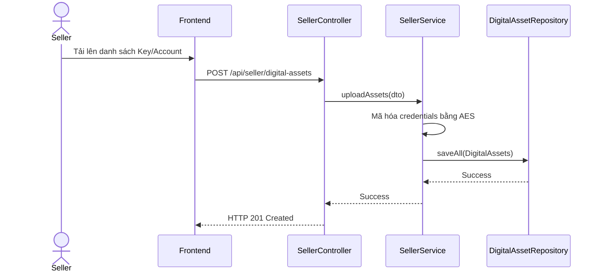

# UC-24 — Quản Lý Biến Thể & Tài Sản Số (Manage Product Variants & Digital Assets)

> **Feature:** `feat-product` | **Phiên bản:** 2.0 | **Trạng thái:** Published
> **Tham chiếu FR:** FR-PRODUCT-01 đến FR-PRODUCT-12
> **Cập nhật:** 2026-07-24

---

## 1. Tổng Quan

| Thuộc tính | Nội dung |
|:---|:---|
| **Mã Use Case** | UC-24 |
| **Tên** | Quản Lý Biến Thể & Tài Sản Số (Manage Product Variants & Digital Assets) |
| **Tác nhân chính** | Người bán (Seller) |
| **Mô tả ngắn** | Seller thêm các gói biến thể của sản phẩm và tải lên thông tin tài khoản số tương ứng để hệ thống tự động bán. |
| **Độ ưu tiên** | Cao (P0) |

---

## 2. Tác Nhân & Điều Kiện

### 2.1 Tác Nhân
| Tác nhân | Vai trò |
|:---|:---|
| **Người bán (Seller)** | Tác nhân chính thực hiện nghiệp vụ của hệ thống. |

### 2.2 Điều Kiện Tiền Quyết (Preconditions)
- Sản phẩm thuộc quyền sở hữu của Seller và chưa bị xóa.

### 2.3 Hậu Điều Kiện (Postconditions)
- **Thành công:** Biến thể sản phẩm được tạo, tài sản số nhạy cảm được mã hóa AES và lưu trữ thành công.
- **Thất bại:** Trạng thái database không đổi, hệ thống trả về mã lỗi chi tiết.

---

## 3. Luồng Xử Lý (Sequence Steps)

### 3.1 Luồng Chính (Happy Path)
Bước 1 [Seller]:    Chọn sản phẩm, nhập tên gói biến thể và đơn giá VNĐ.
Bước 2 [Frontend]:  Gửi yêu cầu POST /api/seller/variants.
Bước 3 [Backend]:   Lưu vào bảng ProductVariants.
Bước 4 [Seller]:    Tải danh sách tài khoản số thô (mã thẻ, tài khoản, mật khẩu) lên hệ thống.
Bước 5 [Frontend]:  Gửi yêu cầu POST /api/seller/digital-assets.
Bước 6 [Backend]:   Gọi EncryptionService thực hiện mã hóa đối xứng AES các thông tin nhạy cảm.
                     - Lưu vào bảng DigitalAssets (isUsed = 0).
                     - Tăng tồn kho (stock) của biến thể.
Bước 7 [Backend]:   Trả về thông báo tải lên thành công.

### 3.2 Luồng Lỗi (Error Path)
| Tình huống | HTTP | Error Code | Xử lý |
|:---|:---:|:---|:---|
| Giá sản phẩm <= 0 | 400 | `VALIDATION_FAILED` | Đơn giá biến thể bắt buộc phải lớn hơn 0 |

---

## 4. Quy Tắc Nghiệp Vụ (Business Rules)

| Mã | Quy tắc | Chi tiết |
|:---|:---|:---|
| BR-24-01 | Mã hóa an toàn dữ liệu | Bắt buộc mã hóa AES toàn bộ dữ liệu tài khoản/mật khẩu trước khi lưu trữ xuống DB để phòng chống rò rỉ |

---

## 5. Quy Tắc Kiểm Tra Đầu Vào

| Trường | Kiểm tra | Thông báo lỗi nếu sai |
|:---|:---|:---|
| `priceVnd` | Bắt buộc, số nguyên dương | "Đơn giá VNĐ phải lớn hơn 0" |

---

## 6. Sơ Đồ Tuần Tự (Sequence Diagram)

---

## 7. Tham Chiếu API

| Phương thức | Endpoint | Mô tả |
|:---|:---|:---|
| POST | `/api/seller/variants` | Tạo biến thể sản phẩm mới |
| POST | `/api/seller/digital-assets` | Tải lên tài sản số thô cho biến thể |

---

## 8. Tiêu Chỉ Chấp Nhận (Acceptance Criteria)

### AC-24-01 — Tải lên tài sản số tự động bán thành công
> **Tham chiếu:** FR-PROD-05
- **Cho trước:** Biến thể Gói 1 Tháng có stock = 0.
- **Khi:** Tải lên 2 tài khoản Netflix.
- **Thì:** Tồn kho (stock) tự động tăng lên 2 và lưu mã hóa vào DB.

---

## 9. Ngoài Phạm Vi (Out of Scope)
- ❌ Tự động kiểm tra chất lượng tài khoản số tải lên.

---

## 10. Danh Sách SRS Use Cases Hạt Nhân Trực Thuộc (SRS Mapping)

| SRS UC ID | Tên Use Case SRS | Feature Module | Mô Tả Chức Năng Chi Tiết |
|:---|:---|:---|:---|
| **UC 24** | Manage Product Variants & Digital Assets | feat-product | Seller thêm các gói biến thể của sản phẩm và tải lên thông tin tài khoản số tương ứng để hệ thống tự động bán. |
