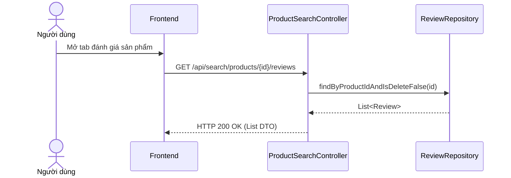

# UC-10 — Xem Đánh Giá Sản Phẩm (View Product Feedback & Reviews)

> **Feature:** `feat-review` | **Phiên bản:** 2.0 | **Trạng thái:** Published
> **Tham chiếu FR:** FR-REVIEW-01 đến FR-REVIEW-12
> **Cập nhật:** 2026-07-24

---

## 1. Tổng Quan

| Thuộc tính | Nội dung |
|:---|:---|
| **Mã Use Case** | UC-10 |
| **Tên** | Xem Đánh Giá Sản Phẩm (View Product Feedback & Reviews) |
| **Tác nhân chính** | Khách (Guest) / Người mua (Customer) |
| **Mô tả ngắn** | Người dùng xem danh sách các đánh giá, bình luận và số sao của khách hàng đã mua sản phẩm. |
| **Độ ưu tiên** | Trung bình (P1) |

---

## 2. Tác Nhân & Điều Kiện

### 2.1 Tác Nhân
| Tác nhân | Vai trò |
|:---|:---|
| **undefined** | Tác nhân chính thực hiện nghiệp vụ của hệ thống. |

### 2.2 Điều Kiện Tiền Quyết (Preconditions)
- Sản phẩm tồn tại trong DB.

### 2.3 Hậu Điều Kiện (Postconditions)
- **Thành công:** Danh sách đánh giá hiển thị thành công.
- **Thất bại:** Trạng thái database không đổi, hệ thống trả về mã lỗi chi tiết.

---

## 3. Luồng Xử Lý (Sequence Steps)

### 3.1 Luồng Chính (Happy Path)
Bước 1  [Guest/Customer]: Tại trang chi tiết sản phẩm, cuộn xuống phần Đánh giá.
Bước 2  [Frontend]:   GET /api/search/products/{productId}/reviews
Bước 3  [Backend]:    ProductSearchController nhận request, gọi ReviewRepository.findByProductIdAndIsDeleteFalse().
Bước 4  [Backend]:    Trả về danh sách List<ReviewResponseDTO>.
Bước 5  [Frontend]:   Hiển thị danh sách đánh giá, số sao và bình luận của người mua trước đó.

### 3.2 Luồng Lỗi (Error Path)
| Tình huống | HTTP | Error Code | Xử lý |
|:---|:---:|:---|:---|
| Lỗi DB | 500 | `INTERNAL_SERVER_ERROR` | Hiển thị lỗi hệ thống |

---

## 4. Quy Tắc Nghiệp Vụ (Business Rules)

| Mã | Quy tắc | Chi tiết |
|:---|:---|:---|
| BR-10-01 | Không lấy review bị xóa | FR-REV-01 |

---

## 5. Quy Tắc Kiểm Tra Đầu Vào

| Trường | Kiểm tra | Thông báo lỗi nếu sai |
|:---|:---|:---|
| `productId` | Bắt buộc | "ID sản phẩm không hợp lệ" |

---

## 6. Sơ Đồ Tuần Tự (Sequence Diagram)

---

## 7. Tham Chiếu API

| Phương thức | Endpoint | Mô tả |
|:---|:---|:---|
| GET | `/api/search/products/{productId}/reviews` | Xem danh sách đánh giá sản phẩm |

---

## 8. Tiêu Chỉ Chấp Nhận (Acceptance Criteria)

### AC-10-01 — Xem danh sách đánh giá sản phẩm
> **Tham chiếu:** FR-REV-01
- **Cho trước:** Sản phẩm có 5 đánh giá hợp lệ.
- **Khi:** Cuộn xuống tab đánh giá.
- **Thì:** Tải đầy đủ 5 đánh giá.

---

## 9. Ngoài Phạm Vi (Out of Scope)
- ❌ Phân tích bình luận tiêu cực bằng AI.

---

## 10. Danh Sách SRS Use Cases Hạt Nhân Trực Thuộc (SRS Mapping)

| SRS UC ID | Tên Use Case SRS | Feature Module | Mô Tả Chức Năng Chi Tiết |
|:---|:---|:---|:---|
| **UC 10** | View Product Feedback & Reviews | feat-review | Người dùng xem danh sách các đánh giá, bình luận và số sao của khách hàng đã mua sản phẩm. |
