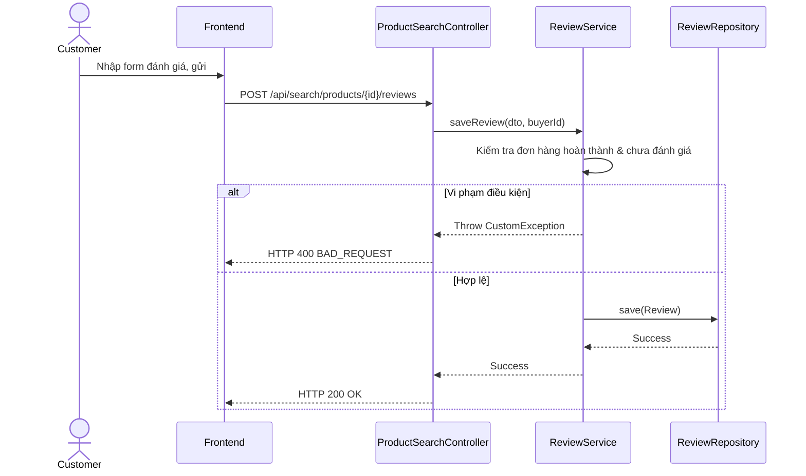

# UC-11 — Đánh Giá Sản Phẩm (Feedback Product)

> **Feature:** `feat-review` | **Phiên bản:** 2.0 | **Trạng thái:** Published
> **Tham chiếu FR:** FR-REVIEW-01 đến FR-REVIEW-12
> **Cập nhật:** 2026-07-24

---

## 1. Tổng Quan

| Thuộc tính | Nội dung |
|:---|:---|
| **Mã Use Case** | UC-11 |
| **Tên** | Đánh Giá Sản Phẩm (Feedback Product) |
| **Tác nhân chính** | Người mua (Customer) |
| **Mô tả ngắn** | Người mua gửi đánh giá số sao và lời nhận xét cho sản phẩm họ đã đặt mua thành công. |
| **Độ ưu tiên** | Trung bình (P1) |

---

## 2. Tác Nhân & Điều Kiện

### 2.1 Tác Nhân
| Tác nhân | Vai trò |
|:---|:---|
| **Người mua (Customer)** | Tác nhân chính thực hiện nghiệp vụ của hệ thống. |

### 2.2 Điều Kiện Tiền Quyết (Preconditions)
- Người mua đã mua sản phẩm này, đơn hàng hoàn thành (isDelete = 0) và chưa từng gửi đánh giá cho đơn hàng này.

### 2.3 Hậu Điều Kiện (Postconditions)
- **Thành công:** Bản ghi đánh giá mới được tạo thành công, cập nhật số sao trung bình của sản phẩm tương ứng.
- **Thất bại:** Trạng thái database không đổi, hệ thống trả về mã lỗi chi tiết.

---

## 3. Luồng Xử Lý (Sequence Steps)

### 3.1 Luồng Chính (Happy Path)
Bước 1 [Customer]:   Tại Lịch sử đơn hàng, chọn đơn hàng đã hoàn thành, bấm "Đánh giá".
Bước 2 [Frontend]:   Gửi yêu cầu POST /api/search/products/{productId}/reviews { "rating": 5, "comment": "Rất hài lòng" }.
Bước 3 [Backend]:    ProductSearchController nhận request, gọi ReviewService.saveReview().
                       - Kiểm chứng: Người dùng đăng nhập có đúng là người mua của đơn hàng.
                       - Đơn hàng đã ở trạng thái Completed.
                       - Lưu đánh giá vào bảng Reviews.
                       - Tính toán lại số sao trung bình của sản phẩm.
Bước 4 [Backend]:    Trả về HTTP 200 OK.
Bước 5 [Frontend]:   Hiển thị thông báo gửi đánh giá thành công.

### 3.2 Luồng Lỗi (Error Path)
| Tình huống | HTTP | Error Code | Xử lý |
|:---|:---:|:---|:---|
| Chưa mua hàng | 400 | `BAD_REQUEST` | Người mua chưa mua sản phẩm này hoặc đơn hàng chưa hoàn thành |
| Đã đánh giá rồi | 400 | `ALREADY_REVIEWED` | Mỗi giao dịch mua chỉ được đánh giá 1 lần duy nhất |

---

## 4. Quy Tắc Nghiệp Vụ (Business Rules)

| Mã | Quy tắc | Chi tiết |
|:---|:---|:---|
| BR-11-01 | Thang sao đánh giá | Số sao đánh giá bắt buộc phải nằm trong khoảng số nguyên từ 1 đến 5 sao |

---

## 5. Quy Tắc Kiểm Tra Đầu Vào

| Trường | Kiểm tra | Thông báo lỗi nếu sai |
|:---|:---|:---|
| `rating` | Bắt buộc, số nguyên [1-5] | "Số sao đánh giá phải từ 1 đến 5" |
| `comment` | Bắt buộc, tối đa 500 ký tự | "Nhận xét không được vượt quá 500 ký tự" |

---

## 6. Sơ Đồ Tuần Tự (Sequence Diagram)

---

## 7. Tham Chiếu API

| Phương thức | Endpoint | Mô tả |
|:---|:---|:---|
| POST | `/api/search/products/{productId}/reviews` | Gửi đánh giá sản phẩm |

---

## 8. Tiêu Chỉ Chấp Nhận (Acceptance Criteria)

### AC-11-01 — Gửi đánh giá hợp lệ thành công
> **Tham chiếu:** FR-REV-02
- **Cho trước:** Đơn hàng đã hoàn thành và chưa từng đánh giá.
- **Khi:** Người mua gửi đánh giá 5 sao.
- **Thì:** Hệ thống lưu đánh giá vào DB và tính lại số sao trung bình của sản phẩm.

---

## 9. Ngoài Phạm Vi (Out of Scope)
- ❌ Chỉnh sửa nội dung đánh giá sau khi đã gửi.

---

## 10. Danh Sách SRS Use Cases Hạt Nhân Trực Thuộc (SRS Mapping)

| SRS UC ID | Tên Use Case SRS | Feature Module | Mô Tả Chức Năng Chi Tiết |
|:---|:---|:---|:---|
| **UC 11** | Feedback Product | feat-review | Người mua gửi đánh giá số sao và lời nhận xét cho sản phẩm họ đã đặt mua thành công. |
