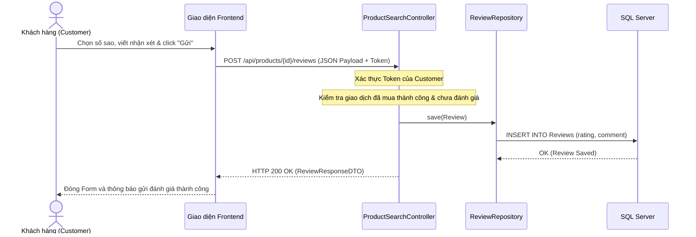

# UC-11 — Đánh Giá & Phản Hồi Sản Phẩm (Product Review & Rating)

> **Feature:** `feat-review` | **Phiên bản:** 2.0 | **Trạng thái:** Published
> **Cập nhật:** 2026-07-16

---

## 1. Tổng Quan

| Thuộc tính | Nội dung |
|:---|:---|
| **Mã Use Case** | UC-11 |
| **Tên** | Đánh Giá & Phản Hồi Sản Phẩm (Product Review & Rating) |
| **Tác nhân chính** | Người mua (Customer), Khách vãng lai (Guest) |
| **Mô tả ngắn** | Người mua đã mua sản phẩm thành công thực hiện viết đánh giá (chọn số sao, viết nhận xét và chèn link hình ảnh) cho sản phẩm từ lịch sử đơn hàng. Khách vãng lai và các người dùng khác có thể xem các đánh giá này trên trang chi tiết sản phẩm. |
| **Độ ưu tiên** | Trung bình (P2) — nâng cao trải nghiệm mua sắm và độ tin cậy của sàn giao dịch |

---

## 2. Tác Nhân & Điều Kiện

### 2.1 Tác Nhân

| Tác nhân | Vai trò |
|:---|:---|
| **Người mua (Customer)** | Đăng nhập, gửi đánh giá cho giao dịch đã hoàn tất thành công |
| **Khách vãng lai (Guest)** | Xem danh sách đánh giá công khai của sản phẩm |

### 2.2 Điều Kiện Tiền Quyết (Preconditions)

- Giao dịch liên quan đến sản phẩm của Buyer đã hoàn thành (`Completed`) hoặc đang bị giữ tạm (`Held`).
- Đơn hàng này chưa từng được đánh giá trước đây.
- Khách hàng đã đăng nhập tài khoản.

### 2.3 Hậu Điều Kiện (Postconditions)

- Đánh giá được lưu thành công vào bảng `Reviews`.
- Trường `isReviewed` của giao dịch chuyển sang `true`, ngăn chặn đánh giá lần hai.
- Điểm đánh giá trung bình và tổng lượt đánh giá của sản phẩm được cập nhật hiển thị công khai trên giao diện.

---

## 3. Luồng Xử Lý

### 3.1 Luồng Chính — Gửi Đánh Giá Sản Phẩm (Happy Path)

```
Bước 1  [Customer]:   Mở Lịch sử giao dịch ví / Lịch sử đơn hàng, chọn đơn hàng đã thanh toán thành công
Bước 2  [Frontend]:   Hiển thị thông tin đơn hàng kèm nút "Đánh giá sản phẩm" (nếu isReviewed == false)
Bước 3  [Customer]:   Nhấn nút "Đánh giá sản phẩm"
Bước 4  [Frontend]:   Hiển thị hộp thoại Form đánh giá (chọn số sao từ 1 đến 5, nhập nhận xét, đính kèm link ảnh minh họa)
Bước 5  [Customer]:   Chọn 5 sao, nhập nhận xét "Sản phẩm chất lượng tốt, giao nhanh" và click "Xác nhận gửi"
Bước 6  [Frontend]:   Gửi yêu cầu POST /api/products/{productId}/reviews với body: { rating, comment, mediaUrl, transactionId } kèm token
Bước 7  [Backend]:    Validate thông tin:
                       - Rating phải nằm trong khoảng [1, 5]
                       - Giao dịch phải thuộc về tài khoản đăng nhập, đúng mã sản phẩm
                       - Trạng thái giao dịch thuộc danh sách [Completed, Held]
                       - Giao dịch này chưa từng được đánh giá trước đó
Bước 8  [Backend]:    Tạo thực thể Review, lưu vào bảng Reviews trong CSDL
Bước 9  [Backend]:    Trả về thông tin ReviewResponseDTO (HTTP 200 OK)
Bước 10 [Frontend]:   Đóng hộp thoại, hiển thị thông báo thành công, cập nhật giao diện đơn hàng thành "Đã đánh giá" và ẩn nút viết đánh giá
```

---

## 4. Quy Tắc Kiểm Tra Đầu Vào (Validation)

### POST /api/products/{productId}/reviews

| Trường | Kiểm tra | Lỗi khi vi phạm |
|:---|:---|:---|
| `rating` | Bắt buộc, số nguyên từ 1 đến 5 | "Số sao đánh giá phải từ 1 đến 5." |
| `comment` | Tùy chọn, tối đa 2000 ký tự | "Nhận xét quá dài" |
| `transactionId` | Bắt buộc (hoặc tùy chọn nếu dùng luồng tương thích ngược cũ) | "Giao dịch không tồn tại hoặc đã bị xóa." |

---

## 5. Sơ Đồ Tuần Tự (Sequence Diagram)


