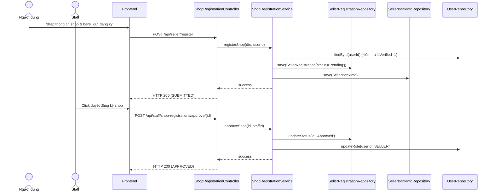

# UC-04 — Đăng Ký Cửa Hàng (Seller Store Registration)

> **Feature:** `feat-seller` | **Phiên bản:** 1.0 | **Trạng thái:** Published
> **Tham chiếu FR:** FR-SELL-01 đến FR-SELL-05
> **Cập nhật:** 2026-06-30

---

## 1. Tổng Quan

| Thuộc tính | Nội dung |
|:---|:---|
| **Mã Use Case** | UC-04 |
| **Tên** | Đăng Ký Cửa Hàng (Seller Store Registration) |
| **Tác nhân chính** | Người dùng (User), Nhân viên kiểm duyệt (Staff) |
| **Mô tả ngắn** | Khách hàng đã được duyệt KYC thực hiện đăng ký mở gian hàng (Shop) và khai báo tài khoản ngân hàng chính chủ để rút doanh thu. Nhân viên (Staff) kiểm duyệt hồ sơ và nâng cấp quyền. |
| **Độ ưu tiên** | Trung bình (P1) — luồng mở màn cho vai trò người bán hàng |

---

## 2. Tác Nhân & Điều Kiện

### 2.1 Tác Nhân

| Tác nhân | Vai trò |
|:---|:---|
| **Người dùng (User)** | Điền thông tin đăng ký shop, điền tài khoản ngân hàng |
| **Nhân viên (Staff)** | Xem danh sách đăng ký shop, duyệt hoặc từ chối |

### 2.2 Điều Kiện Tiền Quyết (Preconditions)

- Tài khoản đã được KYC thành công (`isVerified = 1`).
- Tài khoản chưa đăng ký Shop hoặc đăng ký trước đó bị `Rejected` (không ở trạng thái `Pending` hay `Approved`).

### 2.3 Hậu Điều Kiện (Postconditions)

- **Thành công (Approve):** Tạo bản ghi Shop hợp lệ, tài khoản User được nâng cấp role thành `SELLER`.
- **Từ chối (Reject):** Lưu vết lý do từ chối, User có thể chỉnh sửa và gửi lại yêu cầu khác.

---

## 3. Luồng Xử Lý

### 3.1 Luồng Chính — Đăng Ký Shop & Bank Info (Happy Path)

```
Bước 1  [User]:       Truy cập mục "Kênh Người Bán", chọn "Đăng ký mở gian hàng"
Bước 2  [Frontend]:   GET /api/seller/registration/status để kiểm tra trạng thái
Bước 3  [Backend]:    Trả về trạng thái chưa đăng ký (NOT_SUBMITTED)
Bước 4  [User]:       Nhập Tên gian hàng (Shop Name), Mô tả ngắn, và Thông tin ngân hàng (Tên ngân hàng, Số tài khoản, Tên chủ tài khoản)
Bước 5  [Frontend]:   POST /api/seller/register { shopName, description, bankName, accountNumber, accountName }
Bước 6  [Backend]:    Validate: shopName không trùng lặp trong DB
                       Validate: các trường tài khoản ngân hàng không để trống
                       Tạo bản ghi trong SellerRegistrations (status = 'Pending')
                       Tạo bản ghi trong SellerBankInfo
                       Trả về: status = 200, message = "SUBMITTED"
Bước 7  [Frontend]:   Hiển thị thông báo gửi hồ sơ thành công, trạng thái "Đang chờ duyệt"
```

### 3.2 Luồng Phê Duyệt Hồ Sơ Shop (Staff)

```
Bước 1  [Staff]:      Vào Console quản lý, chọn danh sách đăng ký shop chờ duyệt
Bước 2  [Frontend]:   GET /api/staff/shop-registrations?status=Pending
Bước 3  [Backend]:    Trả về danh sách đăng ký shop
Bước 4  [Staff]:      Nhấp xem chi tiết, đối chiếu tên shop và thông tin ngân hàng hợp lệ
Bước 5  [Staff]:      Nhấn nút "Phê duyệt"
Bước 6  [Frontend]:   POST /api/staff/shop-registrations/approve/{regId}
Bước 7  [Backend]:    @Transactional:
                       - Cập nhật SellerRegistrations.status = 'Approved'
                       - Cập nhật vai trò người dùng (Users.role) sang 'SELLER'
                       - Gửi thông báo hệ thống chúc mừng người dùng
                       Trả về: status = 200, message = "APPROVED"
```

---

## 4. Quy Tắc Nghiệp Vụ

| Mã | Quy tắc | Chi tiết |
|:---|:---|:---|
| BR-04-01 | KYC bắt buộc | Chỉ tài khoản có `isVerified = 1` mới được đăng ký gian hàng |
| BR-04-02 | Tên shop độc nhất | Tên gian hàng không được trùng lặp với các shop đang hoạt động khác |
| BR-04-03 | Chỉ 1 hồ sơ hoạt động | Không cho phép gửi yêu cầu đăng ký mới khi có yêu cầu đang ở trạng thái `Pending` |

---

## 5. Quy Tắc Kiểm Tra Đầu Vào

### POST /api/seller/register

| Trường | Kiểm tra | Lỗi khi vi phạm |
|:---|:---|:---|
| `shopName` | Bắt buộc, không rỗng, tối đa 100 ký tự | "Tên gian hàng không được rỗng" |
| `bankName` | Bắt buộc | "Tên ngân hàng là bắt buộc" |
| `accountNumber`| Bắt buộc, định dạng số | "Số tài khoản ngân hàng không hợp lệ" |

---

## 6. Sơ Đồ Tuần Tự (Sequence Diagram)

### Luồng Đăng Ký và Phê Duyệt Shop



---

## 7. Tham Chiếu API

| Phương thức | Endpoint | Mô tả |
|:---|:---|:---|
| `POST` | `/api/seller/register` | Đăng ký gian hàng mới |
| `GET` | `/api/seller/registration/status` | Lấy trạng thái đăng ký của tôi |
| `POST` | `/api/staff/shop-registrations/approve/{id}` | Phê duyệt đăng ký shop (Staff) |
| `POST` | `/api/staff/shop-registrations/reject/{id}` | Từ chối đăng ký shop (Staff) |

---

## 8. Tiêu Chí Chấp Nhận (Acceptance Criteria)

### AC-04-01 — Đăng ký khi chưa KYC bị chặn

- **Cho trước:** Người dùng `User B` chưa được duyệt KYC (`isVerified = 0`)
- **Khi:** Thực hiện gọi POST `/api/seller/register`
- **Thì:** Hệ thống chặn lại và trả về lỗi HTTP 400 kèm thông điệp "Tài khoản chưa hoàn tất KYC"

---

## 9. Ngoài Phạm Vi (Out of Scope)

- ❌ Liên kết tài khoản thanh toán quốc tế (PayPal, Stripe).
- ❌ Tự động đồng bộ mã số thuế doanh nghiệp với cục thuế.
