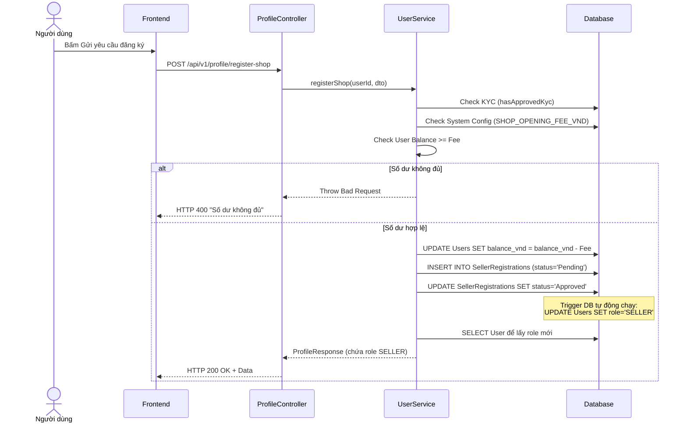

# UC-18 — Đăng Ký Mở Cửa Hàng (Shop Registration - Auto Approve)

> **Feature:** `feat-seller` | **Phiên bản:** 2.0 | **Trạng thái:** Published
> **Tham chiếu FR:** FR-SELL-01 đến FR-SELL-04
> **Cập nhật:** 2026-07-16

---

## 1. Tổng Quan

| Thuộc tính | Nội dung |
|:---|:---|
| **Mã Use Case** | UC-18 |
| **Tên** | Đăng Ký Mở Gian Hàng Tự Động (Shop Registration) |
| **Tác nhân chính** | Người dùng (User) |
| **Mô tả ngắn** | Người dùng đã hoàn thành KYC có thể gửi yêu cầu tạo gian hàng. Hệ thống thu một khoản phí mở Shop (do Admin cấu hình) từ ví (VND) và tự động duyệt nâng cấp tài khoản lên thành Người bán (SELLER). |
| **Độ ưu tiên** | Cao (P1) |

---

## 2. Tác Nhân & Điều Kiện

### 2.1 Tác Nhân

| Tác nhân | Vai trò |
|:---|:---|
| **Người dùng (User)** | Khai báo thông tin Shop và xác nhận nộp phí đăng ký |

### 2.2 Điều Kiện Tiền Quyết (Preconditions)

- Tài khoản đang hoạt động bình thường, chưa phải là SELLER.
- Đã hoàn tất Định danh (KYC) với trạng thái `APPROVED`.
- Số dư ví (Balance) phải lớn hơn hoặc bằng phí mở shop quy định (mức phí này do Admin cài đặt, mặc định 50.000 VNĐ).

### 2.3 Hậu Điều Kiện (Postconditions)

- Trừ tiền trực tiếp vào số dư ví của User.
- Bản ghi Shop được lưu vào Database và lập tức tự động set trạng thái `Approved`.
- Kích hoạt Database Trigger `trg_UpdateShopStatus` tự động đổi role User sang `SELLER` và `shopStatus` sang `Approved`.

---

## 3. Luồng Xử Lý

### 3.1 Luồng Chính — Đăng Ký Shop Tự Động (Happy Path)

```
Bước 1  [User]:       Truy cập màn hình Đăng ký mở shop.
Bước 2  [User]:       Điền thông tin: Tên Shop, Danh mục, Mô tả, SĐT, Email hỗ trợ. Bấm Xác nhận mở.
Bước 3  [Frontend]:   POST /api/v1/profile/register-shop { shopName, category, description, supportEmail, supportPhone }
Bước 4  [Backend]:    Xác thực (Validation) User đã KYC thành công hay chưa.
Bước 5  [Backend]:    Lấy giá trị phí mở shop (SHOP_OPENING_FEE_VND) từ bảng SystemConfig.
Bước 6  [Backend]:    Kiểm tra số dư ví. Nếu đủ, trừ phí thẳng vào user.balanceVnd.
Bước 7  [Backend]:    Tạo bản ghi trong SellerRegistrations (status = 'Pending'), sau đó cập nhật ngay lập tức thành 'Approved' để kích hoạt Trigger.
Bước 8  [Backend]:    Load lại User Entity để lấy Role mới, trả về ProfileResponse cho Client.
Bước 9  [Frontend]:   Hiển thị thông báo "Đăng ký thành công" và mở khóa các tính năng của Kênh Người Bán.
```

### 3.2 Luồng Lỗi — Số Dư Ví Không Đủ

```
Bước 4  [Backend]:    Lấy phí mở Shop do Admin cấu hình (ví dụ 50.000 VNĐ).
Bước 5  [Backend]:    Kiểm tra user.balanceVnd (chỉ có 20.000 VNĐ).
Bước 6  [Backend]:    Trả về HTTP 400 Bad Request kèm thông báo "Số dư tài khoản không đủ để đăng ký...".
Bước 7  [Frontend]:   Báo lỗi trên giao diện, gợi ý người dùng đi Nạp tiền.
```

---

## 4. Quy Tắc Nghiệp Vụ

| Mã | Quy tắc | Chi tiết |
|:---|:---|:---|
| BR-18-01 | Phí mở Shop | Phí mở gian hàng được lấy linh động từ cấu hình hệ thống (`SHOP_OPENING_FEE_VND`).|
| BR-18-02 | KYC bắt buộc | Hàm `hasApprovedKyc` sẽ kiểm tra trạng thái KYC của người dùng, bắt buộc `APPROVED` mới cho chạy tiếp. |
| BR-18-03 | Không phê duyệt tay | Hệ thống không sử dụng luồng Staff duyệt. Yêu cầu tạo mới sẽ được DB tự động biến thành Approved. |

---

## 5. Quy Tắc Kiểm Tra Đầu Vào (Validation)

### POST /api/v1/profile/register-shop

| Trường | Kiểm tra | Lỗi khi vi phạm |
|:---|:---|:---|
| `shopName` | Bắt buộc, không được để trống | "Tên cửa hàng không được để trống" |
| `description` | Có thể rỗng | N/A |
| `category` | Có thể rỗng | N/A |
| `supportEmail`| Có thể rỗng | N/A |
| `supportPhone`| Có thể rỗng | N/A |

*(Ghi chú: Tại thời điểm hiện tại Backend chưa thực hiện validate nghiêm ngặt độ dài/định dạng cho các trường phụ như Email/SĐT hỗ trợ, chỉ validate bắt buộc có `shopName`).*

---

## 6. Sơ Đồ Tuần Tự (Sequence Diagram)



---

## 7. Tham Chiếu API

| Phương thức | Endpoint | Mô tả |
|:---|:---|:---|
| `POST` | `/api/v1/profile/register-shop` | Thực hiện thanh toán và đăng ký mở shop trực tiếp |

*(Luồng API dành cho Staff duyệt trước đây đã bị loại bỏ hoàn toàn).*
