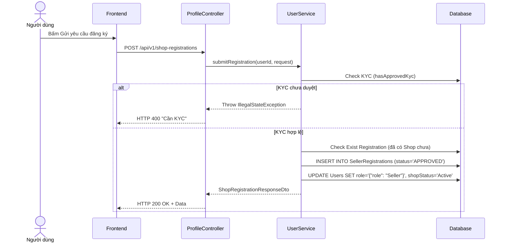

# UC-18 — Đăng Ký Mở Cửa Hàng (Shop Registration - Auto Approve)

> **Feature:** `feat-seller` | **Phiên bản:** 2.0 | **Trạng thái:** Published
> **Tham chiếu FR:** FR-SELL-01 đến FR-SELL-04
> **Cập nhật:** 2026-07-16

---

## 1. Tổng Quan

| Thuộc tính | Nội dung |
|:---|:---|
| **Mã Use Case** | UC-18 |
| **Tên** | Đăng Ký Mở Gian Hàng Tự Động (Shop Registration) |
| **Tác nhân chính** | Người dùng (User) |
| **Mô tả ngắn** | Người dùng đã hoàn thành KYC có thể gửi yêu cầu tạo gian hàng. Hệ thống tự động duyệt nâng cấp tài khoản lên thành Người bán (SELLER). |
| **Độ ưu tiên** | Cao (P1) |

---

## 2. Tác Nhân & Điều Kiện

### 2.1 Tác Nhân

| Tác nhân | Vai trò |
|:---|:---|
| **Người dùng (User)** | Khai báo thông tin Shop và xác nhận nộp phí đăng ký |

### 2.2 Điều Kiện Tiền Quyết (Preconditions)

- Tài khoản đang hoạt động bình thường, chưa phải là SELLER.
- Đã hoàn tất Định danh (KYC) với trạng thái `APPROVED`.

### 2.3 Hậu Điều Kiện (Postconditions)

- Bản ghi Shop được lưu vào Database và lập tức tự động set trạng thái `Approved`.
- Tài khoản người dùng (User) tự động đổi role sang `SELLER` và `shopStatus` sang `Active`.

---

## 3. Luồng Xử Lý

### 3.1 Luồng Chính — Đăng Ký Shop Tự Động (Happy Path)

```
Bước 1  [User]:       Truy cập màn hình Đăng ký mở shop.
Bước 2  [User]:       Điền thông tin: Tên Shop, Danh mục, Mô tả, SĐT, Email hỗ trợ. Bấm Xác nhận mở.
Bước 3  [Frontend]:   POST /api/v1/shop-registrations { shopName, category, description, supportEmail, supportPhone }
Bước 4  [Backend]:    Xác thực (Validation) User đã KYC thành công hay chưa.
Bước 5  [Backend]:    Tạo bản ghi trong SellerRegistrations (status = 'APPROVED').
Bước 6  [Backend]:    Cập nhật User Entity để thêm Role SELLER và kích hoạt ShopStatus = 'Active'. Trả về dữ liệu ShopRegistrationResponse.
Bước 7  [Frontend]:   Hiển thị thông báo "Đăng ký thành công" và mở khóa các tính năng của Kênh Người Bán.
```

### 3.2 Luồng Lỗi — Chưa KYC

```
Bước 4  [Backend]:    Kiểm tra KYC. Phát hiện User chưa có bản ghi KYC ở trạng thái APPROVED.
Bước 5  [Backend]:    Trả về HTTP 400 Bad Request kèm thông báo "Bạn phải hoàn tất xác minh danh tính (KYC) trước khi đăng ký Shop.".
Bước 6  [Frontend]:   Báo lỗi trên giao diện, gợi ý người dùng đi KYC.
```

---

## 4. Quy Tắc Nghiệp Vụ

| Mã | Quy tắc | Chi tiết |
|:---|:---|:---|
| BR-18-01 | KYC bắt buộc | Hàm xác thực sẽ kiểm tra trạng thái KYC của người dùng, bắt buộc `APPROVED` mới cho chạy tiếp. |
| BR-18-02 | Không phê duyệt tay | Hệ thống tự động lưu trạng thái đăng ký là APPROVED. Đã loại bỏ luồng Admin/Staff duyệt. |

---

## 5. Quy Tắc Kiểm Tra Đầu Vào (Validation)

### POST /api/v1/shop-registrations

| Trường | Kiểm tra | Lỗi khi vi phạm |
|:---|:---|:---|
| `shopName` | Bắt buộc, không được để trống | "Tên cửa hàng không được để trống" |
| `description` | Có thể rỗng | N/A |
| `category` | Có thể rỗng | N/A |
| `supportEmail`| Có thể rỗng | N/A |
| `supportPhone`| Có thể rỗng | N/A |

*(Ghi chú: Tại thời điểm hiện tại Backend chưa thực hiện validate nghiêm ngặt độ dài/định dạng cho các trường phụ như Email/SĐT hỗ trợ, chỉ validate bắt buộc có `shopName`).*

---

## 6. Sơ Đồ Tuần Tự (Sequence Diagram)



---

## 7. Tham Chiếu API

| Phương thức | Endpoint | Mô tả |
|:---|:---|:---|
| `POST` | `/api/v1/shop-registrations` | Gửi yêu cầu đăng ký mở shop và tự động duyệt |

*(Luồng API dành cho Staff duyệt trước đây đã bị loại bỏ hoàn toàn).*
