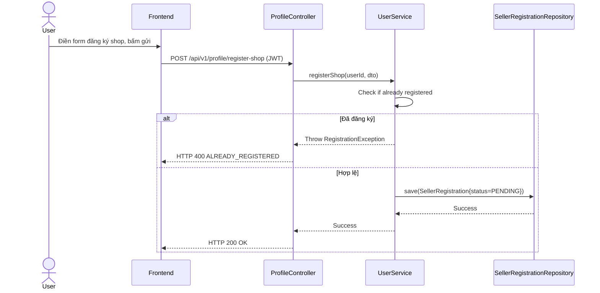

# UC-21 — Đăng Ký Mở Gian Hàng (Request Register Shop)

> **Feature:** `feat-seller` | **Phiên bản:** 2.0 | **Trạng thái:** Published
> **Tham chiếu FR:** FR-SELLER-01 đến FR-SELLER-12
> **Cập nhật:** 2026-07-24

---

## 1. Tổng Quan

| Thuộc tính | Nội dung |
|:---|:---|
| **Mã Use Case** | UC-21 |
| **Tên** | Đăng Ký Mở Gian Hàng (Request Register Shop) |
| **Tác nhân chính** | Người dùng (User) |
| **Mô tả ngắn** | Người dùng đăng ký mở Shop bán sản phẩm số trên sàn giao dịch. |
| **Độ ưu tiên** | Cao (P0) |

---

## 2. Tác Nhân & Điều Kiện

### 2.1 Tác Nhân
| Tác nhân | Vai trò |
|:---|:---|
| **Người dùng (User)** | Tác nhân chính thực hiện nghiệp vụ của hệ thống. |

### 2.2 Điều Kiện Tiền Quyết (Preconditions)
- Tài khoản hoạt động bình thường, chưa đăng ký mở Shop trước đó.

### 2.3 Hậu Điều Kiện (Postconditions)
- **Thành công:** Bản ghi đăng ký mở Shop được tạo ở trạng thái PENDING.
- **Thất bại:** Trạng thái database không đổi, hệ thống trả về mã lỗi chi tiết.

---

## 3. Luồng Xử Lý (Sequence Steps)

### 3.1 Luồng Chính (Happy Path)
Bước 1 [User]:       Vào cài đặt cá nhân, chọn "Đăng ký mở shop".
Bước 2 [Frontend]:   Gửi yêu cầu POST /api/v1/profile/register-shop.
Bước 3 [Backend]:    ProfileController nhận request, gọi UserService.registerShop().
                       - Kiểm tra tính độc nhất của tên shop đăng ký.
                       - Tạo bản ghi mới trong bảng SellerRegistrations trạng thái PENDING.
Bước 4 [Backend]:    Trả về HTTP 200 OK.
Bước 5 [Frontend]:   Hiển thị thông báo đăng ký đang chờ Admin phê duyệt.

### 3.2 Luồng Lỗi (Error Path)
| Tình huống | HTTP | Error Code | Xử lý |
|:---|:---:|:---|:---|
| Đã đăng ký rồi | 400 | `ALREADY_REGISTERED` | Tài khoản đã là Seller hoặc đang có đơn đăng ký chờ duyệt |

---

## 4. Quy Tắc Nghiệp Vụ (Business Rules)

| Mã | Quy tắc | Chi tiết |
|:---|:---|:---|
| BR-21-01 | Tên shop duy nhất | Tên shop đăng ký không được trùng lặp với các shop đang hoạt động |

---

## 5. Quy Tắc Kiểm Tra Đầu Vào

| Trường | Kiểm tra | Thông báo lỗi nếu sai |
|:---|:---|:---|
| `shopName` | Bắt buộc, từ 5-100 ký tự | "Tên shop phải từ 5 đến 100 ký tự" |

---

## 6. Sơ Đồ Tuần Tự (Sequence Diagram)

---

## 7. Tham Chiếu API

| Phương thức | Endpoint | Mô tả |
|:---|:---|:---|
| POST | `/api/v1/profile/register-shop` | Yêu cầu đăng ký mở gian hàng mới |

---

## 8. Tiêu Chỉ Chấp Nhận (Acceptance Criteria)

### AC-21-01 — Đăng ký mở shop thành công
> **Tham chiếu:** FR-SEL-01
- **Cho trước:** Tài khoản chưa từng đăng ký shop.
- **Khi:** Đăng ký shop với tên hợp lệ.
- **Thì:** Tạo bản ghi đăng ký trạng thái PENDING thành công.

---

## 9. Ngoài Phạm Vi (Out of Scope)
- ❌ Tự động duyệt mở shop.

---

## 10. Danh Sách SRS Use Cases Hạt Nhân Trực Thuộc (SRS Mapping)

| SRS UC ID | Tên Use Case SRS | Feature Module | Mô Tả Chức Năng Chi Tiết |
|:---|:---|:---|:---|
| **UC 21** | Request Register Shop | feat-seller | Người dùng đăng ký mở Shop bán sản phẩm số trên sàn giao dịch. |
