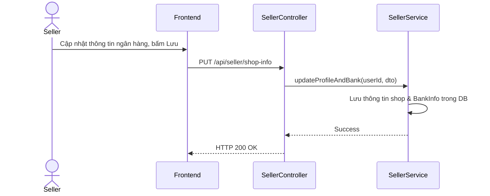

# UC-22 — Quản Lý Thông Tin Shop & Ngân Hàng (Manage Shop Profile & Bank Info)

> **Feature:** `feat-seller` | **Phiên bản:** 2.0 | **Trạng thái:** Published
> **Tham chiếu FR:** FR-SELLER-01 đến FR-SELLER-12
> **Cập nhật:** 2026-07-24

---

## 1. Tổng Quan

| Thuộc tính | Nội dung |
|:---|:---|
| **Mã Use Case** | UC-22 |
| **Tên** | Quản Lý Thông Tin Shop & Ngân Hàng (Manage Shop Profile & Bank Info) |
| **Tác nhân chính** | Người bán (Seller) |
| **Mô tả ngắn** | Seller cập nhật hồ sơ hiển thị của Shop và cấu hình thông tin tài khoản ngân hàng thụ hưởng. |
| **Độ ưu tiên** | Cao (P0) |

---

## 2. Tác Nhân & Điều Kiện

### 2.1 Tác Nhân
| Tác nhân | Vai trò |
|:---|:---|
| **Người bán (Seller)** | Tác nhân chính thực hiện nghiệp vụ của hệ thống. |

### 2.2 Điều Kiện Tiền Quyết (Preconditions)
- Người dùng đã là Seller hoạt động bình thường.

### 2.3 Hậu Điều Kiện (Postconditions)
- **Thành công:** Thông tin Shop và ngân hàng được cập nhật thành công.
- **Thất bại:** Trạng thái database không đổi, hệ thống trả về mã lỗi chi tiết.

---

## 3. Luồng Xử Lý (Sequence Steps)

### 3.1 Luồng Chính (Happy Path)
Bước 1 [Seller]:    Vào phần Cấu hình shop, nhập mô tả shop và tài khoản ngân hàng.
Bước 2 [Frontend]:  Gửi yêu cầu PUT /api/seller/shop-info.
Bước 3 [Backend]:   SellerController gọi SellerService.updateShopProfile() và WalletService.saveBankInfo().
                     - Lưu cập nhật vào DB.
Bước 4 [Backend]:   Trả về HTTP 200 OK.
Bước 5 [Frontend]:   Thông báo cập nhật cấu hình shop thành công.

### 3.2 Luồng Lỗi (Error Path)
| Tình huống | HTTP | Error Code | Xử lý |
|:---|:---:|:---|:---|
| Không có quyền | 403 | `FORBIDDEN` | Từ chối truy cập API do không phải Seller |

---

## 4. Quy Tắc Nghiệp Vụ (Business Rules)

| Mã | Quy tắc | Chi tiết |
|:---|:---|:---|
| BR-22-01 | Ràng buộc tài khoản ngân hàng | Phải nhập đầy đủ tên ngân hàng, số tài khoản và tên chủ tài khoản ngân hàng thụ hưởng |

---

## 5. Quy Tắc Kiểm Tra Đầu Vào

| Trường | Kiểm tra | Thông báo lỗi nếu sai |
|:---|:---|:---|
| `bankAccount` | Bắt buộc, chuỗi số | "Số tài khoản ngân hàng không hợp lệ" |
| `bankName` | Bắt buộc | "Tên ngân hàng không được để trống" |

---

## 6. Sơ Đồ Tuần Tự (Sequence Diagram)

---

## 7. Tham Chiếu API

| Phương thức | Endpoint | Mô tả |
|:---|:---|:---|
| PUT | `/api/seller/shop-info` | Cập nhật thông tin cấu hình shop và tài khoản ngân hàng |

---

## 8. Tiêu Chỉ Chấp Nhận (Acceptance Criteria)

### AC-22-01 — Lưu cấu hình shop thành công
> **Tham chiếu:** FR-SEL-02
- **Cho trước:** Seller đang hoạt động.
- **Khi:** Cập nhật thông tin ngân hàng MBBank.
- **Thì:** Hệ thống ghi nhận thành công.

---

## 9. Ngoài Phạm Vi (Out of Scope)
- ❌ Xác thực thông tin tài khoản ngân hàng qua cổng NAPAS.

---

## 10. Danh Sách SRS Use Cases Hạt Nhân Trực Thuộc (SRS Mapping)

| SRS UC ID | Tên Use Case SRS | Feature Module | Mô Tả Chức Năng Chi Tiết |
|:---|:---|:---|:---|
| **UC 22** | Manage Shop Profile & Bank Info | feat-seller | Seller cập nhật hồ sơ hiển thị của Shop và cấu hình thông tin tài khoản ngân hàng thụ hưởng. |
