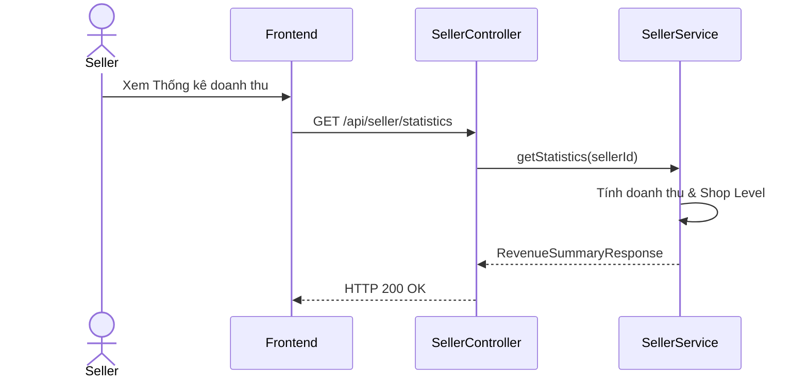

# UC-25 — Xem Báo Cáo Thống Kê & Cấp Độ Shop (View Shop Statistics & Level)

> **Feature:** `feat-seller` | **Phiên bản:** 2.0 | **Trạng thái:** Published
> **Tham chiếu FR:** FR-SELLER-01 đến FR-SELLER-12
> **Cập nhật:** 2026-07-24

---

## 1. Tổng Quan

| Thuộc tính | Nội dung |
|:---|:---|
| **Mã Use Case** | UC-25 |
| **Tên** | Xem Báo Cáo Thống Kê & Cấp Độ Shop (View Shop Statistics & Level) |
| **Tác nhân chính** | Người bán (Seller) |
| **Mô tả ngắn** | Seller theo dõi báo cáo thống kê doanh số bán, số lượng đơn hàng, tỷ lệ khiếu nại và Shop Level hiện tại. |
| **Độ ưu tiên** | Trung bình (P1) |

---

## 2. Tác Nhân & Điều Kiện

### 2.1 Tác Nhân
| Tác nhân | Vai trò |
|:---|:---|
| **Người bán (Seller)** | Tác nhân chính thực hiện nghiệp vụ của hệ thống. |

### 2.2 Điều Kiện Tiền Quyết (Preconditions)
- Người bán đã đăng nhập hệ thống.

### 2.3 Hậu Điều Kiện (Postconditions)
- **Thành công:** Thông tin thống kê hiệu suất hoạt động hiển thị chi tiết.
- **Thất bại:** Trạng thái database không đổi, hệ thống trả về mã lỗi chi tiết.

---

## 3. Luồng Xử Lý (Sequence Steps)

### 3.1 Luồng Chính (Happy Path)
Bước 1 [Seller]:    Vào Dashboard Seller, chọn mục "Thống kê doanh số".
Bước 2 [Frontend]:  Gửi yêu cầu GET /api/seller/statistics.
Bước 3 [Backend]:   SellerController gọi SellerService.getShopStatistics().
                     - Tính toán: Tổng doanh thu, tổng số đơn bán, tỷ lệ khiếu nại thành công, Shop Level.
Bước 4 [Backend]:   Trả về RevenueSummaryResponse.
Bước 5 [Frontend]:   Render biểu đồ doanh thu và các chỉ số hiệu suất.

### 3.2 Luồng Lỗi (Error Path)
| Tình huống | HTTP | Error Code | Xử lý |
|:---|:---:|:---|:---|
| Lỗi DB | 500 | `INTERNAL_SERVER_ERROR` | Hiển thị thông báo lỗi hệ thống |

---

## 4. Quy Tắc Nghiệp Vụ (Business Rules)

| Mã | Quy tắc | Chi tiết |
|:---|:---|:---|
| BR-25-01 | Phân cấp độ gian hàng | Shop dưới 20 đơn hoặc tỷ lệ khiếu nại đúng >= 2% sẽ bị đưa về Shop Level 0 (Escrow giam tiền 168h) |

---

## 5. Quy Tắc Kiểm Tra Đầu Vào

| Trường | Kiểm tra | Thông báo lỗi nếu sai |
|:---|:---|:---|
| None | | |

---

## 6. Sơ Đồ Tuần Tự (Sequence Diagram)

---

## 7. Tham Chiếu API

| Phương thức | Endpoint | Mô tả |
|:---|:---|:---|
| GET | `/api/seller/statistics` | Xem báo cáo doanh thu và thống kê hiệu suất shop |

---

## 8. Tiêu Chỉ Chấp Nhận (Acceptance Criteria)

### AC-25-01 — Xem thống kê shop thành công
> **Tham chiếu:** FR-SEL-03
- **Cho trước:** Shop bán được 10 đơn hàng.
- **Khi:** Truy cập trang thống kê.
- **Thì:** Hiển thị đúng doanh số thực tế và xếp hạng Level 0.

---

## 9. Ngoài Phạm Vi (Out of Scope)
- ❌ Xuất báo cáo thống kê shop ra file Excel/PDF.

---

## 10. Danh Sách SRS Use Cases Hạt Nhân Trực Thuộc (SRS Mapping)

| SRS UC ID | Tên Use Case SRS | Feature Module | Mô Tả Chức Năng Chi Tiết |
|:---|:---|:---|:---|
| **UC 25** | View Shop Statistics & Level | feat-seller | Seller theo dõi báo cáo thống kê doanh số bán, số lượng đơn hàng, tỷ lệ khiếu nại và Shop Level hiện tại. |
