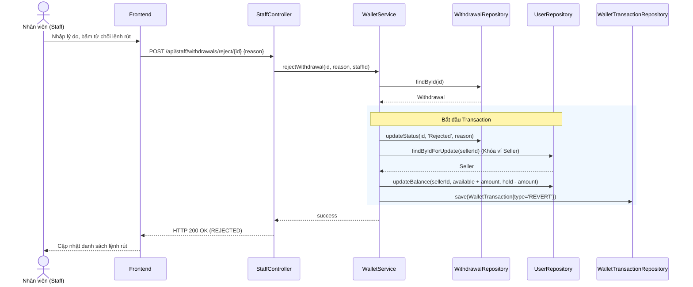

# UC-14 — Vận Hành Hệ Thống (Staff Operations & Approvals)

> **Feature:** `feat-staff` | **Phiên bản:** 1.0 | **Trạng thái:** Published
> **Tham chiếu FR:** FR-STAFF-01 đến FR-STAFF-12
> **Cập nhật:** 2026-06-30

---

## 1. Tổng Quan

| Thuộc tính | Nội dung |
|:---|:---|
| **Mã Use Case** | UC-14 |
| **Tên** | Vận Hành Hệ Thống (Staff Operations & Approvals) |
| **Tác nhân chính** | Nhân viên vận hành (Staff), Quản trị viên (Admin) |
| **Mô tả ngắn** | Nhân viên hệ thống xem và kiểm duyệt các lệnh yêu cầu rút tiền của Seller. Staff cũng có quyền gắn cờ (Shop Flags) cảnh cáo các Shop vi phạm quy chế sàn. |
| **Độ ưu tiên** | Cao (P1) — kiểm soát dòng tiền rút ra ngoài hệ thống và duy trì kỷ luật sàn |

---

## 2. Tác Nhân & Điều Kiện

### 2.1 Tác Nhân

| Tác nhân | Vai trò |
|:---|:---|
| **Nhân viên (Staff)** | Duyệt/Từ chối lệnh rút tiền, gắn cờ shop vi phạm |
| **Người bán (Seller)** | Đối tượng gửi yêu cầu rút tiền hoặc bị gắn cờ vi phạm |
| **WalletService** | Giải phóng hoặc hoàn trả hold balance dựa trên phán quyết |

### 2.2 Điều Kiện Tiền Quyết (Preconditions)

- Người vận hành đã đăng nhập vào hệ thống với vai trò tài khoản có quyền `Staff` hoặc `Admin`.
- Lệnh rút tiền cần xử lý phải ở trạng thái `Pending`.
- Shop bị gắn cờ phải tồn tại trong DB (`Users.role = 'SELLER'`).

### 2.3 Hậu Điều Kiện (Postconditions)

- **Duyệt rút tiền thành công:** `hold_balance` của Seller bị khấu trừ vĩnh viễn, trạng thái lệnh rút cập nhật thành `Approved`.
- **Từ chối rút tiền:** Số tiền hoàn trả từ `hold_balance` về lại `available_balance` của Seller.
- **Gắn cờ Shop:** Ghi nhận bản ghi `ShopFlags`, gửi thông báo cảnh cáo cho Seller.

---

## 3. Luồng Xử Lý

### 3.1 Luồng Chính — Phê Duyệt Lệnh Rút Tiền (Happy Path)

```
Bước 1  [Staff]:      Truy cập trang Quản lý Rút tiền trên Staff Console
Bước 2  [Frontend]:   GET /api/staff/withdrawals?status=Pending
Bước 3  [Backend]:    Trả về danh sách các lệnh rút tiền đang chờ duyệt
Bước 4  [Staff]:      Nhấp xem chi tiết lệnh rút của Seller (Tên ngân hàng, Số tài khoản, Số tiền rút)
Bước 5  [Staff]:      Thực hiện chuyển khoản ngân hàng thủ công ngoài đời thực cho Seller
Bước 6  [Staff]:      Chuyển khoản thành công, nhấn nút "Duyệt lệnh rút" trên giao diện
Bước 7  [Frontend]:   POST /api/staff/withdrawals/approve/{withdrawalId}
Bước 8  [Backend]:    @Transactional:
                       - Khóa Pessimistic Lock ví của Seller
                       - Cập nhật Withdrawals.status = 'Approved', lưu reviewed_by và reviewed_at
                       - Khấu trừ vĩnh viễn số tiền rút khỏi Seller.holdBalance
                       - Tạo WalletTransactions (type = 'WITHDRAW')
                       - Tạo Notification gửi thông báo rút tiền thành công cho Seller
                       Trả về: status = 200, message = "APPROVED"
Bước 9  [Frontend]:   Cập nhật danh sách ẩn dòng lệnh rút đã duyệt
```

### 3.2 Luồng Từ Chối Lệnh Rút Tiền (Staff)

```
Bước 5  [Staff]:      Phát hiện số tài khoản ngân hàng sai lệch, nhấn nút "Từ chối"
Bước 6  [Frontend]:   Hiển thị hộp thoại yêu cầu nhập lý do từ chối
Bước 7  [Staff]:      Nhập "Số tài khoản ngân hàng không tồn tại", bấm xác nhận
Bước 8  [Frontend]:   POST /api/staff/withdrawals/reject/{withdrawalId} { reason }
Bước 9  [Backend]:    @Transactional:
                       - Khóa Pessimistic Lock ví Seller
                       - Cập nhật Withdrawals.status = 'Rejected', lưu rejection_reason
                       - Khấu trừ số tiền từ Seller.holdBalance và cộng lại vào Seller.availableBalance
                       - Tạo WalletTransactions (type = 'REVERT')
                       - Tạo Notification gửi thông báo từ chối kèm lý do cho Seller
                       Trả về: status = 200, message = "REJECTED"
```

### 3.3 Luồng Gắn Cờ Cảnh Báo Gian Hàng (Shop Flagging)

```
Bước 1  [Staff]:      Nhận báo cáo Shop bán key giả, truy cập trang chi tiết Shop của Seller
Bước 2  [Staff]:      Nhấp chọn "Gắn cờ cảnh cáo (Flag Shop)"
Bước 3  [Frontend]:   Yêu cầu nhập lý do gắn cờ
Bước 4  [Staff]:      Nhập "Bán hàng không đúng mô tả nhiều lần", gửi yêu cầu
Bước 5  [Frontend]:   POST /api/staff/shops/{shopId}/flag { reason }
Bước 6  [Backend]:    Tạo bản ghi mới trong ShopFlags
                       Gửi thông báo cảnh cáo nghiêm trọng cho Seller
                       (Nếu số lượng cờ vi phạm hoạt động tích lũy > 3, hệ thống tự động khóa tạm thời tính năng đăng sản phẩm mới)
```

---

## 4. Quy Tắc Nghiệp Vụ

| Mã | Quy tắc | Chi tiết |
|:---|:---|:---|
| BR-14-01 | Kiểm soát ví chặt chẽ | Lệnh rút tiền phải sử dụng Pessimistic Lock để cập nhật số dư ví, tránh lỗi bất đồng bộ số dư |
| BR-14-02 | Lý do từ chối | Từ chối lệnh rút hoặc gắn cờ bắt buộc phải khai báo lý do cụ thể |
| BR-14-03 | Phân quyền Staff | Chỉ người dùng có vai trò `STAFF` hoặc `ADMIN` mới được truy cập các API này |

---

## 5. Quy Tắc Kiểm Tra Đầu Vào

### POST /api/staff/withdrawals/reject/{id}

| Trường | Kiểm tra | Lỗi khi vi phạm |
|:---|:---|:---|
| `reason` | Bắt buộc, không rỗng, tối đa 500 ký tự | "Lý do từ chối không được để trống" |

---

## 6. Sơ Đồ Tuần Tự (Sequence Diagram)

### Luồng Từ Chối Rút Tiền



---

## 7. Tham Chiếu API

| Phương thức | Endpoint | Mô tả |
|:---|:---|:---|
| `GET` | `/api/staff/withdrawals` | Lấy danh sách lệnh rút tiền |
| `POST` | `/api/staff/withdrawals/approve/{id}` | Phê duyệt lệnh rút tiền |
| `POST` | `/api/staff/withdrawals/reject/{id}` | Từ chối lệnh rút tiền kèm lý do |
| `POST` | `/api/staff/shops/{shopId}/flag` | Gắn cờ cảnh báo Shop vi phạm |

---

## 8. Tiêu Chí Chấp Nhận (Acceptance Criteria)

### AC-14-01 — Từ chối rút tiền trả lại khả dụng thành công

- **Cho trước:** Lệnh rút tiền ID `22` trị giá 500,000đ của Seller đang ở trạng thái `Pending`. Ví của Seller có `hold_balance = 500,000` VNĐ, `available_balance = 0` VNĐ.
- **Khi:** Staff gọi POST `/api/staff/withdrawals/reject/22` với lý do "Sai tên chủ tài khoản"
- **Thì:**
  - Trạng thái lệnh rút chuyển thành `Rejected`
  - Ví của Seller chuyển thành `hold_balance = 0` VNĐ, `available_balance = 500,000` VNĐ
  - Tạo giao dịch ví loại `REVERT` thành công.

---

## 9. Ngoài Phạm Vi (Out of Scope)

- ❌ Tự động kết nối ngân hàng qua API Napas để tự động chuyển tiền liên ngân hàng 24/7.
- ❌ Tự động khóa vĩnh viễn tài khoản người dùng khi bị gắn 1 cờ (cần có quy trình duyệt tay).
