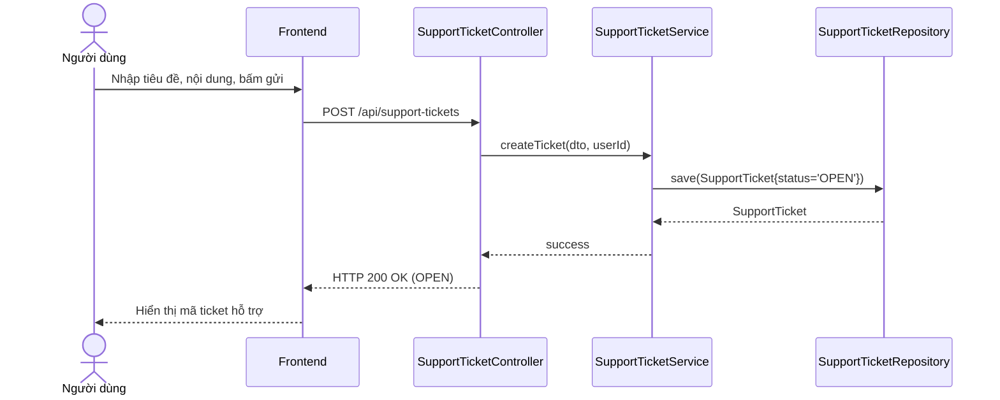

# UC-17 — Yêu Cầu Hỗ Trợ (Support Tickets)

> **Feature:** `feat-support` | **Phiên bản:** 1.0 | **Trạng thái:** Published
> **Tham chiếu FR:** FR-SUP-01 đến FR-SUP-08
> **Cập nhật:** 2026-06-30

---

## 1. Tổng Quan

| Thuộc tính | Nội dung |
|:---|:---|
| **Mã Use Case** | UC-17 |
| **Tên** | Yêu Cầu Hỗ Trợ (Support Tickets) |
| **Tác nhân chính** | Người dùng (User), Nhân viên vận hành (Staff) |
| **Mô tả ngắn** | Người dùng gặp sự cố kỹ thuật hoặc thắc mắc giao dịch thực hiện gửi yêu cầu hỗ trợ (Support Ticket). Nhân viên (Staff) xem danh sách các yêu cầu đang mở, trả lời giải đáp và đóng yêu cầu hỗ trợ. |
| **Độ ưu tiên** | Thấp (P2) — hỗ trợ chăm sóc khách hàng và tiếp nhận phản hồi |

---

## 2. Tác Nhân & Điều Kiện

### 2.1 Tác Nhân

| Tác nhân | Vai trò |
|:---|:---|
| **Người dùng (User)** | Gửi yêu cầu hỗ trợ, xem trạng thái yêu cầu của bản thân |
| **Nhân viên (Staff)** | Tiếp nhận yêu cầu, phản hồi giải đáp, thay đổi trạng thái ticket |

### 2.2 Điều Kiện Tiền Quyết (Preconditions)

- Người dùng đã đăng nhập hệ thống và tài khoản đã được kích hoạt.

### 2.3 Hậu Điều Kiện (Postconditions)

- **Gửi ticket thành công:** Tạo bản ghi mới trong bảng `SupportTickets` ở trạng thái `OPEN`.

---

## 3. Luồng Xử Lý

### 3.1 Luồng Chính — Gửi Yêu Cầu Hỗ Trợ (Happy Path)

```
Bước 1  [User]:       Truy cập mục "Trợ giúp & Hỗ trợ", chọn "Gửi yêu cầu mới"
Bước 2  [Frontend]:   Hiển thị mẫu điền yêu cầu (Tiêu đề, Nội dung chi tiết)
Bước 3  [User]:       Nhập Tiêu đề "Không nhận được OTP email đăng ký", nhập Nội dung "Tôi đăng ký tài khoản từ 10 phút trước nhưng chưa nhận được mã kích hoạt", bấm gửi
Bước 4  [Frontend]:   POST /api/support-tickets { subject, message }
Bước 5  [Backend]:    Validate: các trường không được trống
                       Tạo bản ghi mới trong SupportTickets với status = 'OPEN'
                       Trả về: status = 200, ticketId, status = "OPEN"
Bước 6  [Frontend]:   Hiển thị thông báo gửi yêu cầu hỗ trợ thành công kèm mã Ticket.
```

### 3.2 Luồng Giải Đáp & Đóng Ticket (Staff)

```
Bước 1  [Staff]:      Vào màn hình Admin/Staff, chọn mục "Hỗ trợ khách hàng"
Bước 2  [Frontend]:   GET /api/staff/support-tickets?status=OPEN
Bước 3  [Backend]:    Trả về danh sách các ticket hỗ trợ chưa được giải quyết
Bước 4  [Staff]:      Nhấp xem chi tiết ticket, liên hệ giải đáp cho User qua email/điện thoại
Bước 5  [Staff]:      Sau khi giải đáp xong, nhấn nút "Đánh dấu đã giải quyết" (Resolved)
Bước 6  [Frontend]:   POST /api/staff/support-tickets/{ticketId}/resolve
Bước 7  [Backend]:    Cập nhật SupportTickets.status = 'RESOLVED'
                       Gửi email/thông báo thông báo ticket đã được xử lý cho User
                       Trả về: status = 200, message = "RESOLVED"
```

---

## 4. Quy Tắc Nghiệp Vụ

| Mã | Quy tắc | Chi tiết |
|:---|:---|:---|
| BR-17-01 | Phân quyền Staff | Chỉ tài khoản có vai trò `STAFF` hoặc `ADMIN` mới được phép truy cập danh sách và cập nhật trạng thái ticket |
| BR-17-02 | Trạng thái đóng | Khi ticket đã chuyển sang `CLOSED` hoặc `RESOLVED`, người dùng không thể chỉnh sửa nội dung |

---

## 5. Quy Tắc Kiểm Tra Đầu Vào

### POST /api/support-tickets

| Trường | Kiểm tra | Lỗi khi vi phạm |
|:---|:---|:---|
| `subject` | Bắt buộc, không rỗng, tối đa 200 ký tự | "Tiêu đề yêu cầu không được rỗng" |
| `message` | Bắt buộc, không rỗng, tối đa 2000 ký tự | "Nội dung yêu cầu không được rỗng" |

---

## 6. Sơ Đồ Tuần Tự (Sequence Diagram)

### Luồng Gửi Ticket Hỗ Trợ



---

## 7. Tham Chiếu API

| Phương thức | Endpoint | Mô tả |
|:---|:---|:---|
| `POST` | `/api/support-tickets` | Gửi yêu cầu hỗ trợ mới |
| `GET` | `/api/staff/support-tickets` | Lấy danh sách ticket (Staff) |
| `POST` | `/api/staff/support-tickets/{id}/resolve` | Đánh dấu đã giải quyết (Staff) |

---

## 8. Tiêu Chí Chấp Nhận (Acceptance Criteria)

### AC-17-01 — Gửi yêu cầu hỗ trợ thành công tạo bản ghi OPEN

- **Cho trước:** Người dùng đã đăng nhập hệ thống
- **Khi:** Thực hiện gọi POST `/api/support-tickets` với đầy đủ thông tin hợp lệ
- **Thì:**
  - Hệ thống tạo 1 bản ghi mới trong bảng `SupportTickets` ở trạng thái `OPEN`
  - HTTP 200 OK

---

## 9. Ngoài Phạm Vi (Out of Scope)

- ❌ Hộp thoại trò chuyện trực tiếp (Live Chat) với nhân viên hỗ trợ trực tuyến.
- ❌ Tự động trả lời tự động bằng AI Chatbot (AI Auto-reply).
