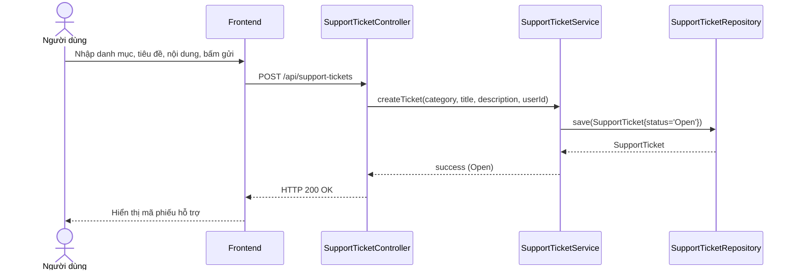

# UC-17 — Yêu Cầu Hỗ Trợ (Phiếu hỗ trợ)

> **Feature:** `feat-support` | **Phiên bản:** 1.0 | **Trạng thái:** Published
> **Tham chiếu FR:** FR-SUP-01 đến FR-SUP-08
> **Cập nhật:** 2026-06-30

---

## 1. Tổng Quan

| Thuộc tính | Nội dung |
|:---|:---|
| **Mã Use Case** | UC-17 |
| **Tên** | Yêu Cầu Hỗ Trợ (Phiếu hỗ trợ) |
| **Tác nhân chính** | Người dùng (User), Nhân viên vận hành (Staff) |
| **Mô tả ngắn** | Người dùng gặp sự cố kỹ thuật hoặc thắc mắc giao dịch thực hiện gửi yêu cầu hỗ trợ (Phiếu hỗ trợ). Nhân viên (Staff) xem danh sách các yêu cầu đang mở, trả lời giải đáp và đóng yêu cầu hỗ trợ. |
| **Độ ưu tiên** | Thấp (P2) — hỗ trợ chăm sóc khách hàng và tiếp nhận phản hồi |

---

## 2. Tác Nhân & Điều Kiện

### 2.1 Tác Nhân

| Tác nhân | Vai trò |
|:---|:---|
| **Người dùng (User)** | Gửi yêu cầu hỗ trợ, xem trạng thái yêu cầu của bản thân |
| **Nhân viên (Staff)** | Tiếp nhận yêu cầu, phản hồi giải đáp, thay đổi trạng thái phiếu |

### 2.2 Điều Kiện Tiền Quyết (Preconditions)

- Người dùng đã đăng nhập hệ thống và tài khoản đã được kích hoạt.

### 2.3 Hậu Điều Kiện (Postconditions)

- **Gửi phiếu hỗ trợ thành công:** Tạo bản ghi mới trong bảng `SupportTickets` ở trạng thái `OPEN`.

---

## 3. Luồng Xử Lý

### 3.1 Luồng Chính — Gửi Yêu Cầu Hỗ Trợ (Happy Path)

```
Bước 1  [User]:       Truy cập mục "Trợ giúp & Hỗ trợ", chọn "Gửi yêu cầu mới"
<<<<<<< HEAD
Bước 2  [Frontend]:   Hiển thị mẫu điền yêu cầu (Danh mục hỗ trợ, Tiêu đề, Nội dung chi tiết)
Bước 3  [User]:       Chọn danh mục "TECHNICAL", nhập Tiêu đề "Không nhận được OTP email đăng ký", nhập Nội dung "Tôi đăng ký tài khoản từ 10 phút trước nhưng chưa nhận được mã kích hoạt", bấm gửi
Bước 4  [Frontend]:   POST /api/support-tickets { category, title, description }
Bước 5  [Backend]:    Validate: các trường không được trống và đúng phân quyền CUSTOMER/SELLER
                       Tạo bản ghi mới trong SupportTickets với status = 'Open'
                       Gửi thông báo xác nhận cho User và thông báo hỗ trợ mới cho tất cả Staff/Admin
                       Trả về: status = 200, ticket details (status = "Open")
Bước 6  [Frontend]:   Hiển thị thông báo gửi yêu cầu hỗ trợ thành công kèm mã phiếu.
```

### 3.2 Luồng Giải Đáp & Đóng Phiếu (Staff)

```
Bước 1  [Staff]:      Vào màn hình Admin/Staff, chọn mục "Hỗ trợ khách hàng"
Bước 2  [Frontend]:   GET /api/support-tickets/all (Có JWT token của Staff)
Bước 3  [Backend]:    Trả về danh sách tất cả các phiếu hỗ trợ toàn hệ thống
Bước 4  [Staff]:      Nhấp xem chi tiết phiếu hỗ trợ, liên hệ giải đáp cho User qua email/điện thoại hoặc hệ thống
Bước 5  [Staff]:      Sau khi giải đáp xong, nhập Resolution và nhấn nút "Đóng / Đã giải quyết" (Resolved)
Bước 6  [Frontend]:   PUT /api/support-tickets/{ticketId}/status { status: "Resolved", resolution: "..." }
Bước 7  [Backend]:    Cập nhật SupportTickets.status = 'Resolved' và lưu resolution
                       Gửi thông báo cập nhật trạng thái hỗ trợ cho User
                       Trả về: status = 200, ticket details (status = "Resolved")
```

---

## 4. Quy Tắc Nghiệp Vụ

| Mã | Quy tắc | Chi tiết |
|:---|:---|:---|
| BR-17-01 | Phân quyền Staff | Chỉ tài khoản có vai trò `STAFF` hoặc `ADMIN` mới được phép truy cập danh sách toàn hệ thống và cập nhật trạng thái/phản hồi giải pháp |
| BR-17-02 | Trạng thái đóng | Khi phiếu hỗ trợ đã chuyển sang `Resolved`, người dùng không thể tự chỉnh sửa nội dung |
| BR-17-03 | Quyền bảo mật | API xem chi tiết `/api/support-tickets/{id}` chỉ cho phép chủ nhân của phiếu hỗ trợ hoặc tài khoản Staff/Admin truy cập |

---

## 5. Quy Tắc Kiểm Tra Đầu Vào

### POST /api/support-tickets

| Trường | Kiểm tra | Lỗi khi vi phạm |
|:---|:---|:---|
| `category` | Bắt buộc, không rỗng, thuộc danh mục | "Danh mục hỗ trợ không hợp lệ" |
| `title` | Bắt buộc, không rỗng, tối đa 200 ký tự | "Tiêu đề yêu cầu không được rỗng" |
| `description` | Bắt buộc, không rỗng, tối đa 2000 ký tự | "Nội dung yêu cầu không được rỗng" |

---

## 6. Sơ Đồ Tuần Tự (Sequence Diagram)

### Luồng Gửi Phiếu Hỗ Trợ



---

## 7. Tham Chiếu API

| Phương thức | Endpoint | Mô tả |
|:---|:---|:---|
| `POST` | `/api/support-tickets` | Gửi yêu cầu hỗ trợ mới (Customer/Seller) |
| `GET` | `/api/support-tickets` | Xem lịch sử danh sách phiếu hỗ trợ của bản thân |
| `GET` | `/api/support-tickets/all` | Lấy danh sách phiếu hỗ trợ toàn hệ thống (Staff/Admin) |
| `GET` | `/api/support-tickets/{id}` | Xem chi tiết phiếu hỗ trợ |
| `PUT` | `/api/support-tickets/{id}/status` | Cập nhật trạng thái và giải pháp (Staff/Admin) |

---

## 8. Tiêu Chí Chấp Nhận (Acceptance Criteria)

### AC-17-01 — Gửi yêu cầu hỗ trợ thành công tạo bản ghi Open

- **Cho trước:** Người dùng đã đăng nhập hệ thống với vai trò CUSTOMER hoặc SELLER
- **Khi:** Thực hiện gọi POST `/api/support-tickets` với đầy đủ thông tin hợp lệ
- **Thì:**
  - Hệ thống tạo 1 bản ghi mới trong bảng `SupportTickets` ở trạng thái `Open`
  - Gửi thông báo đến người gửi và các nhân viên hỗ trợ.
  - HTTP 200 OK trả về thông tin chi tiết ticket.

---

## 9. Ngoài Phạm Vi (Out of Scope)

- ❌ Hộp thoại trò chuyện trực tiếp (Live Chat) với nhân viên hỗ trợ trực tuyến.
- ❌ Tự động trả lời tự động bằng AI Chatbot (AI Auto-reply).
