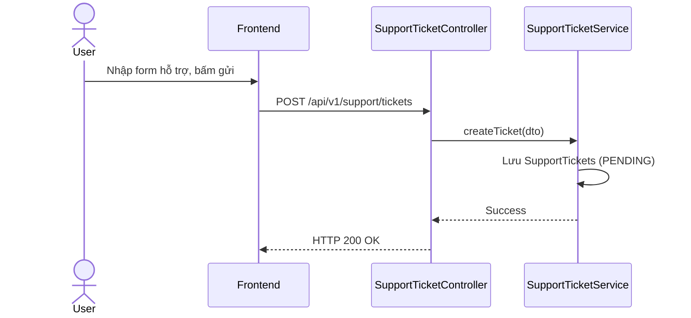

# UC-27 — Gửi Yêu Cầu Hỗ Trợ (Support Request)

> **Feature:** `feat-support` | **Phiên bản:** 2.0 | **Trạng thái:** Published
> **Tham chiếu FR:** FR-SUPPORT-01 đến FR-SUPPORT-12
> **Cập nhật:** 2026-07-24

---

## 1. Tổng Quan

| Thuộc tính | Nội dung |
|:---|:---|
| **Mã Use Case** | UC-27 |
| **Tên** | Gửi Yêu Cầu Hỗ Trợ (Support Request) |
| **Tác nhân chính** | Khách (Guest) / Người dùng (User) |
| **Mô tả ngắn** | Người dùng gửi yêu cầu hỗ trợ (Support Ticket) lên hệ thống để yêu cầu nhân viên giúp đỡ. |
| **Độ ưu tiên** | Trung bình (P1) |

---

## 2. Tác Nhân & Điều Kiện

### 2.1 Tác Nhân
| Tác nhân | Vai trò |
|:---|:---|
| **Khách (Guest) / Người dùng (User)** | Tác nhân chính thực hiện nghiệp vụ của hệ thống. |

### 2.2 Điều Kiện Tiền Quyết (Preconditions)
- None

### 2.3 Hậu Điều Kiện (Postconditions)
- **Thành công:** Yêu cầu hỗ trợ được tạo thành công ở trạng thái PENDING.
- **Thất bại:** Trạng thái database không đổi, hệ thống trả về mã lỗi chi tiết.

---

## 3. Luồng Xử Lý (Sequence Steps)

### 3.1 Luồng Chính (Happy Path)
Bước 1 [User]:       Vào trang hỗ trợ, nhập email, tiêu đề và nội dung yêu cầu.
Bước 2 [Frontend]:   Gửi yêu cầu POST /api/v1/support/tickets.
Bước 3 [Backend]:    SupportTicketController gọi SupportTicketService.createTicket().
                     - Lưu bản ghi vào bảng SupportTickets trạng thái PENDING.
Bước 4 [Backend]:    Trả về HTTP 200 OK.
Bước 5 [Frontend]:   Hiển thị thông báo gửi hỗ trợ thành công.

### 3.2 Luồng Lỗi (Error Path)
| Tình huống | HTTP | Error Code | Xử lý |
|:---|:---:|:---|:---|
| Email sai định dạng | 400 | `VALIDATION_FAILED` | Báo lỗi định dạng địa chỉ email |

---

## 4. Quy Tắc Nghiệp Vụ (Business Rules)

| Mã | Quy tắc | Chi tiết |
|:---|:---|:---|
| BR-27-01 | Tự động điền email | Nếu người dùng đã đăng nhập, hệ thống tự động điền email của tài khoản đó vào biểu mẫu |

---

## 5. Quy Tắc Kiểm Tra Đầu Vào

| Trường | Kiểm tra | Thông báo lỗi nếu sai |
|:---|:---|:---|
| `email` | Bắt buộc, email | "Email không đúng định dạng" |
| `title` | Bắt buộc | "Tiêu đề không được để trống" |

---

## 6. Sơ Đồ Tuần Tự (Sequence Diagram)

---

## 7. Tham Chiếu API

| Phương thức | Endpoint | Mô tả |
|:---|:---|:---|
| POST | `/api/v1/support/tickets` | Khởi tạo yêu cầu hỗ trợ hệ thống |

---

## 8. Tiêu Chỉ Chấp Nhận (Acceptance Criteria)

### AC-27-01 — Gửi hỗ trợ hệ thống thành công
> **Tham chiếu:** FR-SUPP-01
- **Cho trước:** Điền đầy đủ thông tin hợp lệ.
- **Khi:** Bấm gửi yêu cầu.
- **Thì:** Lưu ticket PENDING thành công.

---

## 9. Ngoài Phạm Vi (Out of Scope)
- ❌ Chat trực tuyến thời gian thực với nhân viên hỗ trợ.

---

## 10. Danh Sách SRS Use Cases Hạt Nhân Trực Thuộc (SRS Mapping)

| SRS UC ID | Tên Use Case SRS | Feature Module | Mô Tả Chức Năng Chi Tiết |
|:---|:---|:---|:---|
| **UC 27** | Support Request | feat-support | Người dùng gửi yêu cầu hỗ trợ (Support Ticket) lên hệ thống để yêu cầu nhân viên giúp đỡ. |
